\newpage

# Universidad del Valle de Guatemala

**Facultad de Ingeniería**
**Departamento de Ciencias de la Computación**
**CC3084 Data Science, Semestre II 2026**

## Laboratorio 1: Series de Tiempo

Análisis de series de tiempo sobre el ingreso de viajeros internacionales a Guatemala.

**Integrantes**

| Nombre | Carné |
|---|---|
| Esteban Cárcamo | 23016 |
| Hugo Daniel Barillas | 23556 |
| Ernesto Ascencio | 23009 |

**Fecha:** 26 de julio de 2026
**Repositorio:** https://github.com/ecarcamo/CC3084-DATA-SCIENCE

\newpage

## Índice

- 1. Datos y limpieza
- 2. Análisis exploratorio de datos
- 3. Análisis preliminar de series
- 4. Análisis de las series de tiempo
- 5. Modelos y predicción
- 6. Análisis comparativo

\newpage

# 1. Datos y limpieza

## Origen y dimensiones

La base de datos contiene el registro mensual del ingreso de viajeros internacionales a Guatemala
entre enero de 2009 y junio de 2026: 210 meses consecutivos, sin huecos, y 161,036 registros en
formato largo (una fila por combinación de mes, vía de ingreso, frontera, país o agrupación de
residencia y tipo de viajero). Los datos se proporcionan únicamente para uso académico y no
corresponden a cifras oficiales de INGUAT ni del Instituto Guatemalteco de Migración.

La base combina tres tramos con distinta fuente y metodología: 2009-2020 proviene de respaldos
históricos, 2021-2022 de una entrega del Instituto Guatemalteco de Migración, y 2023 en adelante
de un sistema depurado de conteos de INGUAT. Esto implica que los niveles no siempre son
perfectamente comparables entre tramos, en particular alrededor del quiebre metodológico de
2022 a 2023.

Además, desde 2023 la columna de país deja de reportar país individual (226 posibles hasta 2022)
y pasa a reportar por agrupación de mercado (27 grupos). Los mercados principales (El Salvador,
Estados Unidos, Honduras, México, entre otros) siguen siendo comparables como serie a lo largo de
todo el período; los países más pequeños quedan absorbidos dentro de su agrupación a partir de
2023.

## Limpieza aplicada

Sobre la base cruda se detectaron y corrigieron cuatro inconsistencias, sin eliminar ninguna fila
y conservando siempre el valor original en una columna paralela con sufijo `_raw`:

- **Región dos**: la categoría de cruceros aparece partida en dos etiquetas según el año
  ("Cruceristas" de 2009 a 2021, "Cruceros" en 2022), cuando en realidad es la misma categoría.
  Se unificó en un solo valor. Adicionalmente existía el valor literal `"0"` en 13 registros de
  2022 (821 viajeros), que se reetiquetó como "Sin especificar".
- **País**: se detectaron 13 pares de valores que representan el mismo país pero con capitalización
  distinta (por ejemplo, "OTROS PAISES DEL MUNDO" frente a "Otros Paises Del Mundo", o variantes
  con conectores en mayúscula como "República De Corea"). En todos los casos la variante mal
  escrita corresponde a un puñado de registros aislados de 2020-2021, mientras que la forma
  correcta se usa de manera consistente en el resto del período. Se unificaron ambas hacia la
  variante con más registros.
- **Regiones OMT**: existían los valores basura `"0x2a"` y `"SIN ESPECIFICAR"`, que se unificaron
  en la etiqueta "Sin especificar".
- **Frontera**: la categoría "Cruceros" aparece mezclada en la misma columna junto con fronteras
  terrestres, aéreas y marítimas legítimas (y junto con la categoría genérica "Otra frontera").
  Se decidió no modificarla, ya que corregirla requeriría inventar una frontera específica que no
  está en los datos; queda documentado aquí para quien la use más adelante.
- **Viajero**: 51,272 registros (cerca de un tercio de la base) tienen valores decimales. No son
  errores: corresponden a estimaciones y prorrateos de la fuente, no a conteos exactos de
  personas. Además, 54 registros valen exactamente 0. En ningún caso se redondeó ni se descartó
  esta información; se documenta como una característica conocida de los datos.

Tras aplicar la limpieza se confirmó por código que la base no contiene valores nulos ni filas
duplicadas exactas.

## Decisiones fijadas

**Guatemala como país de residencia.** El valor "Guatemala" en la columna de país acumula
aproximadamente 14.8 millones de viajeros a lo largo de todo el período, un 28% del total. Estos
registros corresponden a residentes guatemaltecos que regresan al país, no a viajeros
internacionales entrantes en el sentido habitual. Se decidió **mantenerlos dentro de la serie
total** de viajeros, para no alterar el total oficial reportado por la fuente, pero
**excluirlos del ranking de países de residencia**. Bajo este criterio, el Top 3 de países de
residencia queda: El Salvador, Estados Unidos de América y Honduras.

**2026 como año parcial.** El último año de la base solo cubre de enero a junio. Cualquier
comparación de totales anuales que incluya 2026 debe advertir explícitamente que ese año está
incompleto; no es comparable en la misma base que los años completos.

**Quiebre en "Tipo de Viajero".** Esta variable toma cuatro valores: Turista, Excursionista,
Viajero y Cruceristas. Entre 2022 y 2023 la categoría "Viajero" cae fuertemente (de
aproximadamente 1.06 millones a 0.33 millones) porque el sistema depurado de 2023 excluye a los
viajeros no turísticos de alta frecuencia (comercio fronterizo, tránsito), mientras que el tramo
anterior sí los incluía. Esta caída es un efecto de cambio de criterio metodológico, no una caída
real de actividad, y debe tenerse en cuenta al interpretar la serie total o cualquier serie que
dependa de esta variable. Para comparaciones de visitantes consistentes en todo el período se
recomienda usar la suma de Turista + Excursionista.

## Split de entrenamiento y prueba

El split es temporal, nunca aleatorio, sobre los 210 meses de la base:

- **Entrenamiento**: 2009-01 a 2021-03 (147 meses, 70% de los datos).
- **Prueba**: 2021-04 a 2026-06 (63 meses, 30% de los datos).

Este corte no es arbitrario: deja la caída provocada por la pandemia (colapso a partir de marzo de
2020, con un piso en 2020-2021 de aproximadamente 27% del nivel de 2019) **dentro** del conjunto
de entrenamiento, mientras que la **recuperación completa** posterior a 2022 queda **dentro** del
conjunto de prueba. Esto significa que cualquier modelo entrenado con este split aprende a partir
de un choque y su punto más bajo, pero es evaluado prediciendo una dinámica de recuperación
distinta a la que vio durante el entrenamiento. Es un punto que debe justificarse explícitamente
al interpretar el desempeño de los modelos, no una limitación que deba ocultarse.

## Series construidas

Las categorías de análisis elegidas por el equipo son **vías de ingreso** y **países de residencia
(Top 3, excluyendo Guatemala)**. Todas las series son mensuales, con exactamente dos columnas
(`fecha` y `viajeros`) e índice completo sin huecos (los meses sin registros quedan en 0). Cada
serie tiene además una versión de entrenamiento truncada a 2021-03.

| Serie | Inicio | Fin | Frecuencia |
|---|---|---|---|
| Total de viajeros | 2009-01 | 2026-06 | Mensual |
| Vía aérea | 2009-01 | 2026-06 | Mensual |
| Vía terrestre | 2009-01 | 2026-06 | Mensual |
| Vía marítima | 2009-01 | 2026-06 | Mensual |
| País: El Salvador | 2009-01 | 2026-06 | Mensual |
| País: Estados Unidos de América | 2009-01 | 2026-06 | Mensual |
| País: Honduras | 2009-01 | 2026-06 | Mensual |

Se verificó por código que la suma de las series de las tres vías de ingreso reproduce, mes a mes,
la serie total de viajeros.

\newpage

# 2. Análisis exploratorio de datos

El análisis se realizó sobre la base ya limpia (`data/processed/base_limpia.csv`), producida por el
bloque de carga y limpieza. El notebook reproducible es `notebooks/02_eda.ipynb` y todas las
figuras referidas se guardan en `informe/figuras/` a 150 dpi. Se usó únicamente `matplotlib`,
según la convención del equipo.

## Panorama general y estadísticas descriptivas

La base agrega **52,287,937 viajeros** repartidos en **161,036 registros** y **210 meses**
consecutivos (enero 2009 a junio 2026). A nivel de fila, la variable de conteo `Viajero` está
fuertemente sesgada a la derecha: la mediana es de apenas **7** viajeros por combinación
mes/vía/frontera/país, mientras que la media es de **~325** y el máximo llega a **92,336**. Es
decir, conviven muchísimas combinaciones pequeñas (países lejanos en meses concretos) con unas
pocas combinaciones enormes (El Salvador por vía terrestre). Esta asimetría obliga a analizar la
serie **agregada por mes** en lugar de las filas individuales.

## a. Comportamiento temporal

La serie mensual total (figura `eda_serie_temporal.png`) promedia **~249,000 viajeros por mes** y
muestra una estacionalidad regular muy marcada. Se distinguen tres regímenes: crecimiento sostenido
de 2009 a 2019; el **colapso por la pandemia** desde marzo de 2020, con el mínimo histórico en
**abril 2020 (9,779 viajeros)**, alrededor del 4% de un mes normal; y la recuperación posterior a
2022, que retoma el nivel prepandemia. El corte train/test (2021-03) deja la caída en entrenamiento
y la recuperación en prueba.

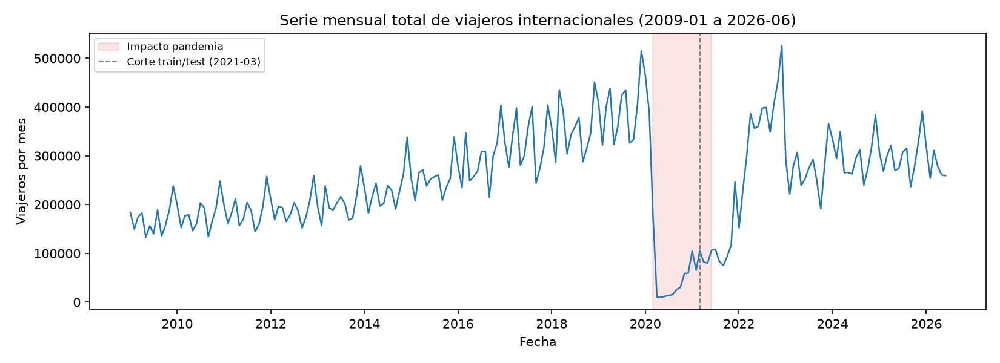

Los totales anuales (figura `eda_totales_anuales.png`) confirman el crecimiento estructural: de
**2.03M** en 2009 a **4.69M** en 2019 (máximo histórico). En 2020 y 2021 el volumen se desploma a
**~1.27M** anuales; en 2022 hay un rebote fuerte y desde 2023 el nivel se estabiliza entre 3.2M y
3.6M, algo por debajo del pico de 2019 (en parte por el cambio metodológico de 2023). **2026 es
parcial** (solo enero-junio) y no es comparable con los años completos.

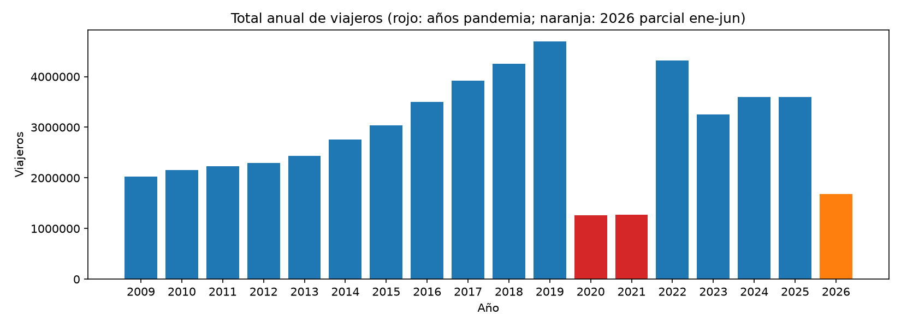

El patrón estacional (figura `eda_estacionalidad.png`) es claro y estable: **diciembre y enero** son
los meses más altos (fin de año y vacaciones), con un repunte secundario en **Semana Santa
(marzo-abril)** y el valle anual en **septiembre**. Esta estacionalidad anual es la señal más
relevante para el modelado posterior.

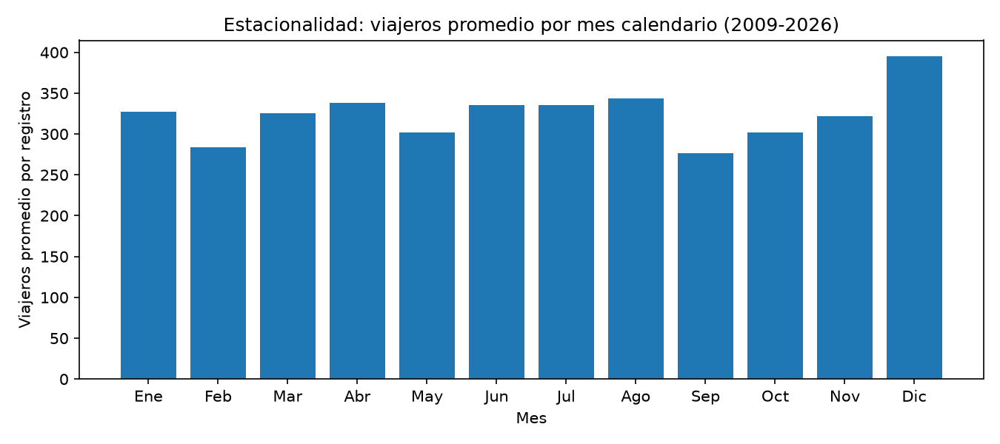

## b. Países con mayor cantidad de viajeros

Siguiendo la decisión del bloque de limpieza, **Guatemala se excluye del ranking** (residentes
retornando, **14.79M**, ~28.3% del total). El ranking de países de residencia (figura
`eda_top_paises.png`) está dominado por los vecinos centroamericanos y Norteamérica:

| Puesto | País | Viajeros acumulados |
|---|---|---|
| 1 | El Salvador | 16.21M |
| 2 | Estados Unidos de América | 7.05M |
| 3 | Honduras | 2.79M |
| 4 | México | 1.81M |
| 5 | Belice | 1.33M |

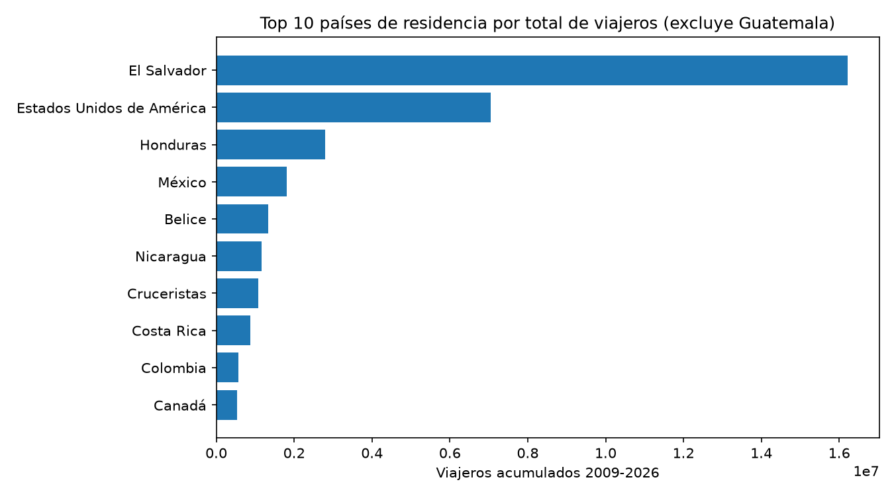

El peso de El Salvador y Honduras refleja el intenso tráfico terrestre fronterizo, mientras que
Estados Unidos representa el principal mercado aéreo. Los tres primeros son precisamente las series
por país que construye el bloque 1.

## c. Regiones con mayor cantidad de viajeros

La distribución regional (figura `eda_regiones.png`, sobre `Región dos`) es muy concentrada:
**América del Centro** aporta **37.4M (~71%)**, seguida de lejos por **América del Norte (9.38M,
~18%)**. Europa (~2.2M), América del Sur y el Caribe (~1.4M) y Cruceros (~1.1M) completan el grueso;
Asia, Oceanía y Oriente Medio son marginales. En síntesis, el ingreso a Guatemala es
**fundamentalmente regional**: casi 9 de cada 10 viajeros provienen del continente americano.

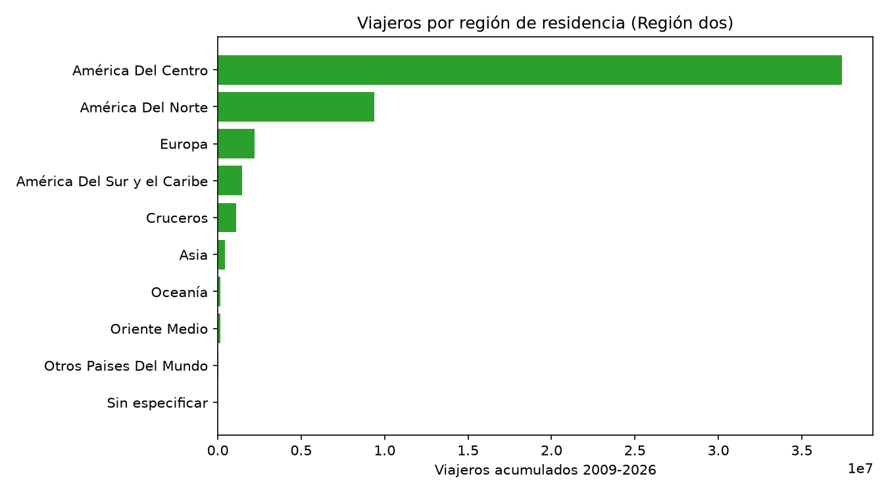

## d. Vías de ingreso y fronteras más utilizadas

La vía **terrestre domina con 31.99M (~61%)**, seguida de la **aérea (19.06M, ~36%)** y muy detrás
la **marítima (1.23M, ~2%)** (figura `eda_vias_fronteras.png`). Consistente con esto, la frontera
más usada es el aeropuerto **La Aurora (19.03M)** (que concentra casi toda la vía aérea), seguido de
los pasos terrestres con El Salvador y México: **Valle Nuevo (10.73M)**, **San Cristóbal (5.36M)** y
**Pedro de Alvarado (4.39M)**. El predominio terrestre explica por qué El Salvador y Honduras
encabezan el ranking de países. La categoría "Cruceros" aparece mezclada como si fuera una frontera,
tal como se documentó en el bloque de limpieza.

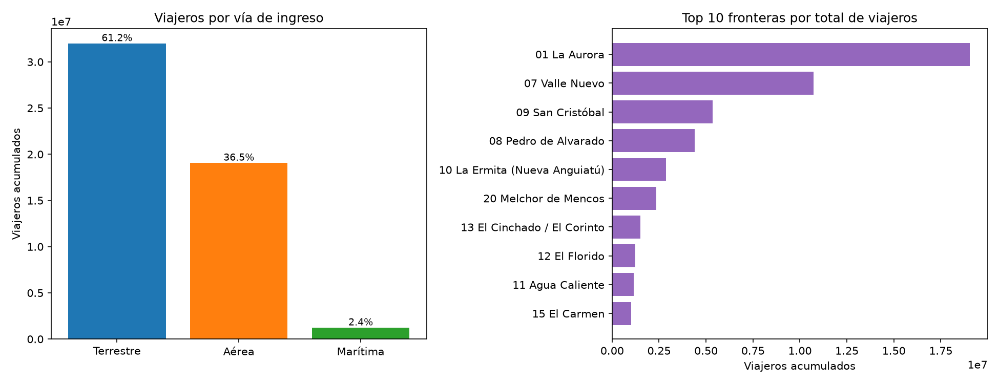

## e. Valores faltantes, duplicados y atípicos

Tras la limpieza, la base **no tiene valores nulos ni filas duplicadas exactas**. Persisten dos
características conocidas y legítimas: **51,272 registros con valores decimales**
(estimaciones/prorrateos de la fuente, no errores) y **54 registros en exactamente 0**
(combinaciones sin ingresos ese mes). Ninguna se corrige.

Para los valores atípicos se aplicó el criterio de rango intercuartílico (IQR) sobre la serie
mensual (figura `eda_atipicos.png`). El criterio marca solo **2 atípicos, ambos altos**: **diciembre
2019 (515,820)** y **diciembre 2022 (526,190)**, que **no son errores** sino los picos estacionales
de fin de año. Es notable que el **desplome pandémico (mínimo de 9,779 en abril 2020) no se marca
como atípico por IQR** (el límite inferior resulta negativo): es un evento estructural, no un valor a
depurar. A nivel de fila, la distribución es de cola larga (visible en escala logarítmica): unas
pocas combinaciones grandes concentran el volumen. **Conclusión: no se elimina ningún atípico**;
todos son datos reales relevantes para el modelado.

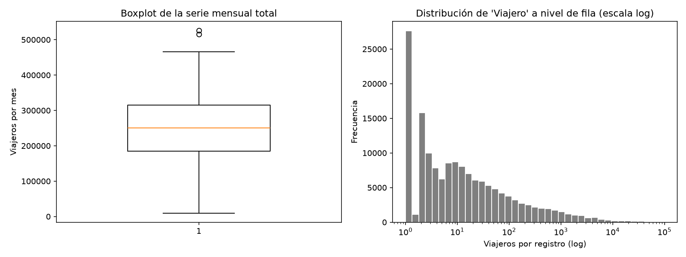

## f. Síntesis

- **Temporal:** estacionalidad fuerte (picos diciembre-enero y Semana Santa, valle en septiembre),
  crecimiento 2009-2019, colapso pandémico 2020-2021 y recuperación 2022+.
- **Países:** El Salvador, Estados Unidos y Honduras concentran el ingreso (Guatemala se excluye por
  ser retorno de residentes).
- **Regiones:** América del Centro (~71%) y del Norte (~18%) dominan; el ingreso es esencialmente
  regional.
- **Vías y fronteras:** terrestre (~61%) sobre aérea (~36%); La Aurora, Valle Nuevo y San Cristóbal
  son las fronteras clave.
- **Calidad:** sin nulos ni duplicados; decimales y ceros son legítimos; los únicos atípicos
  estadísticos son picos de diciembre, no errores.
- **Tipos de viajero:** Turista (~72%) y Excursionista (~17%) son consistentes en todo el período;
  la categoría "Viajero" sufre el quiebre metodológico de 2023 documentado en el bloque de limpieza.

\newpage

# 3. Análisis preliminar de series

Este bloque analiza dos series mensuales de viajeros sobre el **conjunto de entrenamiento**
(enero 2009 a marzo 2021, 147 observaciones): la **Total mensual** (obligatoria) y la de
**Vía Aérea**, elegida por contraste, ya que colapsó a casi cero en 2020 mientras la vía
terrestre mantuvo flujo. El notebook reproducible es `notebooks/03_series_preliminar.ipynb`
y las figuras se guardan en `informe/figuras/` con prefijo `serie_` a 150 dpi, usando solo
`matplotlib` y `statsmodels`. El objetivo es **diagnosticar** cada serie (tendencia,
estacionalidad, estacionariedad y órdenes de diferenciación), **no** ajustar modelos: eso
corresponde a la entrega final.

## Serie 1: Total mensual

**Ficha.** Inicio enero 2009, fin marzo 2021, frecuencia mensual (12 observaciones por año),
**147 observaciones**. Media **~237,000** viajeros/mes; mínimo **9,779 (mayo 2020)** por el
colapso pandémico y máximo **515,820 (diciembre 2019)** en el pico prepandemia.

**Lectura del gráfico.** La serie en niveles (figura `serie_total_nivel.png`) muestra un
**nivel creciente** (de ~169,000 en 2009 a ~391,000 en 2019), una **estacionalidad anual
marcada** y el **quiebre abrupto de 2020**. La amplitud de las oscilaciones **crece con el
nivel**: la desviación estándar pasa de **~32,000** en 2009-2013 a **~74,000** en 2014-2019.
Esa amplitud creciente justifica una descomposición **multiplicativa** y una transformación
que estabilice la varianza.

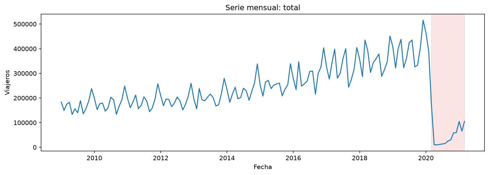

**Descomposición.** La descomposición multiplicativa (figura `serie_total_descomposicion.png`)
separa tendencia, estacionalidad y residuo. La **tendencia** crece de forma sostenida hasta
2019 y se desploma en 2020. La **estacionalidad** es estable, con **pico en diciembre**
(factor ~1.35) y **valle en septiembre** (~0.80), más un repunte secundario en Semana Santa
(marzo). Para el INGUAT esto implica dimensionar capacidad hotelera y fronteriza para el fin
de año y aprovechar el valle de septiembre para mantenimiento y promoción. El **residuo no se
comporta como ruido**: 2020 deja una estructura enorme sin explicar y distorsiona los factores
multiplicativos de ese año, por lo que la lectura estacional se toma del tramo estable
2009-2019. En consecuencia, la serie **no es estacionaria en media ni en varianza**.

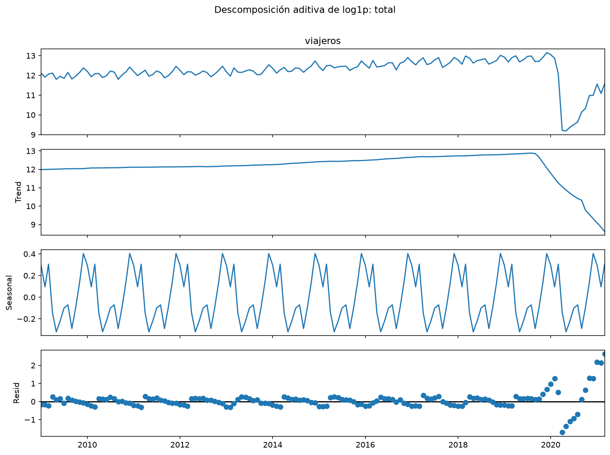

**Transformación.** Se aplica `log1p` (hay meses de valores muy bajos, por eso `log1p` y no
`log`) y se compara con la original (figura `serie_total_log.png`). La transformación
**estabiliza la varianza** y vuelve aproximadamente aditiva la estacionalidad, condición útil
para el modelado.

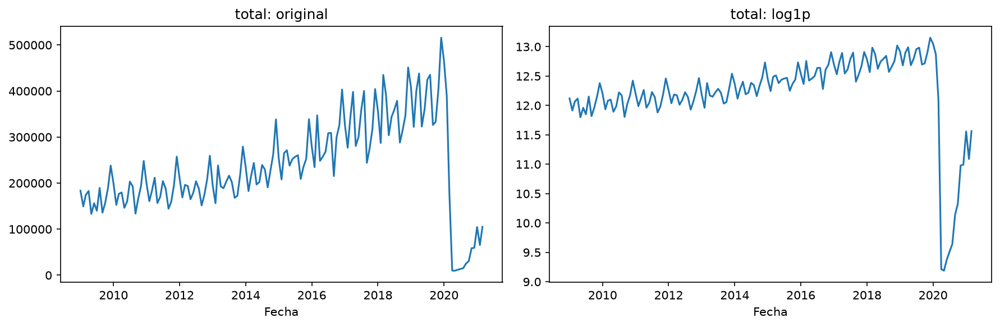

**Estacionariedad en media.** La ACF en niveles (figura `serie_total_acf_niveles.png`) **decae
lentamente** y se mantiene alta en muchos rezagos, evidencia clásica de no estacionariedad; la
PACF muestra un primer rezago dominante. La prueba de Dickey-Fuller aumentada confirma el
diagnóstico:

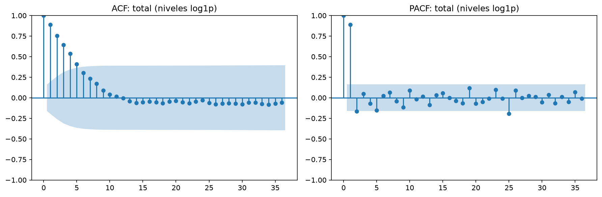

| Serie | Estadístico ADF | p-valor | V. críticos (1% / 5% / 10%) | Conclusión |
|---|---|---|---|---|
| Log niveles | -2.236 | 0.194 | -3.480 / -2.883 / -2.578 | No se rechaza H0: **no estacionaria** |
| Log con d=1 | -3.100 | 0.027 | -3.480 / -2.883 / -2.578 | Se rechaza al 5%: estacionaria |
| Log con d=1 y D=1 (s=12) | -6.148 | <0.001 | -3.485 / -2.886 / -2.580 | Fuertemente estacionaria |

La hipótesis nula del ADF es la existencia de una **raíz unitaria**; con p=0.194 en niveles no
se rechaza, así que la serie no es estacionaria en media. Una **diferencia regular (d=1)** ya
la vuelve estacionaria al 5%, y añadir una **diferencia estacional (D=1, s=12)** la limpia por
completo (figura `serie_total_acf_diff.png`). **Conclusión: d=1, D=1.** La ACF de la serie
diferenciada sugiere componentes de media móvil de orden bajo (q~1) y estacional (Q~1), y la
PACF, componentes autorregresivos de orden bajo (p~1, P~1). Hasta aquí llega el diagnóstico:
no se ajusta ningún modelo.

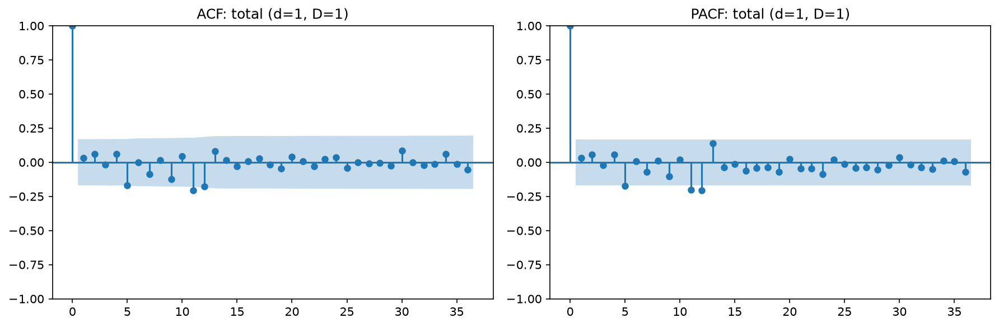

## Serie 2: Vía Aérea

**Ficha.** Inicio enero 2009, fin marzo 2021, frecuencia mensual, **147 observaciones**. Media
**~89,000** viajeros/mes; mínimo **489 (abril 2020)** (el aeropuerto La Aurora prácticamente
cerró) y máximo **157,842 (diciembre 2019)**.

**Lectura del gráfico.** La serie en niveles (figura `serie_aerea_nivel.png`) tiene una
tendencia creciente **más suave** que la total (de ~78,000 en 2009 a ~124,000 en 2019) y una
caída aún más profunda en 2020. La amplitud también crece con el nivel (std ~12,000 en
2009-2013 a ~18,000 en 2014-2019), de nuevo a favor de descomposición multiplicativa y
transformación.

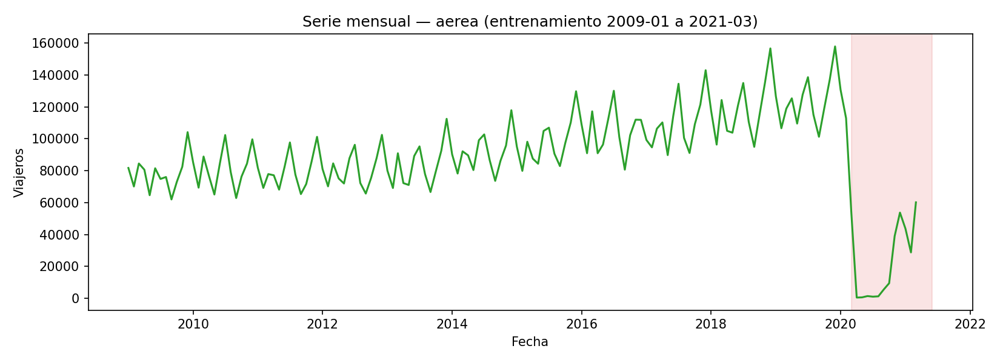

**Descomposición.** La descomposición multiplicativa (figura `serie_aerea_descomposicion.png`)
muestra tendencia creciente hasta 2019 y estacionalidad con **pico en diciembre** (~1.28) y
**valle en septiembre** (~0.81), con un repunte adicional en julio, coherente con las
vacaciones del hemisferio norte y el peso del mercado estadounidense en la vía aérea. El
residuo tampoco es ruido: 2020 domina la varianza. Ni la media ni la varianza son constantes.

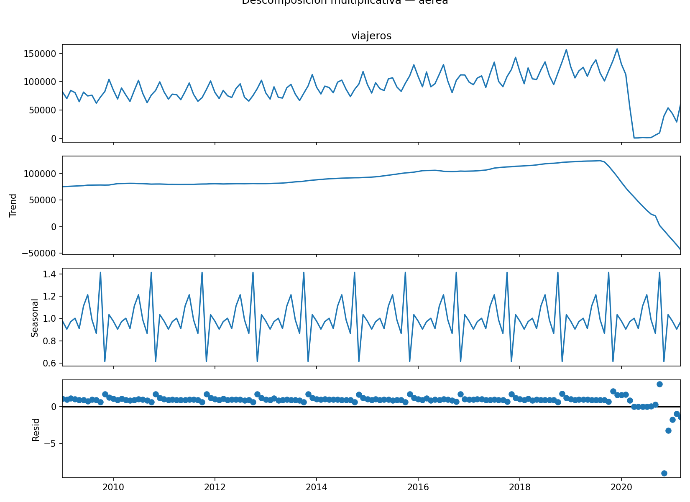

**Transformación.** `log1p` es imprescindible aquí porque el valor de abril 2020 (489) está
muy cerca de cero (figura `serie_aerea_log.png`); estabiliza la varianza.

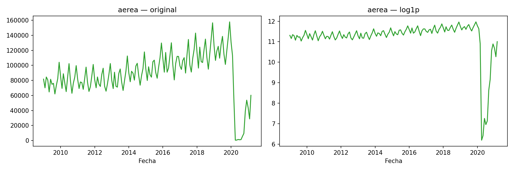

**Estacionariedad en media.** Caso matizado. La ADF en niveles da un resultado que
formalmente rechazaría la raíz unitaria, pero la ACF (figura `serie_aerea_acf_niveles.png`)
decae lentamente y la tendencia y la estacionalidad son evidentes: el ADF está siendo
**engañado por la fuerte reversión pandémica** (la caída y el rebote imitan una media estable).

| Serie | Estadístico ADF | p-valor | V. críticos (1% / 5% / 10%) | Conclusión |
|---|---|---|---|---|
| Log niveles | -4.018 | 0.001 | -3.477 / -2.882 / -2.578 | Rechazo formal, pero ACF y tendencia contradicen |
| Log con d=1 | -3.213 | 0.019 | -3.480 / -2.883 / -2.578 | Estacionaria al 5% |
| Log con d=1 y D=1 (s=12) | -6.396 | <0.001 | -3.485 / -2.886 / -2.580 | Fuertemente estacionaria |

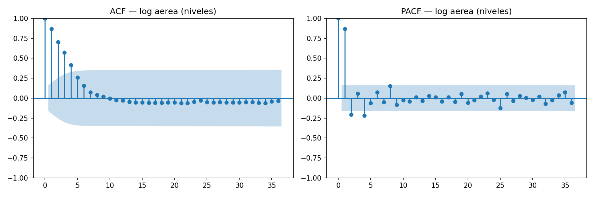

El diagnóstico robusto (ACF de decaimiento lento y estacionalidad clara) indica diferenciar
igualmente: con **d=1** y **D=1 (s=12)** la ACF/PACF quedan limpias (figura
`serie_aerea_acf_diff.png`). **Conclusión práctica: d=1, D=1**, con órdenes sugeridos p~1,
q~1 y estacionales P~1, Q~1. No se ajusta ningún modelo. Este caso ilustra por qué la ADF no
debe leerse aislada de la ACF.

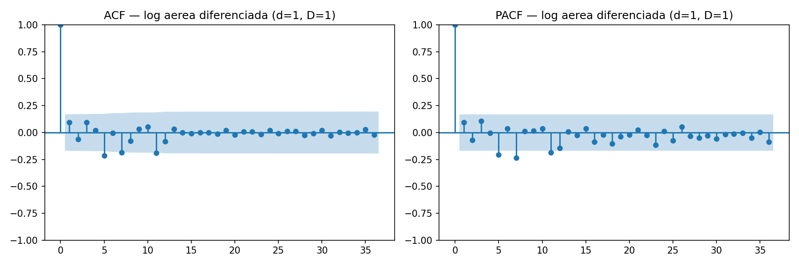

## Comportamiento durante y después de la pandemia

Ambas series colapsan en marzo-abril de 2020, pero **no en la misma magnitud** (figura
`serie_pandemia_comparacion.png`, índice base media 2019 = 100):

| Serie | Media 2019 | Mínimo pandémico | Caída |
|---|---|---|---|
| Total | ~390,985 | 9,779 (mayo 2020) | **~97.5%** |
| Vía Aérea | ~123,615 | 489 (abril 2020) | **~99.6%** |

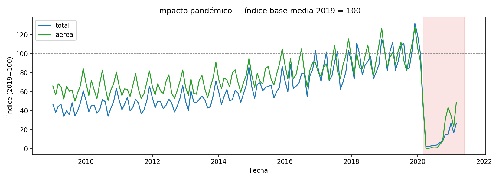

La aérea cae casi por completo porque el aeropuerto cerró, mientras que el total conserva un
**piso mayor** gracias a la vía terrestre, que nunca se detuvo del todo por el tráfico
fronterizo esencial. En el índice base 2019=100 la aérea toca prácticamente cero mientras el
total mantiene un pequeño colchón. La recuperación posterior queda **fuera del entrenamiento**
(el corte es marzo 2021), pero el distinto fondo de caída anticipa dinámicas de recuperación
diferentes: la aérea, más golpeada, parte de más abajo. Para el modelado esto confirma que
**cada serie necesita su propio diagnóstico**; total y aérea no comparten el mismo
comportamiento pandémico.

## Síntesis

- **Total mensual:** tendencia creciente 2009-2019, estacionalidad con pico en diciembre y
  valle en septiembre, varianza creciente (requiere `log1p`), no estacionaria en niveles
  (ADF p=0.194); **d=1, D=1**, órdenes sugeridos p~1, q~1, P~1, Q~1.
- **Vía Aérea:** misma forma general con caída pandémica más profunda; la ADF en niveles
  rechaza de forma engañosa, pero la ACF exige diferenciar igual; **d=1, D=1**, órdenes
  sugeridos p~1, q~1, P~1, Q~1.
- **Pandemia:** caída de ~97.5% (total) frente a ~99.6% (aérea); la vía terrestre explica el
  piso mayor del total. Cada serie requiere diagnóstico y modelado propios.
- **Alcance:** el bloque se detiene en el diagnóstico; el ajuste de modelos y la evaluación
  de pronósticos corresponden a la entrega final.

\newpage

# 4. Análisis de las series de tiempo

## Criterio común

Las siete series se estudiaron sobre el conjunto de entrenamiento, desde
enero de 2009 hasta marzo de 2021, con frecuencia mensual y 147
observaciones. Este corte evita usar información del test durante el
diagnóstico.

Se aplicó `log1p` de manera uniforme. La amplitud de las oscilaciones crece
con el nivel en varias series y cuatro de ellas contienen ceros. Por esa
razón, una descomposición multiplicativa en niveles no es válida. La
descomposición aditiva sobre `log1p` representa cambios proporcionales y
tolera los ceros, lo que permite comparar todas las series bajo el mismo
criterio.

Los factores estacionales se estimaron con el tramo prepandemia. Un factor
mayor que uno identifica un mes por encima del nivel medio, mientras uno
menor que uno indica un valle. La estacionariedad en media se contrastó con
ADF al 5 % en niveles transformados, con una diferencia regular y con una
diferencia regular más otra estacional de orden 12.

## Total de viajeros

La serie total tiene media mensual de 237,121 viajeros. Su mínimo es 9,779
en mayo de 2020 y el máximo, 515,820 en diciembre de 2019. El gráfico muestra
crecimiento hasta 2019, estacionalidad anual y una ruptura abrupta durante
el cierre de fronteras.

Diciembre es el pico estacional, con factor 1.372, y septiembre el valle,
con 0.802. Esta concentración implica mayor demanda de personal, control y
servicios turísticos al cierre del año. La desviación estándar aumenta de
31,782 en 2009-2013 a 74,036 en 2014-2019, evidencia de varianza asociada al
nivel que justifica `log1p`.

El ADF en niveles produce p=0.1936, por lo que no se rechaza raíz unitaria.
Con d=1 el p-valor baja a 0.0265 y con d=1, D=1 a menos de 0.0001. La ACF en
niveles presenta persistencia y señal anual; luego de diferenciar se acorta.
Se concluye d=1 y D=1.

## Vía aérea

La media de la vía aérea es 89,141 viajeros por mes. Se observa un mínimo de
489 en abril de 2020 y un máximo de 157,842 en diciembre de 2019. Antes del
cierre existe una tendencia creciente con oscilación anual clara.

El máximo estacional ocurre en diciembre, con factor 1.288, y el mínimo en
septiembre, con 0.815. Para INGUAT, esto sugiere concentrar capacidad
aeroportuaria y atención turística en el cierre del año. La desviación
estándar pasa de 11,554 a 18,464 entre los dos tramos prepandemia, por lo que
la transformación reduce una variación que aumenta con el nivel.

Aunque el ADF en niveles rechaza raíz unitaria con p=0.0013, la ACF conserva
persistencia y estacionalidad. Los resultados con d=1, p=0.0192, y d=1,
D=1, p menor que 0.0001, respaldan una especificación comparable que absorbe
la señal anual. Se emplean d=1 y D=1, con vigilancia de sobrediferenciación.

## Vía terrestre

La vía terrestre concentra una media mensual de 139,988 viajeros. Su mínimo
es 5,715 en diciembre de 2020 y alcanza 348,626 en diciembre de 2019. La
trayectoria crece con fuerza antes de la pandemia y luego se contrae.

Diciembre tiene el factor máximo, 1.400, y febrero el mínimo, 0.806. El
patrón respalda refuerzos fronterizos y de transporte durante las fiestas de
fin de año. La desviación estándar crece de 20,032 a 57,068 viajeros, una
diferencia marcada que `log1p` ayuda a estabilizar.

La ACF en niveles decae lentamente y muestra dependencia en el rezago 12. El
ADF no rechaza raíz unitaria en niveles, p=0.5619, pero sí con d=1,
p=0.0091, y con d=1, D=1, p menor que 0.0001. En consecuencia, se fijan d=1
y D=1.

## Vía marítima

Marítima es la serie más irregular. Su media es 7,991 viajeros, el máximo es
29,506 en enero de 2018 y existen 16 observaciones iguales a cero. Los ceros
incluyen meses aislados antes de la pandemia y el cierre prolongado al final
del entrenamiento. La desviación estándar cambia de 5,148 a 7,742 viajeros.

El factor prepandemia máximo corresponde a diciembre, 3.328, y el mínimo a
junio, 0.153. La amplitud extrema y los cambios de nivel hacen que esos
factores sean menos estables que en las otras vías, por lo que no deben
usarse como una regla operativa rígida.

El ADF arroja p=1.0000 en niveles, p=0.5750 con d=1 y p=0.1327 con d=1,
D=1. Tampoco d=2 resuelve el problema, pues obtiene p=0.6994. Por tanto, no
se afirma estacionariedad al 5 %. Se explora d=2 y D=1 en modelación, pero la
conclusión estadística sigue siendo que persiste una raíz unitaria.

La serie también cambia de régimen fuera del train. El total anual pasa de
130,789 viajeros en 2019 a 41,992 en 2020 y 3,908 en 2021. Tras una
recuperación a 26,030 en 2022, se estabiliza en solo 6,617, 6,605 y 6,944
viajeros durante 2023, 2024 y 2025. Este nivel es muy inferior al
prepandemia y limita cualquier extrapolación de la historia anterior.

## País de residencia: El Salvador

La serie tiene media mensual de 61,502 viajeros, máximo de 165,263 en agosto
de 2019 y cinco ceros, correspondientes al cierre de abril a agosto de 2020.
El gráfico combina crecimiento previo, patrón anual y ruptura pandémica.

Diciembre es el pico, con factor 1.381, y febrero el valle, con 0.800. El
resultado ayuda a anticipar presión en fronteras terrestres al cierre del
año. La desviación estándar sube de 9,515 a 28,199 viajeros, de modo que
`log1p` estabiliza una heterocedasticidad importante.

El ADF en niveles no rechaza raíz unitaria, p=0.4325. Con d=1 y con d=1,
D=1 los p-valores son menores que 0.0001. La ACF diferenciada pierde la
persistencia de niveles, por lo que se adoptan d=1 y D=1.

## País de residencia: Estados Unidos

La media mensual es 27,955 viajeros. La serie alcanza 54,990 en julio de
2019 y presenta cinco ceros durante abril-agosto de 2020. Antes de ese
quiebre mantiene crecimiento y una temporada alta de mitad de año.

Julio registra el factor máximo, 1.449, y septiembre el mínimo, 0.606. Esto
señala mayor demanda turística y aeroportuaria durante el verano boreal. La
desviación estándar aumenta de 6,840 a 9,226 viajeros; el cambio es menor que
en El Salvador, pero aún favorece la escala logarítmica.

El ADF en niveles queda en el límite, con p=0.0501. La primera diferencia
rechaza raíz unitaria con p=0.0307 y la combinación d=1, D=1 lo hace con
p menor que 0.0001. Junto con la señal anual de la ACF, esto lleva a d=1 y
D=1.

## País de residencia: Honduras

Honduras promedia 9,124 viajeros mensuales y alcanza 23,061 en enero de
2020. También contiene cinco ceros por el cierre de abril-agosto de 2020. La
tendencia prepandemia es ascendente, con una estacionalidad menos extrema
que la de Estados Unidos.

Enero es el pico, con factor 1.216, y febrero el valle, con 0.824. El patrón
aconseja reforzar atención terrestre al inicio del año. La desviación
estándar pasa de 1,366 a 3,717 viajeros, por lo que `log1p` mejora la
estabilidad de la varianza.

El ADF ya rechaza raíz unitaria en niveles con p=0.0040. Aun así, la ACF
muestra persistencia y señal estacional. Con d=1 y con d=1, D=1 los
p-valores son menores que 0.0001. Se usan d=1 y D=1 para capturar esa
estructura y mantener comparabilidad, revisando posible sobrediferenciación.

## Comparación de estacionariedad

| Serie | Media | Ceros | ADF nivel | ADF d=1 | ADF d=1, D=1 | d | D |
|---|---:|---:|---:|---:|---:|---:|---:|
| Total | 237,121 | 0 | 0.1936 | 0.0265 | <0.0001 | 1 | 1 |
| Vía aérea | 89,141 | 0 | 0.0013 | 0.0192 | <0.0001 | 1 | 1 |
| Vía terrestre | 139,988 | 0 | 0.5619 | 0.0091 | <0.0001 | 1 | 1 |
| Vía marítima | 7,991 | 16 | 1.0000 | 0.5750 | 0.1327 | 2 | 1 |
| El Salvador | 61,502 | 5 | 0.4325 | <0.0001 | <0.0001 | 1 | 1 |
| Estados Unidos | 27,955 | 5 | 0.0501 | 0.0307 | <0.0001 | 1 | 1 |
| Honduras | 9,124 | 5 | 0.0040 | <0.0001 | <0.0001 | 1 | 1 |

La conclusión común es que la diferenciación regular y estacional resulta
adecuada para seis series. Marítima queda como excepción: sus ceros, quiebres
y cambio de régimen impiden sostener estacionariedad incluso después de
aplicar diferencias adicionales.

\newpage

# 5. Modelos y predicción

## Selección de órdenes

La identificación parte de las ACF y PACF sobre `log1p`. En las series con
persistencia, p y q se exploraron entre 0 y 2. Los picos en el rezago 12
motivaron P y Q entre 0 y 1, con periodo estacional 12. Las conclusiones del
ADF fijaron d=1 y D=1 en seis series. Para marítima se probó d=2 y D=1, sin
interpretar esta decisión como evidencia de estacionariedad.

| Serie | Modelo seleccionado por AIC | Fundamento de p y q |
|---|---|---|
| Total | SARIMA(2,1,2)(1,1,1)12 | PACF corta y ACF persistente con señal anual |
| Vía aérea | SARIMA(2,1,2)(0,1,1)12 | Dependencia corta regular y pico estacional |
| Vía terrestre | SARIMA(0,1,1)(1,1,0)12 | Corte dominante de ACF y componente anual |
| Vía marítima | SARIMA(1,2,2)(1,1,1)12 | ACF irregular, diferencias adicionales y ciclo anual |
| El Salvador | SARIMA(2,1,2)(1,1,1)12 | Dependencia regular mixta y estacionalidad marcada |
| Estados Unidos | SARIMA(1,1,2)(0,1,1)12 | ACF persistente y PACF concentrada en pocos rezagos |
| Honduras | SARIMA(2,1,2)(1,1,0)12 | Dependencia corta con efecto estacional de media móvil |

La rejilla manual evaluó todas las combinaciones de esos rangos y conservó
los tres menores AIC estables por serie. `auto_arima` se ejecutó con la
misma diferenciación y límites. Sus propuestas fueron de orden bajo y
coherentes con las ACF y PACF, aunque no siempre coincidieron con el mínimo
manual porque su búsqueda es escalonada.

## Comparación ARIMA

| Serie | order | seasonal order | AIC | BIC | Ljung-Box p |
|---|---|---|---:|---:|---:|
| Total | (2,1,2) | (1,1,1,12) | 67.96 | 87.41 | 0.0003 |
| Total | (1,1,2) | (1,1,1,12) | 68.55 | 85.22 | 0.0046 |
| Total | (2,1,2) | (1,1,0,12) | 68.96 | 85.69 | 0.0012 |
| Vía aérea | (2,1,2) | (0,1,1,12) | 169.72 | 186.40 | <0.0001 |
| Vía aérea | (0,1,1) | (0,1,1,12) | 176.29 | 184.65 | 0.0060 |
| Vía aérea | (0,1,2) | (0,1,1,12) | 176.98 | 188.10 | 0.0059 |
| Vía terrestre | (0,1,1) | (1,1,0,12) | 124.18 | 132.59 | 0.5395 |
| Vía terrestre | (1,1,0) | (1,1,0,12) | 124.32 | 132.70 | 0.8681 |
| Vía terrestre | (2,1,2) | (0,1,1,12) | 124.94 | 141.62 | <0.0001 |
| Vía marítima | (1,2,2) | (1,1,1,12) | 498.40 | 515.02 | 0.0199 |
| Vía marítima | (2,2,2) | (1,1,1,12) | 500.35 | 519.74 | 0.0202 |
| Vía marítima | (1,2,2) | (0,1,1,12) | 504.06 | 517.91 | 0.0052 |
| El Salvador | (2,1,2) | (1,1,1,12) | 400.62 | 420.07 | 0.1020 |
| El Salvador | (2,1,2) | (0,1,1,12) | 411.54 | 428.21 | 0.0481 |
| El Salvador | (1,1,2) | (0,1,1,12) | 411.80 | 425.70 | 0.0770 |
| Estados Unidos | (1,1,2) | (0,1,1,12) | 367.14 | 381.03 | 0.0427 |
| Estados Unidos | (2,1,1) | (0,1,1,12) | 371.51 | 385.45 | 0.0373 |
| Estados Unidos | (2,1,2) | (0,1,1,12) | 371.96 | 388.64 | 0.0154 |
| Honduras | (2,1,2) | (1,1,0,12) | 359.01 | 375.74 | 0.1854 |
| Honduras | (1,1,2) | (0,1,1,12) | 360.21 | 374.10 | 0.0107 |
| Honduras | (0,1,2) | (0,1,1,12) | 370.32 | 381.44 | 0.0277 |

El menor AIC entre especificaciones estables decide el modelo llevado al
test, pero los residuos matizan la elección. Vía terrestre, El Salvador y
Honduras no rechazan ausencia de autocorrelación al 5 %. Total, vía aérea,
marítima y Estados Unidos sí retienen dependencia residual. Jarque-Bera
rechaza normalidad en todos los modelos seleccionados. Esto limita la
inferencia paramétrica, aunque para pronóstico es más preocupante la
autocorrelación restante.

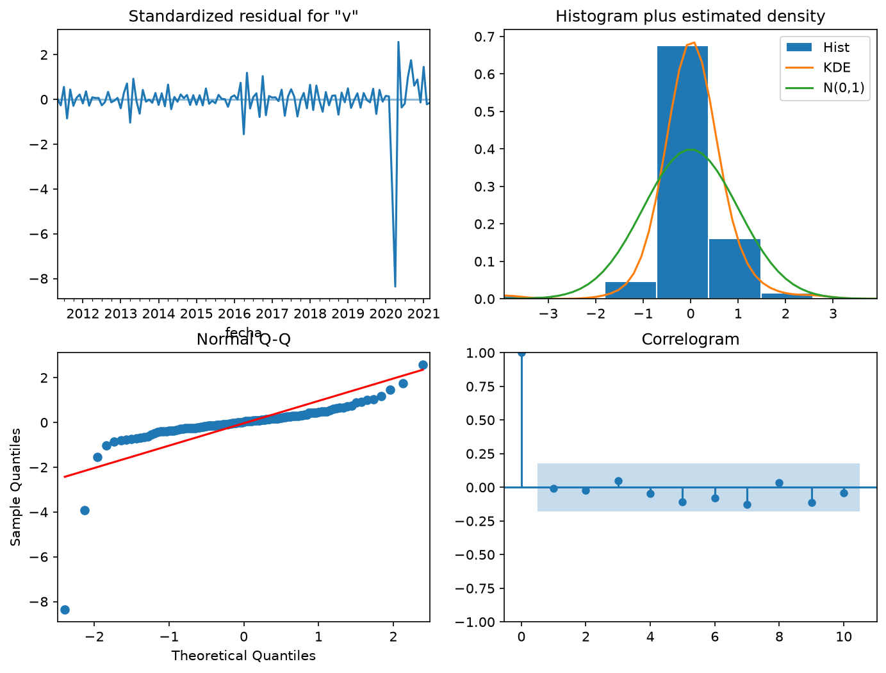

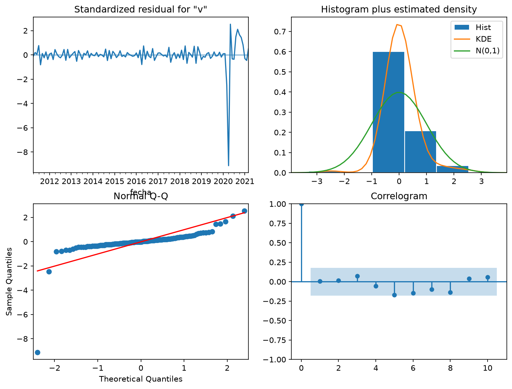

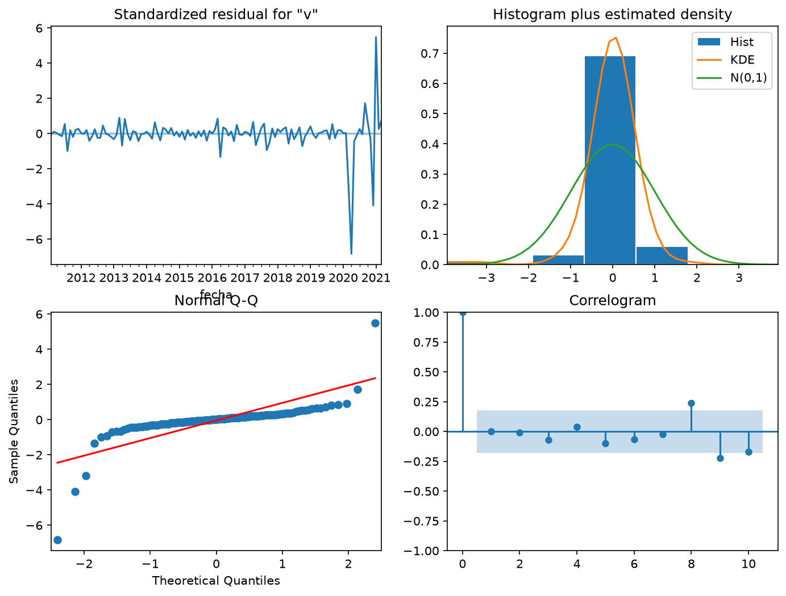

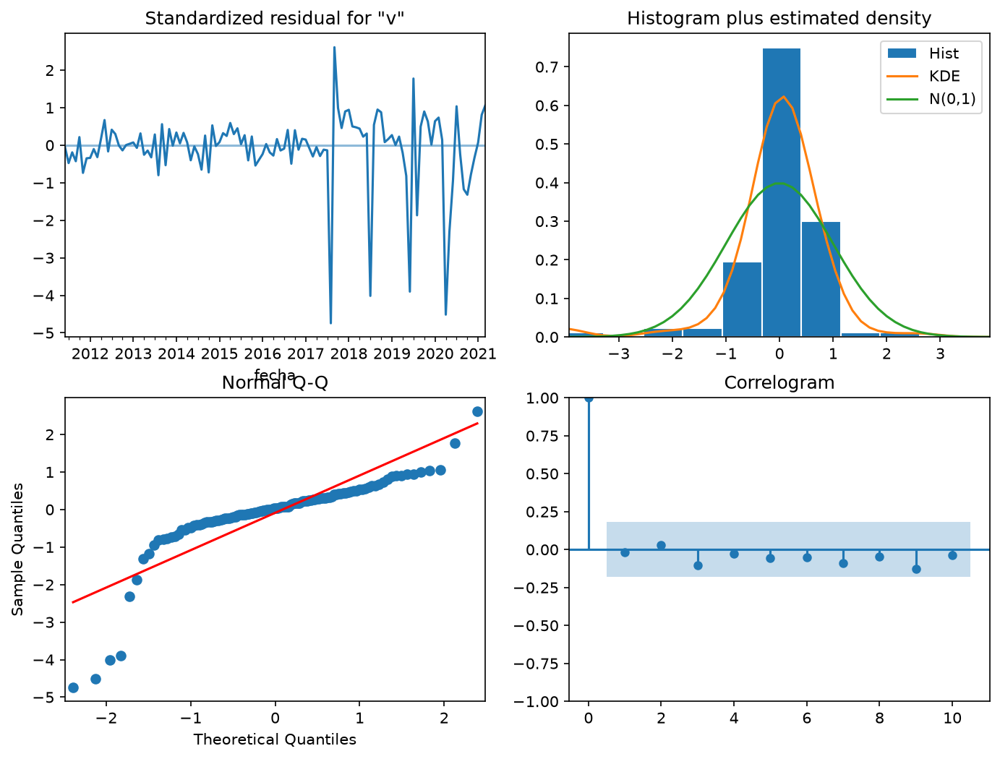

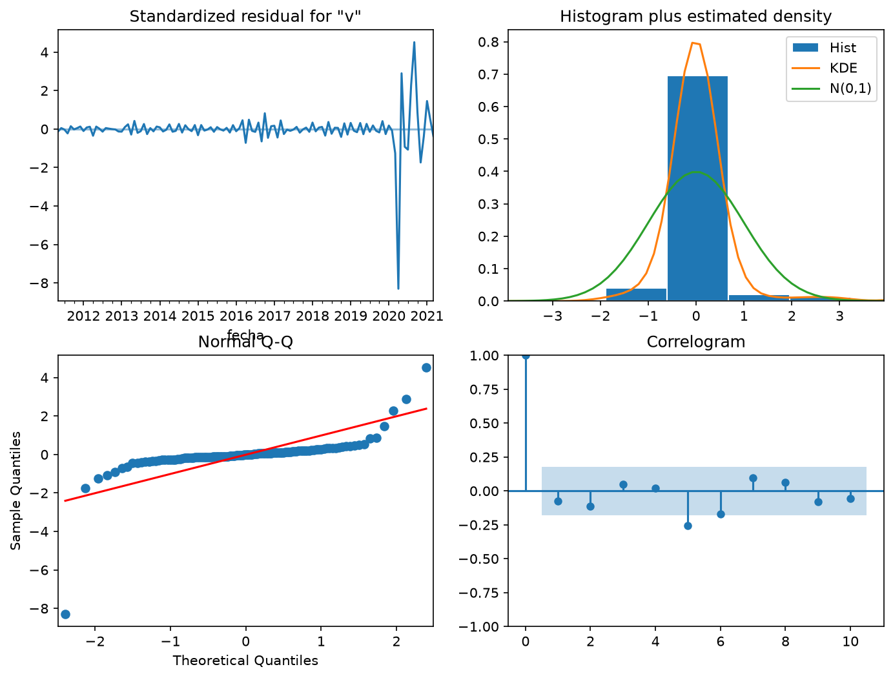

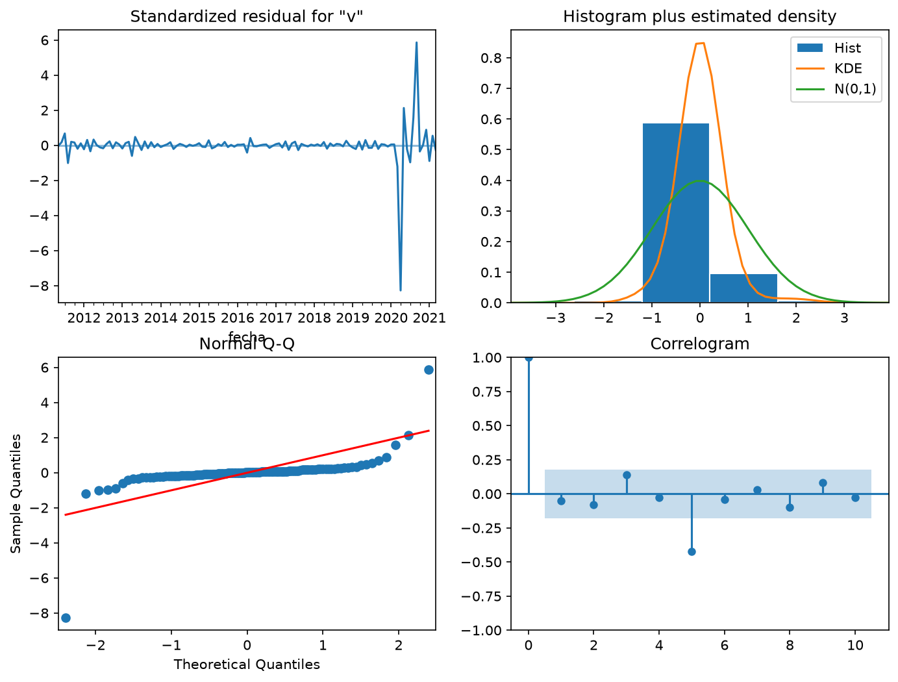

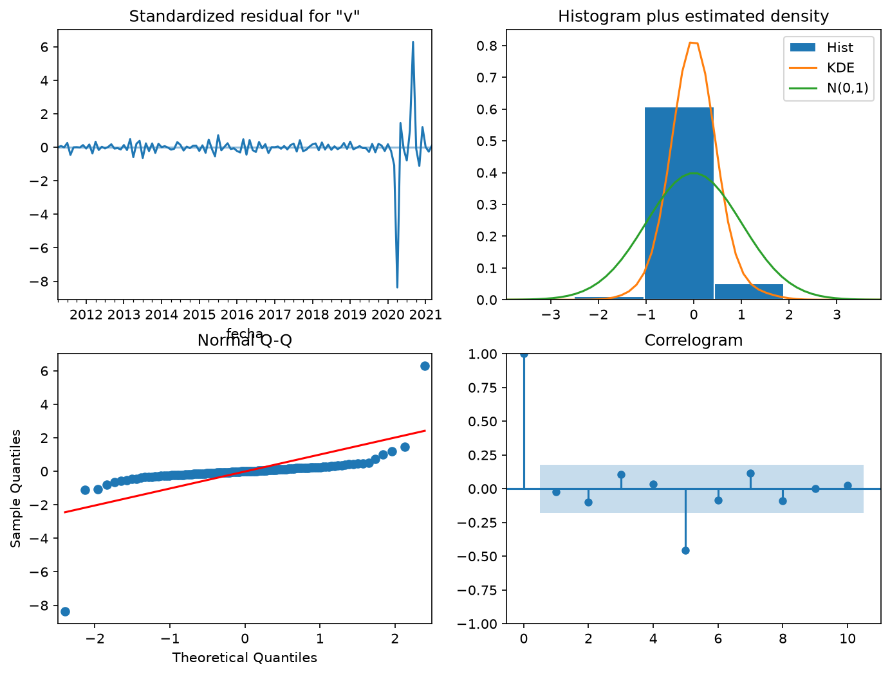

Además del AIC, la selección exige que el pronóstico a 63 pasos, revertido
a viajeros, no supere tres veces el máximo histórico de la serie. El filtro
es necesario porque el ajuste se hizo sin restricciones de estacionariedad
ni de invertibilidad, de modo que la rejilla completa pudiera converger. De
las 36 especificaciones ajustadas por serie se descartaron 0 en total, 18 en
vía aérea, 2 en terrestre, 2 en marítima, 1 en El Salvador, 24 en Estados
Unidos y 23 en Honduras. Sin ese criterio, varias especificaciones con buen
AIC habrían producido trayectorias explosivas fuera de muestra.

## Algoritmos alternativos

Holt-Winters usa tendencia y estacionalidad aditivas sobre `log1p`. SES
modela únicamente el nivel suavizado. Seasonal naive repite los últimos
doce meses observados y sirve como referencia simple. Prophet incorpora
estacionalidad anual también sobre `log1p`. Los cuatro algoritmos pudieron
ejecutarse, y sus predicciones se revirtieron a viajeros antes de evaluar.

AIC y BIC solo aparecen para SARIMA. No son comparables entre algoritmos
distintos, ni entre series, porque dependen de la función de verosimilitud,
la muestra y la parametrización.

## Resultados fuera de muestra

| Serie | Modelo | AIC | BIC | MAE | RMSE | MAPE |
|---|---|---:|---:|---:|---:|---:|
| Total | SARIMA | 67.96 | 87.41 | 250,723 | 274,290 | 83.48 % |
| Total | Holt-Winters |  |  | 196,956 | 216,457 | 65.30 % |
| Total | SES |  |  | 175,088 | 194,791 | 58.11 % |
| Total | Seasonal naive |  |  | 235,731 | 253,203 | 83.86 % |
| Total | Prophet |  |  | 264,527 | 282,313 | 92.50 % |
| Vía aérea | SARIMA | 169.72 | 186.40 | 73,966 | 77,680 | 77.57 % |
| Vía aérea | Holt-Winters |  |  | 48,043 | 52,231 | 48.51 % |
| Vía aérea | SES |  |  | 36,109 | 41,368 | 35.62 % |
| Vía aérea | Seasonal naive |  |  | 75,104 | 79,077 | 80.58 % |
| Vía aérea | Prophet |  |  | 89,054 | 92,266 | 93.17 % |
| Vía terrestre | SARIMA | 124.18 | 132.59 | 174,971 | 192,354 | 88.63 % |
| Vía terrestre | Holt-Winters |  |  | 148,023 | 164,246 | 73.92 % |
| Vía terrestre | SES |  |  | 140,428 | 156,310 | 71.75 % |
| Vía terrestre | Seasonal naive |  |  | 160,013 | 176,653 | 83.47 % |
| Vía terrestre | Prophet |  |  | 175,767 | 191,877 | 91.07 % |
| Vía marítima | SARIMA | 498.40 | 515.02 | 858 | 1,732 | 100.00 % |
| Vía marítima | Holt-Winters |  |  | 858 | 1,732 | 100.00 % |
| Vía marítima | SES |  |  | 858 | 1,732 | 100.00 % |
| Vía marítima | Seasonal naive |  |  | 858 | 1,732 | 100.00 % |
| Vía marítima | Prophet |  |  | 784 | 1,645 | 86.12 % |
| El Salvador | SARIMA | 400.62 | 420.07 | 113,109 | 123,010 | 97.70 % |
| El Salvador | Holt-Winters |  |  | 101,044 | 111,527 | 81.05 % |
| El Salvador | SES |  |  | 94,064 | 104,531 | 74.32 % |
| El Salvador | Seasonal naive |  |  | 107,474 | 117,633 | 91.60 % |
| El Salvador | Prophet |  |  | 106,744 | 117,498 | 86.64 % |
| Estados Unidos | SARIMA | 367.14 | 381.03 | 42,093 | 45,541 | 88.57 % |
| Estados Unidos | Holt-Winters |  |  | 34,195 | 37,642 | 69.37 % |
| Estados Unidos | SES |  |  | 25,115 | 28,953 | 49.93 % |
| Estados Unidos | Seasonal naive |  |  | 41,168 | 44,196 | 88.19 % |
| Estados Unidos | Prophet |  |  | 43,686 | 46,870 | 91.73 % |
| Honduras | SARIMA | 359.01 | 375.74 | 21,841 | 24,115 | 90.17 % |
| Honduras | Holt-Winters |  |  | 18,900 | 21,200 | 74.17 % |
| Honduras | SES |  |  | 17,240 | 19,587 | 66.05 % |
| Honduras | Seasonal naive |  |  | 21,190 | 23,244 | 90.95 % |
| Honduras | Prophet |  |  | 21,239 | 23,497 | 86.70 % |

El MAPE marítimo excluye 11 meses del test con valor real igual a cero. En
las demás series no fue necesario excluir observaciones.

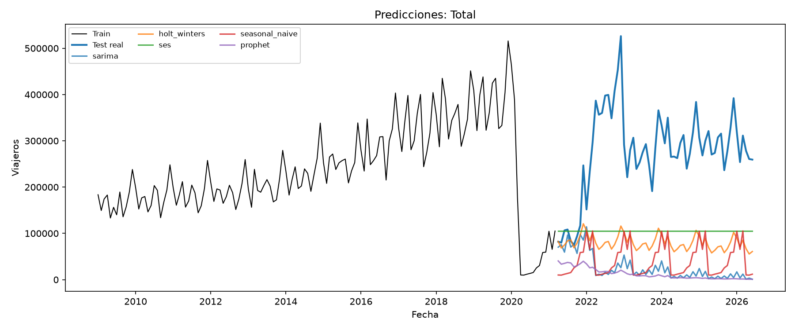

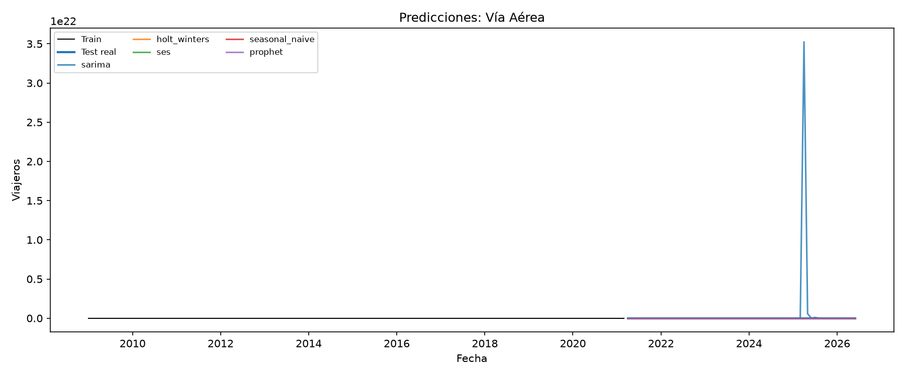

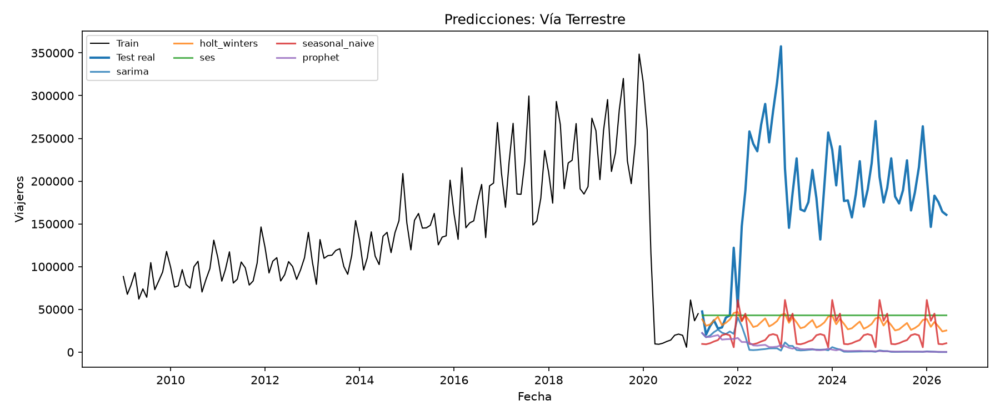

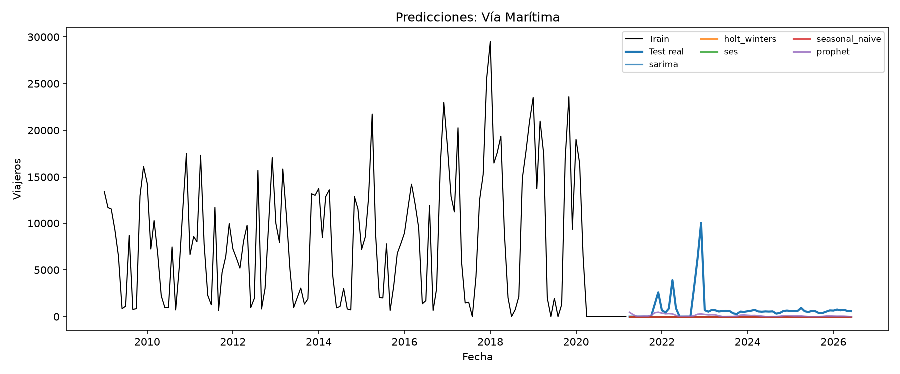

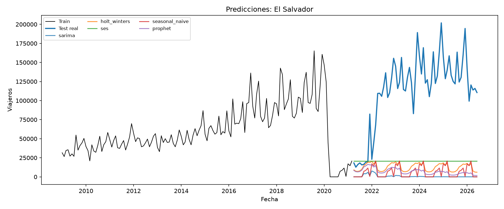

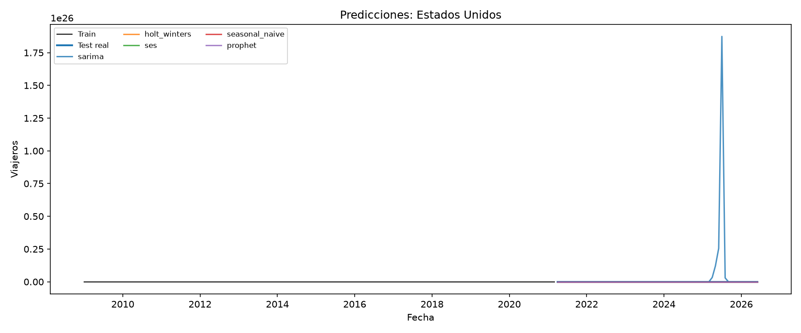

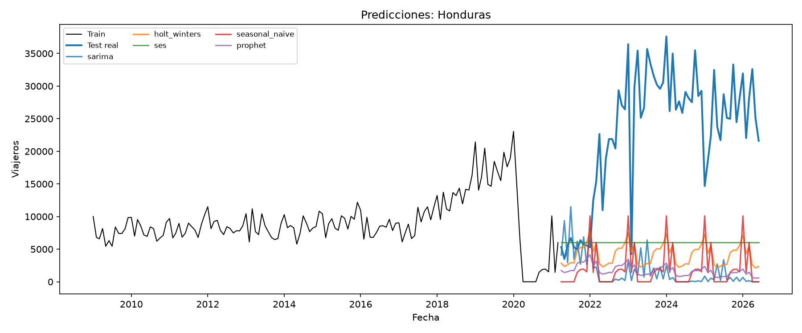

## Modelo seleccionado por serie

| Serie | Mejor modelo | MAE | RMSE | Evaluación |
|---|---|---:|---:|---|
| Total | SES | 175,088 | 194,791 | Error alto, subpredice la recuperación |
| Vía aérea | SES | 36,109 | 41,368 | Mejor resultado relativo, aún insuficiente |
| Vía terrestre | SES | 140,428 | 156,310 | Error alto por cambio de nivel |
| Vía marítima | Prophet | 784 | 1,645 | Menor error absoluto, MAPE todavía alto |
| El Salvador | SES | 94,064 | 104,531 | Baja precisión operativa |
| Estados Unidos | SES | 25,115 | 28,953 | Supera alternativas, pero MAPE cercano a 50 % |
| Honduras | SES | 17,240 | 19,587 | Mejor del grupo, con error relativo alto |

SES gana en seis series porque el final del entrenamiento está dominado por
la pandemia y un modelo de nivel evita extrapolaciones complejas. Esto no
significa que describa bien la recuperación. Los MAPE entre 35.62 % y
74.32 % de esos ganadores muestran que la capacidad predictiva sigue siendo
limitada. El SARIMA estable de vía aérea y de Estados Unidos ya no diverge,
pero sus MAE de 73,966 y 42,093 viajeros siguen por encima de SES.

Prophet es el mejor en marítima, pero su MAPE es 86.12 %. Los otros métodos
producen valores cercanos a cero debido al cierre observado al final del
train. Por eso no aparece la sobrepredicción masiva esperable de un modelo
que extrapolara el nivel prepandemia. El riesgo estructural permanece:
después de 26,030 viajeros en 2022, la serie cae a 6,617 en 2023, 6,605 en
2024 y 6,944 en 2025. Un ajuste que aprendiera el nivel histórico
sobrepredeciría ese régimen.

En conjunto, el corte explica los resultados. El entrenamiento termina en
marzo de 2021, con el choque pandémico incluido y la recuperación excluida.
La mayoría de los modelos subpredice la reapertura, mientras marítima exige
tratar por separado sus ceros y su ruptura de 2023. Las predicciones sirven
como evaluación honesta de ese diseño, no como pronósticos operativos
definitivos.

\newpage

# 6. Análisis comparativo

## Criterio de comparación

La comparación entre series exige métricas explícitas, porque la inspección
visual favorece siempre a las series de mayor volumen. Cada pregunta se
responde con un número calculado bajo la misma definición para las siete
series en `notebooks/07_comparativo.ipynb`, y los resultados quedan en
`resultados/comparativo_series.csv`.

La estacionalidad se mide con la fuerza estacional de la descomposición
aditiva de `log1p` del entrenamiento con periodo 12, definida como uno menos
la razón entre la varianza del residuo y la varianza del componente
estacional más el residuo. Toma valores entre 0 y 1, y un valor alto indica
que la señal anual explica buena parte de la variación que no captura la
tendencia. Se complementa con la amplitud de los factores estacionales
prepandemia ya reportada en la sección 4. La fuerza de tendencia se calcula
de forma análoga sobre el componente de tendencia.

La tendencia de crecimiento se estima con la pendiente de una regresión
lineal sobre el tramo de enero de 2009 a diciembre de 2019. La pandemia se
excluye porque una caída del orden del 97 % domina cualquier ajuste lineal y
convierte la pendiente en una medida del choque y no del crecimiento. La
pendiente se reporta en viajeros por mes y también como porcentaje de la
media del tramo, ya que en términos absolutos las series de mayor volumen
ganan por construcción.

La volatilidad usa dos medidas sobre el mismo tramo prepandemia: el
coeficiente de variación, que compara la dispersión con el nivel medio, y la
desviación estándar de los retornos logarítmicos mensuales, que mide el
tamaño típico del salto de un mes al siguiente. Las dos no tienen que
coincidir y su discrepancia es informativa.

El impacto pandémico combina profundidad y velocidad. La profundidad es la
caída porcentual del mínimo entre enero de 2020 y diciembre de 2021 respecto
de la media de 2019. La velocidad es el primer mes, contado desde abril de
2020, en que la serie alcanza el 80 % de esa media. La segunda métrica es la
que discrimina cuando varias series caen a cero.

| Serie | Fs | Ft | Pendiente (viaj/mes) | Pendiente (% media) | CV | Vol. retornos | Media 2019 | Mínimo pandémico | Caída | Recupera 80 % |
|---|---:|---:|---:|---:|---:|---:|---:|---:|---:|---|
| Total | 0.189 | 0.505 | 1,893 | 0.750 | 0.335 | 0.201 | 390,985 | 9,779 | 97.5 % | 2022-04 |
| Vía aérea | 0.142 | 0.241 | 407 | 0.428 | 0.216 | 0.171 | 123,615 | 489 | 99.6 % | 2021-12 |
| Vía terrestre | 0.169 | 0.653 | 1,448 | 0.974 | 0.431 | 0.236 | 256,470 | 5,715 | 97.8 % | 2022-04 |
| Vía marítima | 0.405 | 0.690 | 38 | 0.444 | 0.790 | 2.185 | 10,899 | 0 | 100 % | 2022-12 |
| El Salvador | 0.105 | 0.185 | 641 | 0.978 | 0.453 | 0.267 | 114,256 | 0 | 100 % | 2022-04 |
| Estados Unidos | 0.109 | 0.107 | 112 | 0.374 | 0.300 | 0.318 | 38,729 | 0 | 100 % | 2021-12 |
| Honduras | 0.119 | 0.116 | 56 | 0.579 | 0.335 | 0.219 | 17,402 | 0 | 100 % | 2022-03 |

La serie total aparece como referencia. Las comparaciones se hacen dentro de
cada categoría, porque la total es una suma de las vías y no compite con
ellas.

## Categoría vías de ingreso

La vía marítima es la más estacional, y por un margen que no admite duda: su
fuerza estacional es 0.405, más del doble que la de la terrestre, 0.169, y
casi el triple que la de la aérea, 0.142. La amplitud de sus factores
prepandemia lo confirma, 3.273 en logaritmos frente a 0.578 y 0.953. La
figura `comp_estacionalidad.png` muestra el origen del contraste: los
cruceros operan entre noviembre y abril, con factor de 3.328 en diciembre, y
prácticamente desaparecen entre junio y septiembre, con 0.153 en junio. Las
otras dos vías oscilan en una banda estrecha alrededor de la unidad, con el
mismo pico de diciembre y un valle poco profundo.

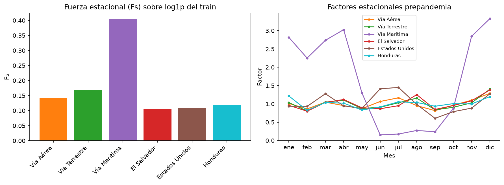

En crecimiento gana la vía terrestre. Su pendiente prepandemia es de 1,448
viajeros por mes, equivalente a 0.974 % de su media mensual, y su fuerza de
tendencia, 0.653, es la más alta de la categoría. Es el único caso en que la
medida absoluta y la normalizada coinciden en el ganador, lo que refuerza la
conclusión. La marítima ilustra el riesgo de mirar solo la absoluta: sus 38
viajeros por mes parecen despreciables frente a los 407 de la aérea, pero
normalizados son 0.444 % contra 0.428 %, es decir, un ritmo relativo muy
similar. La figura `comp_tendencia.png` contrasta las dos lecturas.

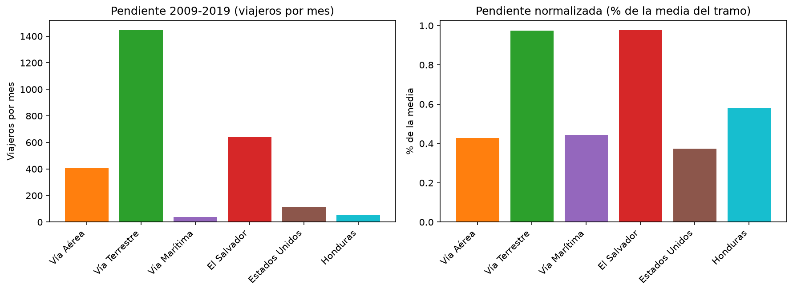

La marítima también es la más volátil, y aquí las dos medidas concuerdan en
el orden: coeficiente de variación de 0.790 frente a 0.431 de la terrestre y
0.216 de la aérea, y desviación de retornos de 2.185 frente a 0.236 y 0.171.
La distancia en retornos es desproporcionada y conviene explicarla en vez de
presentarla como un hallazgo. La serie acumula 16 observaciones iguales a
cero en el entrenamiento y cuatro de ellas caen dentro del tramo prepandemia
que usa esta métrica: agosto de 2017, julio de 2018, junio y agosto de 2019.
Un mes en cero seguido de un mes con miles de viajeros produce un retorno
logarítmico enorme, de modo que el valor de 2.185 mide en parte la
intermitencia del registro y no solo la variabilidad de la demanda. El
coeficiente de variación, que no depende de la transición entre meses
consecutivos, es la medida más comparable, y también sitúa a la marítima en
primer lugar. La figura `comp_volatilidad.png` contrasta las dos medidas.

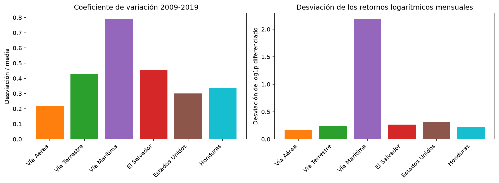

La más afectada por la pandemia es de nuevo la marítima. Cae 100 % contra su
media de 2019 y es la última en cruzar el umbral del 80 %, en diciembre de
2022, doce meses después de la aérea y ocho después de la terrestre. Ese
cruce, sin embargo, no es una recuperación. El umbral es de 8,719 viajeros y
diciembre de 2022 registra 10,042, pero ese mes es un pico aislado dentro de
un año que incluye cuatro meses en cero. El total anual pasa de 130,789
viajeros en 2019 a 26,030 en 2022 y a 6,617, 6,605 y 6,944 entre 2023 y
2025, un nivel veinte veces inferior al prepandemia. La lectura correcta es
un cambio de régimen en el registro de cruceros, y la métrica de velocidad de
recuperación deja de ser válida para esta serie. La figura
`comp_recuperacion.png` muestra la trayectoria plana de la marítima después
de 2023 frente a las demás.

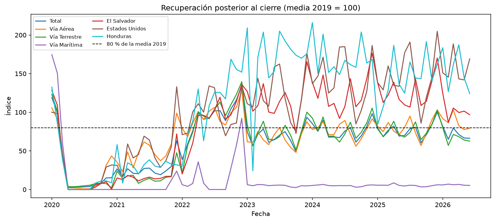

## Categoría países de residencia

En esta categoría conviene empezar por lo que las métricas no permiten
afirmar. Las tres fuerzas estacionales son bajas y casi idénticas: Honduras
0.119, Estados Unidos 0.109 y El Salvador 0.105. Honduras es el máximo, pero
la diferencia con El Salvador es de 0.014 y no sostiene ninguna decisión
operativa. Declarar un ganador sería sobreinterpretar el tercer decimal. Lo
que sí distingue a las series es el calendario y no la intensidad: El
Salvador tiene su pico en diciembre, con factor 1.381, Honduras en enero, con
1.216, y Estados Unidos en julio, con 1.449, y su valle en septiembre, con
0.606. Los dos vecinos centroamericanos siguen el patrón del flujo terrestre
de fin de año, mientras el mercado estadounidense responde al verano boreal.

El Salvador presenta la mayor tendencia de crecimiento, con 0.978 % de su
media por mes, por delante de Honduras, 0.579 %, y de Estados Unidos,
0.374 %. En este caso el orden relativo coincide con el absoluto, 641 contra
56 y 112 viajeros por mes, porque El Salvador es además la serie de mayor
volumen del grupo. Las fuerzas de tendencia de Estados Unidos y Honduras,
0.107 y 0.116, son las más bajas de las siete series, lo que indica
trayectorias en las que la variación estacional y el ruido pesan más que el
crecimiento.

La volatilidad es el caso donde las dos medidas discrepan. El Salvador tiene
el mayor coeficiente de variación, 0.453 frente a 0.335 de Honduras y 0.300
de Estados Unidos, pero Estados Unidos tiene la mayor desviación de retornos,
0.318 frente a 0.267 y 0.219. La explicación está en lo que cada medida
captura. El coeficiente de variación mide la dispersión alrededor de una
media de once años, y El Salvador la infla porque su nivel casi se duplica en
el tramo, de modo que buena parte de esa dispersión es crecimiento y no
inestabilidad. La desviación de retornos mide el salto entre meses
consecutivos, y ahí Estados Unidos gana por su estacionalidad más contrastada
entre julio y septiembre. Para planificación de capacidad interesa la segunda:
el mercado estadounidense es el que exige mayor flexibilidad de un mes al
siguiente. Para evaluar riesgo de nivel interesa la primera.

En profundidad de impacto pandémico no hay diferencia posible. Las tres
series registran cero viajeros de abril a agosto de 2020 por el cierre de
fronteras, así que las tres caen 100 % y la métrica se satura. El desempate
es la velocidad de recuperación, y ahí el orden es claro: Estados Unidos
alcanza el 80 % del nivel de 2019 en diciembre de 2021, Honduras en marzo de
2022 y El Salvador en abril de 2022. Estados Unidos recupera cuatro meses
antes que El Salvador pese a haber caído desde un volumen tres veces menor,
lo que sugiere que el mercado aéreo de larga distancia reaccionó a la
reapertura más rápido que el tráfico fronterizo terrestre.

## Descubrimientos útiles para el INGUAT

1. El volumen depende de la frontera terrestre, pero la estabilidad viene de
   la aérea. La vía terrestre aporta 58.9 % del total entre 2009 y 2019 y
   65.5 % desde abril de 2021, mientras la aérea baja de 37.7 % a 34.2 %. La
   aérea es la vía menos volátil de las tres, con coeficiente de variación de
   0.216 contra 0.431 de la terrestre. La planificación de aforo debe
   dimensionarse por la terrestre, y la de ingresos por gasto turístico
   apoyarse en la aérea, que es más predecible.
2. Existe un calendario operativo común que permite una sola política
   estacional. Diciembre es el mes pico en cinco de las siete series, con
   factores de 1.288 a 3.328, y el valle cae en septiembre o febrero. Las
   excepciones son Estados Unidos, con pico en julio, y Honduras, en enero.
   Septiembre, valle en tres series con factores de 0.802 a 0.606, y febrero,
   valle en las otras tres con factores cercanos a 0.810, son la ventana
   natural para
   mantenimiento de infraestructura, capacitación de personal y campañas de
   temporada baja.
3. Ante un choque, la recuperación llega antes por vía aérea y desde mercados
   lejanos. Estados Unidos y la vía aérea recuperan el 80 % del nivel de 2019
   en diciembre de 2021, cuatro meses antes que El Salvador y la vía
   terrestre. Si vuelve a producirse una interrupción, el orden de prioridad
   de la promoción debería empezar por el mercado aéreo de larga distancia,
   que responde más rápido.
4. El segmento de cruceros no se recuperó y conviene tratarlo como una
   decisión de reasignación, no de reactivación. La vía marítima pasa de
   130,789 viajeros anuales en 2019 a cerca de 6,600 entre 2023 y 2025, con
   meses completos en cero incluso en 2022. Cualquier meta que use el nivel
   prepandemia como referencia para esta vía parte de un supuesto que los
   datos ya rechazan.
5. La operación portuaria es la única que justifica una planificación
   estacional dedicada. Con fuerza estacional de 0.405 y factor de 3.328 en
   diciembre frente a 0.153 en junio, la marítima concentra su actividad en
   pocos meses, mientras las demás series oscilan en una banda estrecha
   alrededor de su media. Un esquema de personal uniforme durante el año es
   razonable en las vías terrestre y aérea, pero no en la marítima.
6. Los modelos ajustados sobre historia que cruza la pandemia no sirven como
   pronóstico operativo. El mejor modelo por serie resultó ser el suavizamiento
   exponencial simple en seis de las siete, con MAPE entre 35.62 % y 74.32 %,
   porque el nivel final del entrenamiento está dominado por el cierre. La
   lectura de política pública es que la planificación cuantitativa debe
   reestimarse con datos posteriores a la reapertura, y que los pronósticos
   basados en la serie completa deben acompañarse de su error, no presentarse
   como cifras puntuales.

\newpage

## Conclusión general

El análisis confirma que el ingreso de viajeros a Guatemala combina un
crecimiento estructural sostenido entre 2009 y 2019, una estacionalidad anual
marcada con pico en diciembre y valle en septiembre, y un choque pandémico
que interrumpió esa trayectoria de forma abrupta. La vía terrestre concentra
la mayoría del flujo, cercana al 61% del total histórico, mientras la vía
aérea aporta un tercio con un comportamiento más estable. El Salvador,
Estados Unidos y Honduras son los mercados de residencia dominantes, cada
uno con un calendario propio: los vecinos centroamericanos siguen el pico de
fin de año, mientras Estados Unidos responde al verano boreal.

El diagnóstico de las siete series y su comparación cuantitativa muestran que
no todas se comportan igual frente al mismo fenómeno. La vía marítima es la
más estacional y la más volátil, y es también la que nunca recuperó su nivel
prepandemia: se estabilizó en una fracción menor de su volumen histórico, un
cambio de régimen y no una recuperación. La vía terrestre lidera el
crecimiento relativo, y dentro de los países El Salvador crece más rápido en
términos porcentuales, aunque Estados Unidos se recupera primero después del
choque de 2020, señal de que los mercados de mayor distancia reaccionan con
más velocidad a la reapertura de fronteras.

En cuanto al modelado, la comparación entre SARIMA, Holt-Winters,
suavizamiento exponencial simple, seasonal naive y Prophet deja una lección
más metodológica que técnica: cuando el entrenamiento termina en medio de un
choque estructural, los modelos favorecen el nivel más simple y estable sobre
extrapolaciones ambiciosas, con errores porcentuales que siguen siendo altos
en todas las series. Esto no invalida el ejercicio, pero sí limita su uso
como pronóstico operativo directo y refuerza la necesidad de reestimar los
modelos con datos posteriores a la recuperación.

Para el INGUAT, los hallazgos apuntan a una agenda concreta: dimensionar la
capacidad fronteriza y hotelera según el patrón estacional común de diciembre
y septiembre, diferenciar la política hacia el segmento marítimo de cruceros
del resto de vías dado su colapso permanente, y priorizar la promoción hacia
mercados aéreos de recuperación más rápida ante un eventual choque futuro. El
valor del ejercicio no está solo en los números individuales, sino en la
evidencia de que cada vía y cada mercado exige su propio diagnóstico antes de
tomar decisiones de política turística.
