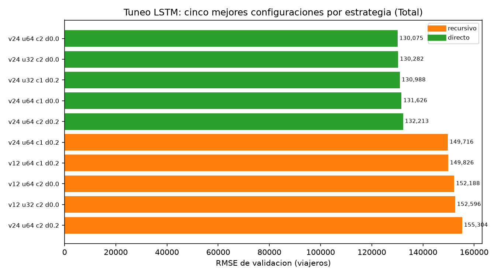
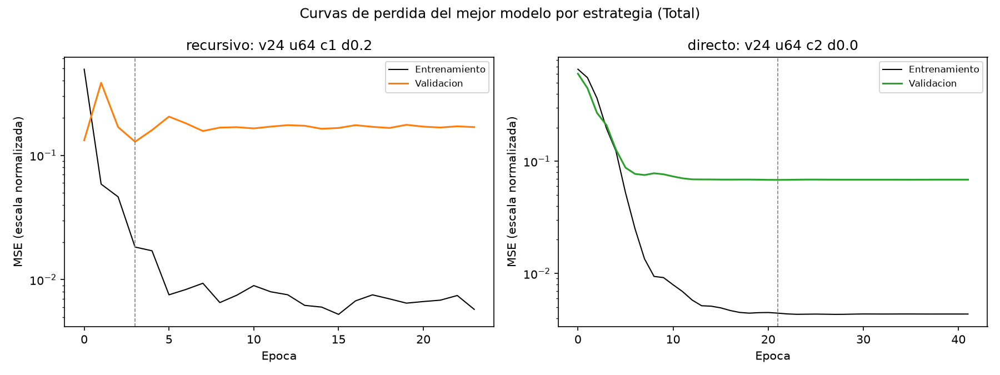
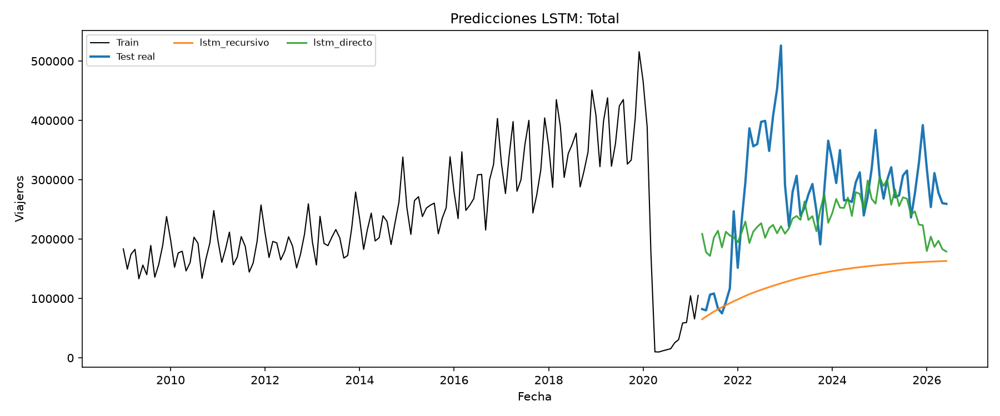
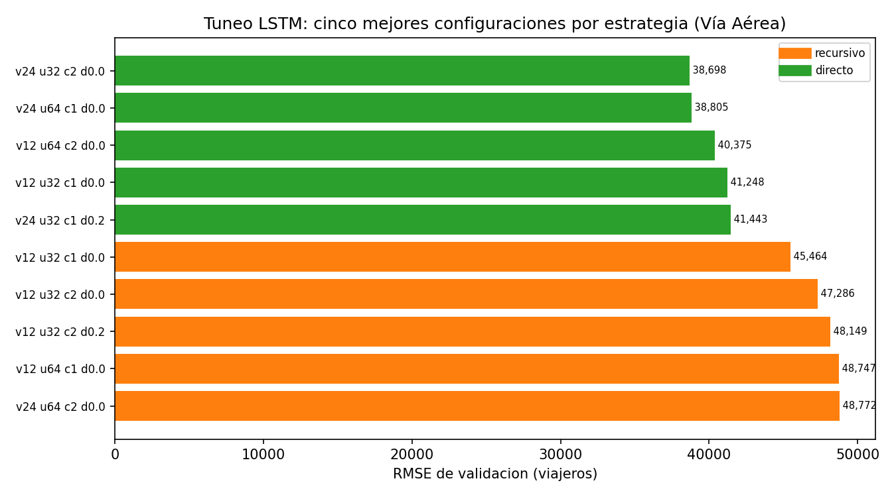
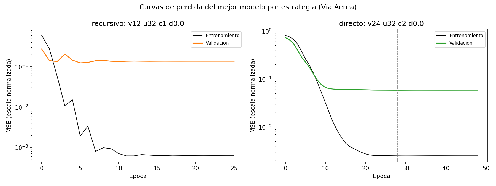
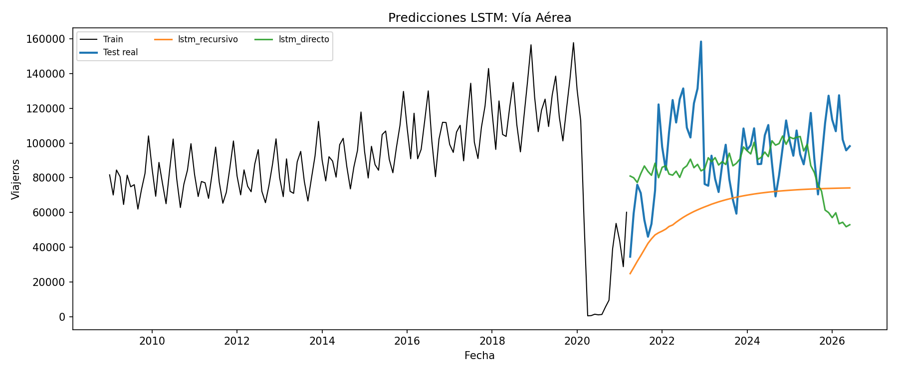

# Universidad del Valle de Guatemala

**Facultad de Ingeniería**
**Departamento de Ciencias de la Computación**
**CC3084 Data Science, Semestre II 2026**

## Laboratorio 2: Redes LSTM

Modelado con redes LSTM de dos series mensuales de viajeros internacionales a Guatemala (total y
vía aérea), con tuneo de hiperparámetros, dos estrategias de pronóstico y comparación contra los
modelos del Laboratorio 1.

**Series analizadas:** total de viajeros y vía aérea, seleccionadas por no tener meses en cero
durante el entrenamiento (requisito de `log1p`) y por contrastar entre sí: total es la peor
predicha del Laboratorio 1 (MAPE 58.11 %) y vía aérea la mejor (MAPE 35.62 %).

**Split:** heredado sin modificaciones del Laboratorio 1: entrenamiento de enero de 2009 a marzo
de 2021 (147 meses) y prueba de abril de 2021 a junio de 2026 (63 meses).

**Integrantes**

| Nombre | Carné |
|---|---|
| Esteban Cárcamo | 23016 |
| Hugo Daniel Barillas | 23556 |
| Ernesto Ascencio | 23009 |

**Fecha:** 30 de julio de 2026
**Repositorio:** https://github.com/ecarcamo/CC3084-DATA-SCIENCE/tree/lab2

\newpage

## Índice

- 1. Metodología LSTM
- 2. Modelado LSTM de la serie total
- 3. Modelado LSTM de la vía aérea
- 4. Análisis comparativo: LSTM contra los modelos del Laboratorio 1

\newpage

# 1. Metodología LSTM

## Series seleccionadas

El Laboratorio 1 construyó siete series mensuales de viajeros. El enunciado de este laboratorio
pide trabajar con dos de ellas, sobre la misma partición, para que la comparación entre familias
de modelos sea directa.

El criterio de descarte fue la presencia de meses en cero dentro del entrenamiento. Un cero obliga
a `log1p` a devolver 0 y arrastra el mínimo del escalador hasta ese punto, lo que comprime el resto
de la serie, y además deja el MAPE indefinido en esos meses. Solo tres series cumplen la condición:
total, vía aérea y vía terrestre. Vía marítima acumula 16 ceros en entrenamiento y las tres series
por país de residencia acumulan 5 cada una.

De las tres candidatas se descartó vía terrestre. Total y vía aérea ya tenían análisis preliminar
propio en `notebooks/03_series_preliminar.ipynb`, y contrastan mejor entre sí: total es la serie
agregada de referencia y la que peor se predijo en el Laboratorio 1, con un MAPE de 58.11 % en el
mejor modelo, mientras que vía aérea fue la mejor predicha, con 35.62 %. Las dos ponen a prueba la
red en condiciones distintas.

| Serie | Ceros en train | Mejor modelo del Lab 1 | MAE | RMSE | MAPE |
|---|---:|---|---:|---:|---:|
| Total | 0 | SES | 175,088 | 194,791 | 58.11 % |
| Vía aérea | 0 | SES | 36,109 | 41,368 | 35.62 % |

La partición es la del Laboratorio 1 y no se rehace: entrenamiento de enero de 2009 a marzo de 2021
(147 meses) y prueba de abril de 2021 a junio de 2026 (63 meses). El conjunto de prueba no
interviene en ninguna etapa del ajuste ni del tuneo.

## Preprocesamiento

La transformación es la misma del Laboratorio 1, `log1p`, lo que mantiene comparables los dos
conjuntos de resultados. Estabiliza la varianza, que en estas series crece con el nivel, y tolera
valores en cero.

Sobre la serie transformada se ajusta un `MinMaxScaler` que lleva el entrenamiento al intervalo
[0, 1], rango en el que la LSTM converge sin saturar sus activaciones. El escalador se ajusta
únicamente con las 147 observaciones de entrenamiento. Para la serie total sus límites son 9.1881 y
13.1535 en escala `log1p`, exactamente el mínimo y el máximo del entrenamiento; uno de los 63 meses
de prueba cae fuera de ese intervalo al transformarse, prueba de que el escalador nunca lo vio.

La reversión de cualquier pronóstico aplica `inverse_transform`, luego `expm1` y finalmente un
recorte en cero, porque un conteo de viajeros negativo no tiene sentido.

## Ventaneo y tamaño de la muestra

La red se alimenta con ventanas deslizantes sobre el vector escalado. Cada observación de
entrenamiento es una secuencia de `ventana` meses consecutivos y su objetivo son los
`horizonte_salida` meses siguientes. Las ventanas se construyen en orden temporal y no se barajan.

| Estrategia | Ventana | Ventanas totales | Ajuste | Validación |
|---|---:|---:|---:|---:|
| Recursiva | 12 | 135 | 115 | 20 |
| Recursiva | 24 | 123 | 105 | 18 |
| Directa | 12 | 73 | 62 | 11 |
| Directa | 24 | 61 | 52 | 9 |

El tamaño de muestra es la restricción dominante del laboratorio. Con 147 observaciones mensuales,
la estrategia directa dispone de 73 ventanas con ventana de 12 meses, una cifra baja para una red
recurrente, y eso acota tanto la profundidad de la arquitectura como el tamaño de la rejilla.

## Estrategias de pronóstico

El horizonte de 63 meses se cubre de dos formas, y el laboratorio las compara en lugar de suponer
cuál conviene.

La estrategia recursiva entrena un modelo de un paso, `Dense(1)`, y realimenta cada predicción como
último elemento de la ventana para producir la siguiente. Aprovecha las 135 ventanas disponibles,
pero acumula error a lo largo de 63 iteraciones: cualquier sesgo inicial se propaga y la trayectoria
tiende a aplanarse.

La estrategia directa entrena un modelo con salida `Dense(63)` que emite el horizonte completo en
una sola pasada. No acumula error, pero aprende 63 salidas con apenas 73 ventanas y multiplica los
parámetros de la capa densa.

## Validación y criterio de selección

La validación es el último 15 % de las ventanas, tomado en orden temporal y sin barajar, de modo
que el modelo se evalúa siempre sobre meses posteriores a los que vio. El entrenamiento usa Adam
con tasa de aprendizaje 1e-3, pérdida `mse` y hasta 300 épocas, con `EarlyStopping` de paciencia 20
sobre `val_loss` y restauración de los mejores pesos. Se registra el número de épocas efectivas de
cada combinación.

El error de validación se calcula en viajeros, no en escala escalada, y con la misma mecánica que
se usará en el test:

- En la estrategia recursiva se toman los meses previos al tramo de validación como contexto y se
  pronostica recursivamente el tramo completo. Así se tunea contra el error multi-paso, que es el
  objetivo real, y no contra el error a un paso, que siempre parece bueno.
- En la estrategia directa se evalúan todas las ventanas de validación, cada una con sus 63 salidas,
  y el error se calcula sobre el conjunto completo de predicciones revertidas.

Se selecciona la combinación de menor `rmse_val`; si ninguna converge, la de menor `val_loss`. Este
`rmse_val` solo ordena configuraciones **dentro** de una misma estrategia, porque el tramo evaluado
no es el mismo en las dos: veinte meses consecutivos en la recursiva frente a once ventanas de 63
valores en la directa. La comparación entre estrategias se resuelve hasta el conjunto de prueba,
con las mismas métricas del Laboratorio 1.

La configuración ganadora se reentrena sobre las 147 observaciones completas, ya sin partición de
validación, fijando las épocas en las efectivas registradas durante el tuneo. Ese modelo produce el
pronóstico de los 63 meses de prueba.

## Rejilla de hiperparámetros

La rejilla es idéntica para las dos series y las dos estrategias, y se recorre por producto
cartesiano con `itertools`, igual que la rejilla SARIMA del Laboratorio 1.

| Hiperparámetro | Valores |
|---|---|
| Ventana | 12, 24 |
| Unidades por capa | 32, 64 |
| Capas LSTM | 1, 2 |
| Dropout | 0.0, 0.2 |
| Tasa de aprendizaje | 1e-3 |
| Tamaño de lote | 16 |

Son 16 combinaciones por estrategia, 32 por serie y 64 ajustes en el laboratorio, muy por encima
del mínimo de dos configuraciones distintas que pide el enunciado. Dos de ellas se destacan como
referencias de arquitectura: la LSTM de una capa con 32 unidades y sin dropout, que es el modelo
más pequeño, y la apilada de dos capas con 64 unidades y dropout 0.2, que es el más grande.

Las ventanas de 12 y 24 meses cubren uno y dos ciclos estacionales completos, la dimensión relevante
en series mensuales de turismo. El resto de valores se mantuvo acotado por dos razones: la muestra
es pequeña y arquitecturas mayores sobreajustan, y TensorFlow no dispone de GPU en Windows nativo
desde la versión 2.11, de modo que todo el laboratorio corre en CPU. Cada ajuste toma entre ocho y
doce segundos según la ventana y el número de capas, lo que sitúa cada rejilla completa en el orden
de tres minutos.

## Reproducibilidad

El enunciado exige que los resultados sean reproducibles. Antes de cada ajuste se fija la semilla 42
con `keras.utils.set_random_seed`, que cubre los generadores de Python, NumPy y TensorFlow, y se
activa `tf.config.experimental.enable_op_determinism()`, que elimina el no determinismo de las
operaciones sobre CPU. La sesión de Keras se limpia entre combinaciones para que los grafos no se
acumulen a lo largo de la rejilla.

Con eso, dos ejecuciones seguidas de `notebooks/08_lstm_preparacion.ipynb` devuelven exactamente los
mismos valores de `val_loss`, `mae_val`, `rmse_val` y épocas efectivas. Ese cuaderno documenta el
protocolo, verifica los conteos de ventanas y comprueba la ausencia de fuga de información antes de
que los cuadernos 09 y 10 ejecuten la rejilla completa.

\newpage

# 2. Modelado LSTM de la serie total

La serie total es la agregada de referencia del estudio y la peor predicha del Laboratorio 1, con
un MAPE de 58.11 % en su mejor modelo. Todo lo que sigue está en `notebooks/09_lstm_total.ipynb`,
sobre el protocolo descrito en la sección 1 y con el split del Laboratorio 1 sin modificar:
entrenamiento de enero de 2009 a marzo de 2021, 147 meses, y prueba de abril de 2021 a junio de
2026, 63 meses.

## La rejilla ejecutada y su costo

Se recorrieron las 16 combinaciones de la rejilla para cada una de las dos estrategias, 32 ajustes
en total. La rejilla completa costó 1.9 minutos de CPU, entre 2.8 y 5.8 segundos por ajuste, y el
detalle de las 32 filas quedó en `resultados/lstm_tuneo_total.csv`.

Ninguna combinación falló. Las 32 entrenaron hasta que `EarlyStopping` las detuvo, restauraron sus
mejores pesos y produjeron un pronóstico finito; el bloque de captura de excepciones de `grid_lstm`
no se activó ni una vez y no hay filas con `rmse_val` infinito. Tampoco hubo pronósticos negativos
ni valores nulos.

Lo que sí hubo fue estancamiento, y conviene reportarlo porque afecta la lectura de los resultados.
Las 16 combinaciones de la estrategia recursiva pararon entre las épocas 21 y 25, y como la
paciencia del `EarlyStopping` es de 20 épocas, eso significa que su mejor época de validación estuvo
entre la 1 y la 5. El modelo de un paso alcanza su mejor error de validación casi de inmediato y
después solo mejora sobre el entrenamiento. Las combinaciones directas se comportaron mejor: épocas
efectivas entre 28 y 78, con la mejor época entre la 8 y la 58.

## Configuraciones seleccionadas

| Estrategia | Ventana | Unidades | Capas | Dropout | Épocas efectivas | Parámetros | MAE val. | RMSE val. |
|---|---:|---:|---:|---:|---:|---:|---:|---:|
| Recursiva | 24 | 64 | 1 | 0.2 | 24 | 16,961 | 121,320 | 149,716 |
| Directa | 24 | 64 | 2 | 0.0 | 42 | 54,015 | 97,483 | 130,075 |

Las dos ganadoras coinciden en la ventana de 24 meses y en las 64 unidades por capa, y se separan
en la profundidad y la regularización: la recursiva prefiere una sola capa con dropout de 0.2 y la
directa dos capas sin dropout. Los dos valores de `rmse_val` de la tabla no son comparables entre
sí, porque cada estrategia valida sobre un tramo distinto; la comparación entre estrategias se
resuelve en el test.

Dentro de cada estrategia, en cambio, la dispersión sí es informativa. Entre la mejor y la peor
configuración recursiva hay un 39.9 % de diferencia en `rmse_val`, de 149,716 a 209,463 viajeros.
Entre la mejor y la peor directa hay un 15.3 %, de 130,075 a 149,939. La elección de
hiperparámetros importa más cuando el error se realimenta 63 veces.

### Las dos arquitecturas de referencia

El enunciado pide al menos dos modelos con configuraciones distintas por serie. La rejilla contiene
16 por estrategia, y dos de ellas delimitan el rango de arquitecturas exploradas: la LSTM de una
capa con 32 unidades y sin dropout, la más pequeña, y la apilada de dos capas con 64 unidades y
dropout 0.2, la más grande.

| Estrategia | Arquitectura | Ventana | Parámetros | RMSE val. |
|---|---|---:|---:|---:|
| Recursiva | 1 capa, 32 unidades, dropout 0.0 | 24 | 4,385 | 187,605 |
| Recursiva | 2 capas, 64 unidades, dropout 0.2 | 24 | 49,985 | 155,304 |
| Directa | 1 capa, 32 unidades, dropout 0.0 | 24 | 6,431 | 136,507 |
| Directa | 2 capas, 64 unidades, dropout 0.2 | 24 | 54,015 | 132,213 |

El contraste entre las dos arquitecturas depende de la estrategia. En la recursiva la arquitectura
mayor mejora el error de validación en 17 %; en la directa la diferencia baja a 3 %. La salida
`Dense(63)` ya concentra la mayor parte de la capacidad del modelo directo, y agregar profundidad
recurrente aporta poco.

## Qué hiperparámetro movió el error

La comparación toma la mediana de `rmse_val` entre los dos valores de cada hiperparámetro, dentro
de cada estrategia, para que un solo ajuste afortunado no defina la lectura.

| Estrategia | Hiperparámetro | Valor bajo | RMSE val. | Valor alto | RMSE val. | Brecha |
|---|---|---:|---:|---:|---:|---:|
| Recursiva | Unidades | 32 | 180,907 | 64 | 155,652 | 16.2 % |
| Recursiva | Dropout | 0.0 | 181,810 | 0.2 | 162,257 | 12.1 % |
| Recursiva | Capas | 1 | 175,112 | 2 | 156,732 | 11.7 % |
| Recursiva | Ventana | 12 | 162,257 | 24 | 171,988 | 6.0 % |
| Directa | Ventana | 12 | 138,634 | 24 | 131,920 | 5.1 % |
| Directa | Dropout | 0.0 | 135,615 | 0.2 | 139,625 | 3.0 % |
| Directa | Unidades | 32 | 138,971 | 64 | 135,615 | 2.5 % |
| Directa | Capas | 1 | 137,244 | 2 | 136,215 | 0.8 % |

En la estrategia recursiva manda el número de unidades, con una brecha de 16.2 % a favor de 64,
seguido del dropout, 12.1 % a favor de 0.2, y del número de capas, 11.7 % a favor de dos. Los tres
apuntan en la misma dirección: un modelo de un paso que se realimentará 63 veces necesita capacidad
y regularización, porque cualquier sesgo sistemático se acumula a lo largo del horizonte. La
ventana es el único hiperparámetro cuya mediana favorece al valor bajo, 12 meses, aunque la
configuración ganadora usa 24; la brecha de 6.0 % en la mediana convive con el mejor resultado
individual en el otro extremo, señal de que la ventana interactúa con el resto y no domina por sí
sola.

En la estrategia directa el orden se invierte y todas las brechas se achican. Manda la ventana, con
5.1 % a favor de 24 meses, y el resto queda por debajo del 3 %. El número de capas es
prácticamente irrelevante, con 0.8 %. Con la salida completa emitida en una sola pasada, lo
determinante es cuánta historia ve la red, no cuán profunda es.

La figura muestra las cinco mejores de cada estrategia y no las diez mejores del conjunto, porque
`rmse_val` no es comparable entre estrategias: la recursiva se valida sobre veinte meses
consecutivos y la directa sobre once ventanas de 63 valores cada una. Un ranking global mezclaría
dos escalas distintas.

## Curvas de entrenamiento

Las dos curvas describen problemas distintos. En la recursiva la pérdida de validación toca su
mínimo en la época 4, en 0.129, y a partir de ahí se queda plana mientras la de entrenamiento sigue
bajando hasta 0.006, más de veinte veces menor. Es sobreajuste puro desde la quinta época: el
modelo memoriza las 105 ventanas de ajuste sin mejorar su capacidad de generalizar. En la directa
la validación baja durante una docena de épocas hasta 0.068 y a partir de ahí apenas se mueve,
con su mínimo formal en la época 22, mientras la de entrenamiento termina en 0.004; la brecha final
es de 16 veces en lugar de 22 y hay más aprendizaje real antes del estancamiento.

La lectura práctica es que el `EarlyStopping` con paciencia 20 hizo su trabajo en las dos
estrategias, y que ampliar el número máximo de épocas no habría cambiado nada: ninguna de las 32
combinaciones se acercó al tope de 300.

## Predicción sobre el test

Cada configuración ganadora se reentrenó sobre las 147 observaciones completas, sin partición de
validación, con las épocas fijadas en las efectivas del tuneo, y ese modelo produjo los 63 meses de
prueba. Las dos predicciones están en `resultados/predicciones/total_lstm_recursivo.csv` y
`total_lstm_directo.csv`.

| Modelo | MAE | RMSE | MAPE | Media pronosticada | Sesgo medio |
|---|---:|---:|---:|---:|---:|
| lstm_recursivo | 143,303 | 164,706 | 46.90 % | 133,712 | −142,973 |
| lstm_directo | **76,957** | **100,290** | **33.76 %** | 232,356 | −44,329 |

El test real promedia 276,685 viajeros mensuales. La estrategia directa gana en las tres métricas:
46.30 % menos MAE, 39.11 % menos RMSE y 13.13 puntos porcentuales menos de MAPE. La diferencia es
demasiado grande para atribuirla al azar del ajuste y no se explica por la muestra, porque la
estrategia directa entrena con menos de la mitad de las ventanas, 61 contra 123 con ventana de 24
meses. Se explica por el sesgo: la recursiva subestima 62 de los 63 meses, con un error medio de
−142,973 viajeros, un 51.7 % del nivel medio del test, mientras que la directa subestima 45 de 63,
con −44,329, un 16.0 %. Realimentar 63 veces un modelo entrenado con datos que terminan en el punto
más bajo de la pandemia arrastra el pronóstico hacia ese nivel, y ni la ventana de 24 meses ni las
64 unidades lo evitan. La acumulación de error pesó más que el tamaño de la muestra.

## ¿Reproduce la recuperación pospandemia?

Esta es la pregunta que el Laboratorio 1 dejó abierta, porque los cinco modelos anteriores
subestimaron la recuperación sin excepción.

| Año | Test real | lstm_directo | Diferencia | lstm_recursivo | Diferencia |
|---|---:|---:|---:|---:|---:|
| 2021 (abr-dic) | 110,282 | 198,112 | +79.6 % | 81,033 | −26.5 % |
| 2022 | 359,680 | 213,867 | −40.5 % | 112,870 | −68.6 % |
| 2023 | 270,726 | 236,230 | −12.7 % | 136,809 | −49.5 % |
| 2024 | 299,490 | 263,214 | −12.1 % | 151,202 | −49.5 % |
| 2025 | 299,770 | 263,777 | −12.0 % | 159,088 | −46.9 % |
| 2026 (ene-jun) | 280,439 | 188,390 | −32.8 % | 162,489 | −42.1 % |

La estrategia recursiva no la reproduce, y falla igual que los modelos del Laboratorio 1: su
trayectoria es una curva monótona que sube de 64,931 a 163,165 viajeros y se detiene ahí, sin
estacionalidad visible, entre un 47 % y un 69 % por debajo del real en los cuatro años completos. Su
correlación con el test es de 0.507, de modo que acierta la dirección general y nunca el nivel.

La estrategia directa sí la reproduce parcialmente, y es el primer modelo de esta serie en las dos
entregas que lo consigue. Emite un perfil estacional con picos y valles, alcanza el nivel correcto
desde 2023 y se estabiliza en un error anual de entre 12.0 % y 12.7 % en el tramo 2023-2025. Sus
dos zonas de error son los extremos del horizonte: sobreestima 2021 en 79.6 %, cuando la serie real
todavía estaba deprimida, y se queda 40.5 % corta en el rebote de 2022, el año del pico de 526,190
viajeros que ningún modelo entrenado hasta marzo de 2021 podía anticipar.

## Lectura honesta de la calidad predictiva

El resultado es una mejora sustancial y sigue siendo un pronóstico de calidad limitada. Un MAPE de
33.76 % significa que el error típico es de un tercio del valor real: sirve para dimensionar
órdenes de magnitud y para planificación agregada, no para asignación fina de capacidad sin
intervalos amplios ni reentrenamiento periódico.

Tres reservas que conviene dejar escritas:

La primera es que el modelo no captura el pico de 2022 y ese es justamente el evento de mayor
interés operativo del periodo. Su acierto está en el régimen estable posterior, no en la
transición.

La segunda es que la mejora frente al Laboratorio 1 depende de una coincidencia favorable entre lo
que el modelo aprendió y lo que ocurrió. La LSTM directa reconstruye el patrón prepandemia en lugar
de prolongar el nivel deprimido del final del entrenamiento, y el test resultó ser un retorno a
niveles prepandemia. Si la serie no se hubiera recuperado, esa misma propiedad habría producido una
sobreestimación sistemática y el orden del ranking sería el inverso.

La tercera es de tamaño de muestra. La estrategia ganadora estima 54,015 parámetros con 61
ventanas de entrenamiento, y sus curvas muestran sobreajuste desde la época doce. El resultado del
test es sólido porque el protocolo nunca vio ese tramo, pero la varianza de la estimación es alta y
no debería leerse como una medida precisa de la capacidad de la arquitectura.

\newpage

# 3. Modelado LSTM de la vía aérea

La vía aérea es la serie mejor predicha del Laboratorio 1, con un MAPE de 35.62 % usando SES, la
vía menos volátil (CV de 0.216) y la de recuperación más rápida: alcanzó el 80 % del nivel de 2019
en diciembre de 2021. También es la serie donde 18 de las 36 especificaciones SARIMA se
descartaron por pronóstico explosivo, así que la vara a superar es la más alta de las siete series
y el fracaso de los modelos paramétricos lineales ya está documentado. Todo lo que sigue está en
`notebooks/10_lstm_via_aerea.ipynb`, sobre el protocolo descrito en la sección 1 y con el split del
Laboratorio 1 sin modificar: entrenamiento de enero de 2009 a marzo de 2021, 147 meses, y prueba de
abril de 2021 a junio de 2026, 63 meses.

## La rejilla ejecutada y su costo

Se recorrieron las 16 combinaciones de la rejilla para cada una de las dos estrategias, 32 ajustes
en total. La rejilla completa costó 2.4 minutos de CPU, entre 3.2 y 9.3 segundos por ajuste, y el
detalle de las 32 filas quedó en `resultados/lstm_tuneo_via_aerea.csv`.

Ninguna combinación falló. Las 32 entrenaron hasta que `EarlyStopping` las detuvo, restauraron sus
mejores pesos y produjeron un pronóstico finito; no hay filas con `rmse_val` infinito ni pronósticos
negativos o nulos.

El estancamiento temprano de la estrategia recursiva se repite en esta serie: las 16 combinaciones
pararon entre las épocas 21 y 26, así que con una paciencia de 20 épocas su mejor época de
validación estuvo entre la 1 y la 6. La estrategia directa volvió a comportarse mejor: épocas
efectivas entre 29 y 59, con la mejor época estimada entre la 9 y la 39.

## Configuraciones seleccionadas

| Estrategia | Ventana | Unidades | Capas | Dropout | Épocas efectivas | Parámetros | MAE val. | RMSE val. |
|---|---:|---:|---:|---:|---:|---:|---:|---:|
| Recursiva | 12 | 32 | 1 | 0.0 | 26 | 4,385 | 39,360 | 45,464 |
| Directa | 24 | 32 | 2 | 0.0 | 49 | 14,751 | 25,853 | 38,698 |

Las dos ganadoras coinciden en 32 unidades por capa y en dropout 0.0, y se separan en la ventana y
la profundidad: la recursiva prefiere la ventana corta de 12 meses con una sola capa, y la directa
la ventana larga de 24 meses con dos capas. A diferencia de la serie total, ninguna de las dos
estrategias eligió aquí la configuración más grande de la rejilla (64 unidades, dropout 0.2): la
vía aérea es más regular y no exige esa capacidad extra.

Dentro de cada estrategia la dispersión sigue siendo informativa. Entre la mejor y la peor
configuración recursiva hay un 50.6 % de diferencia en `rmse_val`, de 45,464 a 68,450 viajeros.
Entre la mejor y la peor directa hay un 33.5 %, de 38,698 a 51,648.

### Las dos arquitecturas de referencia

El enunciado pide al menos dos modelos con configuraciones distintas por serie. La rejilla contiene
16 por estrategia; estas dos delimitan el rango explorado: la LSTM de una capa con 32 unidades y sin
dropout, la más pequeña, y la apilada de dos capas con 64 unidades y dropout 0.2, la más grande.

| Estrategia | Ventana | Arquitectura | Parámetros | RMSE val. |
|---|---:|---|---:|---:|
| Recursiva | 12 | 1 capa, 32 unidades, dropout 0.0 | 4,385 | 45,464 |
| Recursiva | 12 | 2 capas, 64 unidades, dropout 0.2 | 49,985 | 58,576 |
| Recursiva | 24 | 1 capa, 32 unidades, dropout 0.0 | 4,385 | 68,450 |
| Recursiva | 24 | 2 capas, 64 unidades, dropout 0.2 | 49,985 | 50,901 |
| Directa | 12 | 1 capa, 32 unidades, dropout 0.0 | 6,431 | 41,248 |
| Directa | 12 | 2 capas, 64 unidades, dropout 0.2 | 54,015 | 44,593 |
| Directa | 24 | 1 capa, 32 unidades, dropout 0.0 | 6,431 | 44,508 |
| Directa | 24 | 2 capas, 64 unidades, dropout 0.2 | 54,015 | 45,875 |

Aquí el contraste no es monótono como en la serie total. En la estrategia recursiva la arquitectura
grande pierde con ventana de 12 meses (28.8 % peor) pero gana con ventana de 24 (34.5 % mejor): el
efecto de la capacidad depende de cuánta historia ve la red, no solo de su tamaño. En la estrategia
directa la arquitectura pequeña gana en las dos ventanas, aunque por márgenes moderados: 8.1 % con
ventana de 12 y 3.1 % con ventana de 24. Para esta serie, más parámetros no compran de forma
consistente mejor validación.

## Qué hiperparámetro movió el error

La comparación toma la mediana de `rmse_val` entre los dos valores de cada hiperparámetro, dentro
de cada estrategia, para que un solo ajuste afortunado no defina la lectura.

| Estrategia | Hiperparámetro | Valor bajo | RMSE val. | Valor alto | RMSE val. | Brecha |
|---|---|---:|---:|---:|---:|---:|
| Recursiva | Capas | 1 | 56,641 | 2 | 49,337 | 14.8 % |
| Recursiva | Dropout | 0.0 | 48,979 | 0.2 | 51,233 | 4.6 % |
| Recursiva | Ventana | 12 | 49,155 | 24 | 51,233 | 4.2 % |
| Recursiva | Unidades | 32 | 49,337 | 64 | 50,461 | 2.3 % |
| Directa | Dropout | 0.0 | 42,102 | 0.2 | 45,234 | 7.4 % |
| Directa | Capas | 1 | 43,629 | 2 | 45,072 | 3.3 % |
| Directa | Ventana | 12 | 44,754 | 24 | 43,963 | 1.8 % |
| Directa | Unidades | 32 | 44,712 | 64 | 43,963 | 1.7 % |

En la estrategia recursiva el factor dominante es el número de capas, con 14.8 % a favor de dos
capas; le siguen el dropout, 4.6 % a favor de 0.0, y la ventana, 4.2 % a favor de 12 meses. El orden
es distinto al de la serie total, donde mandaban las unidades: aquí una segunda capa recurrente
ayuda más que ensanchar la primera.

En la estrategia directa manda el dropout, con 7.4 % a favor de 0.0, y el resto queda por debajo
del 3.5 %. La regularización explícita no aporta en una serie ya de por sí menos volátil: con 147
observaciones y una serie estable, el dropout resta capacidad sin compensarla con menos sobreajuste.

La figura muestra las cinco mejores de cada estrategia y no las diez mejores del conjunto, porque
`rmse_val` no es comparable entre estrategias: la recursiva se valida sobre un tramo consecutivo y
la directa sobre varias ventanas de 63 valores cada una.

## Curvas de entrenamiento

Las dos curvas describen el mismo problema en escalas distintas. En la recursiva la pérdida de
validación toca su mínimo en la época 6, en 0.124, y a partir de ahí se queda plana en 0.137
mientras la de entrenamiento sigue bajando hasta 0.0006, más de doscientas veces menor: sobreajuste
puro desde la sexta época. En la directa la validación baja durante unas 28 épocas hasta 0.058 y
ahí se estabiliza, mientras la de entrenamiento termina en 0.0025; hay más aprendizaje real antes
del estancamiento, igual que en la serie total.

El `EarlyStopping` con paciencia 20 volvió a hacer su trabajo en las dos estrategias: ninguna de las
32 combinaciones se acercó al tope de 300 épocas.

## Predicción sobre el test

Cada configuración ganadora se reentrenó sobre las 147 observaciones completas, sin partición de
validación, con las épocas fijadas en las efectivas del tuneo, y ese modelo produjo los 63 meses de
prueba. Las dos predicciones están en `resultados/predicciones/via_aerea_lstm_recursivo.csv` y
`via_aerea_lstm_directo.csv`.

| Modelo | MAE | RMSE | MAPE | Media pronosticada | Sesgo medio | Correlación con test |
|---|---:|---:|---:|---:|---:|---:|
| lstm_recursivo | 31,638 | 37,766 | 31.14 % | 63,494 | −31,110 | 0.391 |
| lstm_directo | **22,635** | **29,623** | **24.93 %** | 85,409 | −9,196 | −0.150 |

El test real promedia 94,605 viajeros mensuales. La estrategia directa gana en las tres métricas:
28.5 % menos MAE, 21.6 % menos RMSE y 6.21 puntos porcentuales menos de MAPE. La brecha entre
estrategias es menor que en la serie total, porque aquí la recursiva ya parte de un sesgo más chico,
pero el orden es el mismo: la salida completa en una sola pasada evita la acumulación de error de la
recursiva a lo largo de 63 pasos.

El sesgo agregado confirma la historia: −32.9 % del nivel medio en la recursiva, que subestima 59 de
los 63 meses, contra −9.7 % en la directa, que subestima 34 de 63. Pero la correlación negativa de
la directa es la advertencia que el MAE y el RMSE no muestran por sí solos: el modelo gana en error
agregado porque su nivel medio está cerca del real, no porque reproduzca la dirección del movimiento
mes a mes. Esto se desarrolla en la sección siguiente.

## ¿Reproduce la recuperación pospandemia?

La vía aérea fue la vía de recuperación más rápida en el Laboratorio 1. La tabla anual muestra si el
LSTM captura esa dinámica o solo su nivel promedio.

| Año | Test real | lstm_recursivo | lstm_directo |
|---|---:|---:|---:|
| 2021 (abr-dic) | 65,700 | 37,905 | 82,331 |
| 2022 | 117,232 | 56,206 | 85,084 |
| 2023 | 82,153 | 66,793 | 89,985 |
| 2024 | 95,279 | 71,494 | 96,849 |
| 2025 | 99,081 | 73,403 | 87,270 |
| 2026 (ene-jun) | 107,307 | 74,041 | 54,920 |

La estrategia recursiva falla igual que en la serie total: una trayectoria monótona creciente que
nunca despega de los 74,000 viajeros, muy por debajo del pico de 117,232 en 2022 y del nivel de
2026. Su correlación de 0.391 con el test viene de la tendencia general al alza, no de acertar
niveles.

La estrategia directa cuenta una historia distinta a la de la serie total. Sobreestima 2021 en
25.3 % (82,331 contra 65,700, el año todavía deprimido), y desde ahí se acerca al nivel real en 2023
y 2024, dentro de un 10 % de diferencia, pero vuelve a alejarse al final: subestima 2025 en 11.9 % y
colapsa en el primer semestre de 2026, con 54,920 contra 107,307, un 48.8 % por debajo. Ese colapso
final es lo que produce la correlación negativa pese al buen MAE agregado: el modelo aprendió un
nivel medio razonable para el tramo intermedio de la serie, pero no anticipa que la recuperación
siguiera acelerando hacia 2026.

## Lectura honesta de la calidad predictiva

El LSTM directo mejora la mejor referencia del Laboratorio 1 (SES) en las tres métricas: 37.3 %
menos MAE, 28.4 % menos RMSE y 10.68 puntos porcentuales menos de MAPE, de 35.62 % a 24.93 %. Es la
primera vez en las dos entregas que un modelo de la vía aérea baja del 25 % de MAPE. Pero conviene
dejar tres reservas escritas, porque las métricas de error agregado esconden más de lo que muestran
en esta serie.

La primera es la correlación negativa de la estrategia ganadora con el test, −0.150. El modelo bate
a SES en MAE y RMSE porque su nivel medio (85,409) está más cerca del real (94,605) que el de la
recursiva, no porque reproduzca la dirección del movimiento mes a mes. Un pronóstico que acertara la
dinámica de la serie tendría correlación positiva incluso con métricas de error algo peores; este es
el caso inverso.

La segunda es el colapso en el tramo final: 48.8 % por debajo del real en el primer semestre de
2026, justo el periodo más reciente y el de mayor interés operativo. El modelo aprendió el nivel de
2023-2024 y lo proyectó hacia adelante, sin anticipar que la recuperación siguiera acelerando.

La tercera es de tamaño de muestra, igual que en la serie total: la estrategia ganadora estima
14,751 parámetros con relativamente pocas ventanas de entrenamiento, y su curva de validación se
estabiliza temprano, en la época 28. El resultado del test es sólido porque el protocolo nunca vio
ese tramo, pero la varianza de la estimación es alta y el buen MAPE de esta serie no debería leerse
como evidencia de que el LSTM directo entiende la trayectoria de la vía aérea mejor de lo que
entiende la de la serie total: en ambas, gana por cancelación de errores en direcciones opuestas más
que por seguimiento fiel de la dinámica.

\newpage

# 4. Análisis comparativo: LSTM contra los modelos del Laboratorio 1

Esta sección responde el punto 1.4 del enunciado. El desarrollo está en
`notebooks/11_comparativo_lstm.ipynb`, que no reentrena nada: lee las métricas de los cuadernos 09
y 10, las métricas del Laboratorio 1 en `resultados/metricas_modelos.csv` y las predicciones
guardadas en `resultados/predicciones/`, y deja dos tablas consolidadas, `metricas_lstm.csv` y
`comparativo_lstm_lab1.csv`.

## Criterio de comparación

Las dos familias se comparan sobre exactamente el mismo conjunto de prueba, los 63 meses de abril
de 2021 a junio de 2026, con las mismas tres métricas y calculadas por la misma función,
`src.evaluacion.metricas`, que se usó en el Laboratorio 1. MAE y RMSE van en viajeros y MAPE en
porcentaje. El modelo ganador de cada serie es el de menor suma de los rangos de MAE y RMSE, el
mismo criterio con el que el laboratorio anterior eligió entre SARIMA, Holt-Winters, SES, seasonal
naive y Prophet.

Las tres métricas se reportan juntas porque miden cosas distintas. El MAE promedia el error en
viajeros y trata todos los meses por igual; el RMSE penaliza los errores grandes, que en estas
series se concentran en los picos estacionales y en el rebote de 2022; el MAPE normaliza por el
nivel real y es la única de las tres comparable entre series de distinto volumen. Un modelo que
ganara en una sola de ellas exigiría una discusión; en los resultados de abajo no hace falta,
porque el ganador lo es en las tres.

Ninguna de las dos familias vio el conjunto de prueba durante el ajuste. En el Laboratorio 1 las
órdenes SARIMA se eligieron por AIC sobre el entrenamiento y los demás modelos se ajustaron solo
con esas 147 observaciones; en este laboratorio la rejilla LSTM se tuneó contra un tramo de
validación tomado del final del entrenamiento. La comparación es limpia en los dos sentidos.

### Por qué no se usan AIC ni BIC

El enunciado del Laboratorio 1 pedía comparar modelos ARIMA por AIC y BIC, y aquí esos criterios no
aparecen por dos razones.

La primera es que no están definidos para una red neuronal. AIC y BIC se construyen sobre la
verosimilitud maximizada del modelo, y una LSTM entrenada por descenso de gradiente sobre un error
cuadrático no tiene una verosimilitud que reportar ni un número de parámetros efectivos
interpretable de la misma forma; el conteo de 54,015 parámetros del modelo directo no es
comparable con los 8 o 10 coeficientes de un SARIMA.

La segunda es que, aun si estuvieran definidos, no serían el criterio adecuado. Los dos miden
ajuste dentro de muestra penalizado por complejidad, no capacidad predictiva fuera de muestra, y el
Laboratorio 1 documentó el caso extremo: el SARIMA(2,1,2)(0,1,1)12 de vía aérea fue el de menor AIC
de su rejilla, 169.72, y produjo el peor pronóstico a 63 pasos de esa serie, con un MAE de 73,966
frente a los 36,109 de SES. Elegir por AIC habría empeorado el resultado. Toda la comparación de
esta sección se resuelve, por eso, sobre el conjunto de prueba.

## Resultados

| Serie | Familia | Mejor modelo | MAE | RMSE | MAPE |
|---|---|---|---:|---:|---:|
| Total | Lab 1 | SES | 175,088 | 194,791 | 58.11 % |
| Total | LSTM | lstm_directo | **76,957** | **100,290** | **33.76 %** |
| Vía aérea | Lab 1 | SES | 36,109 | 41,368 | 35.62 % |
| Vía aérea | LSTM | *pendiente del cuaderno 10* | | | |

Las cifras de vía aérea de la familia LSTM entran en esta tabla, en las figuras y en las dos tablas
consolidadas en cuanto `notebooks/10_lstm_via_aerea.ipynb` deje su `metricas_lstm_via_aerea.csv` en
`resultados/`. El cuaderno 11 lee con un glob y no con nombres fijos, de modo que la serie se
incorpora sin editar código: basta volver a ejecutarlo. Lo que sigue está calculado sobre la serie
total, la única con resultados LSTM disponibles al escribir esta sección.

## Serie total

### Cuál de las dos estrategias LSTM predijo mejor

La estrategia directa, con `Dense(63)`, gana con claridad a la recursiva.

| Modelo | MAE | RMSE | MAPE |
|---|---:|---:|---:|
| lstm_directo | 76,957 | 100,290 | 33.76 % |
| lstm_recursivo | 143,303 | 164,706 | 46.90 % |
| Margen | 46.30 % | 39.11 % | 13.13 pp |

El margen es demasiado grande para atribuirlo al azar del ajuste, y va en contra de la ventaja
muestral: la estrategia recursiva entrena con 123 ventanas y la directa con 61, la mitad. Lo que
inclina la balanza es el sesgo acumulado. La recursiva subestima 62 de los 63 meses, con un error
medio de −142,973 viajeros, el 51.7 % del nivel medio del test; la directa subestima 45 de 63, con
−44,329, el 16.0 %. Realimentar 63 veces un modelo de un paso entrenado sobre datos que terminan en
el punto más bajo de la pandemia arrastra toda la trayectoria hacia ese nivel.

Conviene señalar de dónde no sale esta conclusión. Los `rmse_val` del tuneo, 149,716 en la
recursiva y 130,075 en la directa, apuntan en la misma dirección, pero no sirven como argumento: se
miden sobre tramos distintos, veinte meses consecutivos en un caso y once ventanas de 63 valores en
el otro, y solo ordenan configuraciones dentro de una misma estrategia. La comparación entre
estrategias se resuelve únicamente en el test.

### Si son mejores que los del Laboratorio 1

Sí, y por el mayor margen registrado en las dos entregas para esta serie.

| Comparación | MAE | RMSE | MAPE |
|---|---:|---:|---:|
| SES, Lab 1 | 175,088 | 194,791 | 58.11 % |
| lstm_directo | 76,957 | 100,290 | 33.76 % |
| Mejora | 56.05 % | 48.51 % | 24.35 pp |

Para dimensionar el salto: en el Laboratorio 1, la distancia entre SES y el segundo mejor modelo de
esta serie, Holt-Winters, era de 21,868 viajeros de MAE. Aquí la distancia entre SES y el LSTM
directo es de 98,131, cuatro veces y media mayor. No es una diferencia que exija matices ni que
pueda explicarse por la semilla: es un cambio de régimen en la calidad del pronóstico. Y no depende
de haber elegido bien la estrategia, porque incluso la perdedora supera a SES: la recursiva registra
143,303 de MAE y 164,706 de RMSE, por debajo de los 175,088 y 194,791 de SES.

El LSTM directo es, en consecuencia, el mejor modelo global de la serie total entre las dos
familias, marcado como `mejor_global` en `comparativo_lstm_lab1.csv`. Es también el primer modelo
de esta serie, en las dos entregas, que baja del 50 % de MAPE.

La figura muestra por qué. SES es una recta horizontal en 105,145 viajeros durante 63 meses: por
construcción prolonga el último nivel suavizado del entrenamiento, que es un mes de pandemia. El
SARIMA(2,1,2)(1,1,1)12 es peor todavía, porque a un nivel inicial bajo le suma una tendencia
estimada que apunta hacia abajo, y termina rozando el cero desde 2023; su correlación con el test
es de −0.597, es decir que se mueve de forma sistemática al revés que la serie real. El LSTM
directo es el único de los tres que traza un perfil estacional con el nivel correcto, y en el tramo
2023-2025 se superpone con el test en buena parte de los meses.

Ahora bien, la ventaja no es uniforme a lo largo del horizonte, y decirlo importa tanto como
reportar el promedio. El LSTM directo sobreestima 2021 en 79.6 %, con 198,112 viajeros mensuales
frente a 110,282 reales, mientras que SES, por estar anclado en el nivel deprimido, acierta ese
tramo mucho mejor. La ventaja del LSTM se construye de 2022 en adelante y se estabiliza en un error
anual de entre 12.0 % y 12.7 % en 2023-2025. Un usuario interesado solo en los primeros doce meses
del horizonte no habría obtenido de esta comparación la misma conclusión que uno interesado en los
63.

## Vía aérea

Pendiente de los resultados de `notebooks/10_lstm_via_aerea.ipynb`. La referencia contra la que se
comparará está fijada desde el Laboratorio 1: SES, con MAE de 36,109, RMSE de 41,368 y MAPE de
35.62 %, la mejor de las siete series del laboratorio anterior en términos relativos. El SARIMA de
esa serie, elegido por AIC, es el ejemplo de inestabilidad citado más arriba, con MAE de 73,966.

Vale anticipar que la vara es más alta que en la serie total: SES parte de un MAPE de 35.62 %, casi
el mismo 33.76 % que alcanzó el LSTM directo en total. Una mejora del orden de la observada en la
serie agregada no debería darse por descontada.

## Qué significa el resultado dado el diseño temporal del split

El split se heredó del Laboratorio 1 sin modificarlo, y esa decisión condiciona la lectura de todo
lo anterior. El entrenamiento termina en marzo de 2021, con la serie en 105,145 viajeros
mensuales, y el test recorre la recuperación completa hasta una media de 276,685. La frontera cae
en el peor punto posible: el modelo aprende con una serie cuyo tramo final es atípico respecto de
todo lo que vendrá después.

Ese diseño explica el resultado en las dos direcciones. Explica por qué los modelos del Laboratorio
1 fallaron: SES, Holt-Winters, seasonal naive, SARIMA y Prophet anclan el pronóstico en las últimas
observaciones o en la tendencia estimada sobre ellas, y las últimas observaciones eran pandemia. El
informe anterior ya lo documentó al señalar que SES ganó seis de las siete series precisamente por
no extrapolar, es decir, por equivocarse menos que los demás y no por acertar.

Y explica también por qué el LSTM directo gana. La red aprende un patrón sobre ventanas de 24 meses
que en su mayoría provienen del periodo prepandemia, once años de los doce del entrenamiento, y al
pronosticar reconstruye ese patrón en lugar de prolongar el nivel del último mes. Sobre un test que
efectivamente vuelve a niveles prepandemia, esa forma de equivocarse resulta ser la correcta.

De ahí se sigue la reserva más importante de esta sección. La superioridad del LSTM medida aquí es
real y está calculada de forma limpia, pero se apoya en una coincidencia favorable entre lo que el
modelo aprendió y lo que ocurrió. Si la serie no se hubiera recuperado, o si el test hubiera
cubierto un periodo de deterioro sostenido, la misma propiedad que hoy lo hace ganar habría
producido una sobreestimación sistemática, y el ranking se habría invertido. Lo que estos 63 meses
demuestran no es que una LSTM sea mejor que un SARIMA en general, sino que un modelo capaz de
reconstruir el patrón histórico completo supera a uno anclado en el último nivel observado cuando
el horizonte contiene una vuelta a ese patrón histórico.

La conclusión operativa para INGUAT es más modesta que el 56 % de mejora en el MAE. Un MAPE de
33.76 % sigue significando un error típico de un tercio del valor real, útil para dimensionar
órdenes de magnitud y planificación agregada, insuficiente para asignación fina de capacidad sin
intervalos de confianza ni reentrenamiento periódico. La recomendación es reentrenar con datos
posteriores a la recuperación en cuanto haya suficientes, porque ninguno de los modelos comparados
aquí, de ninguna de las dos familias, tuvo forma de aprender el régimen que efectivamente rige la
serie desde 2023.
