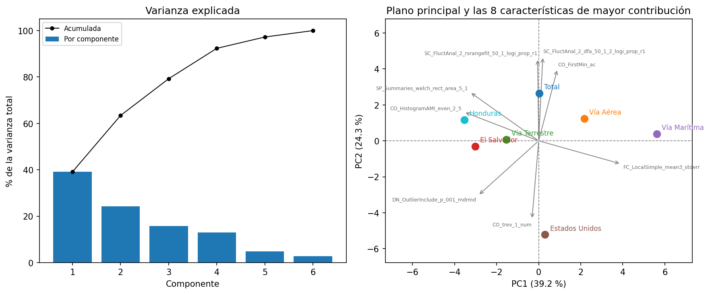
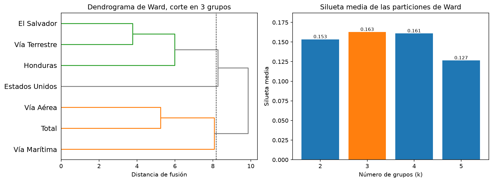
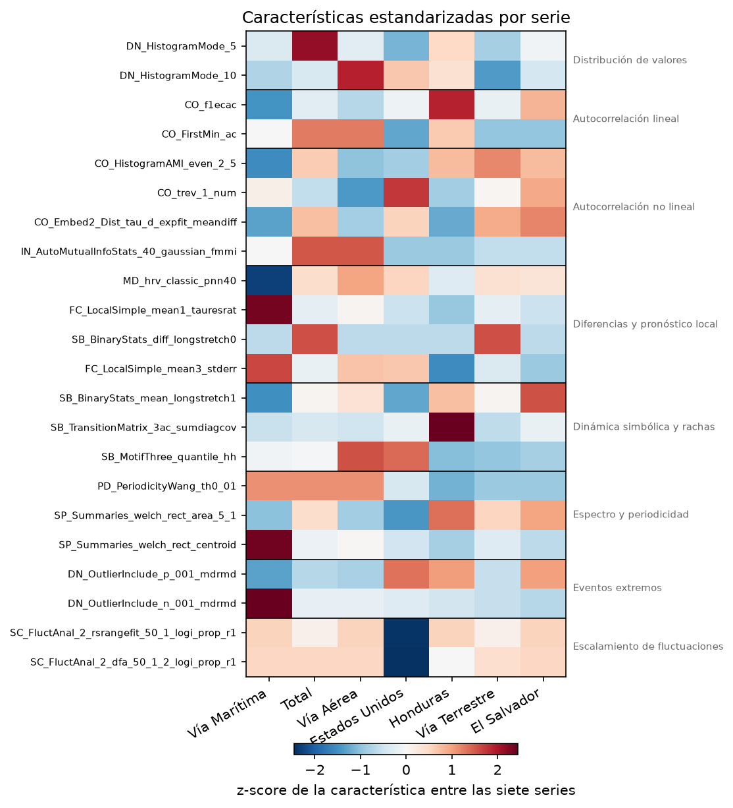
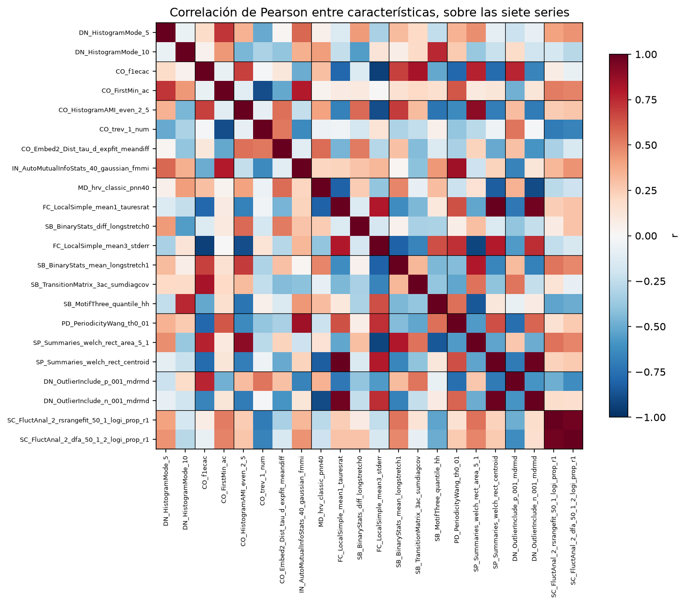
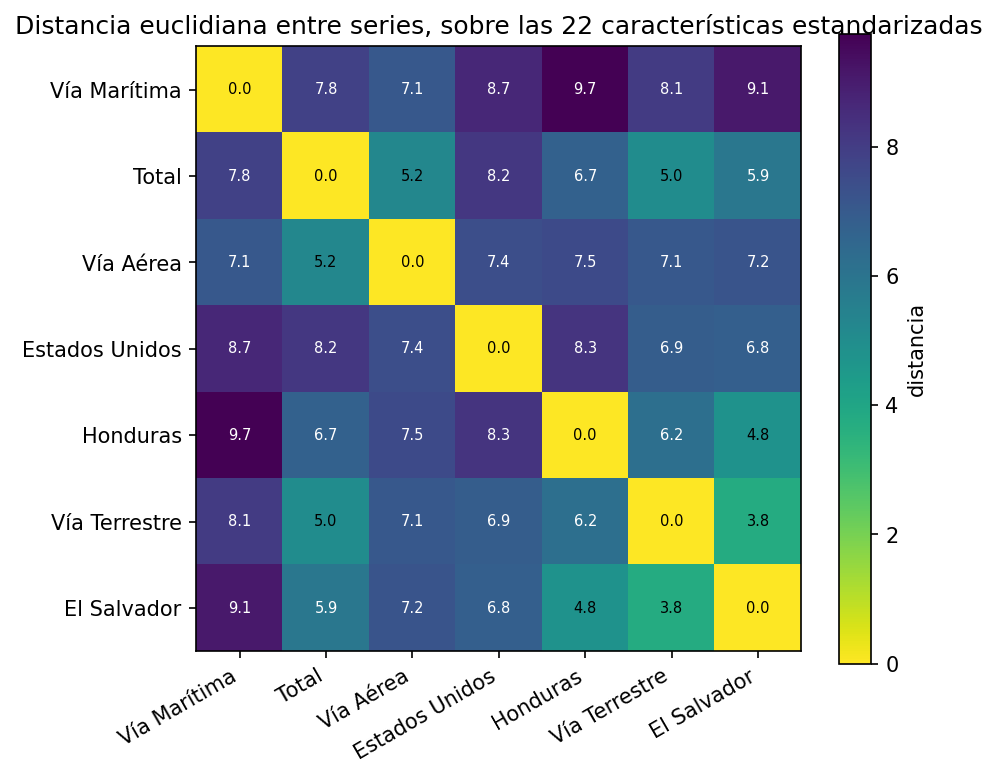
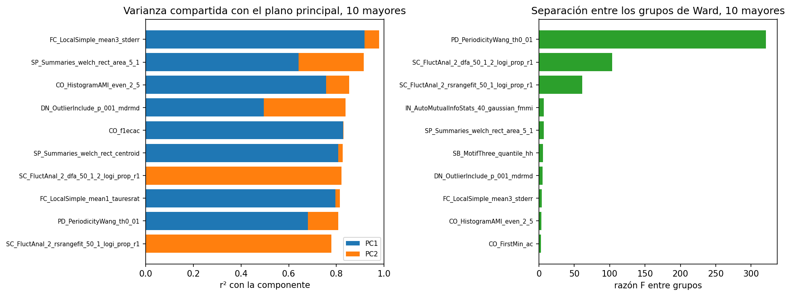
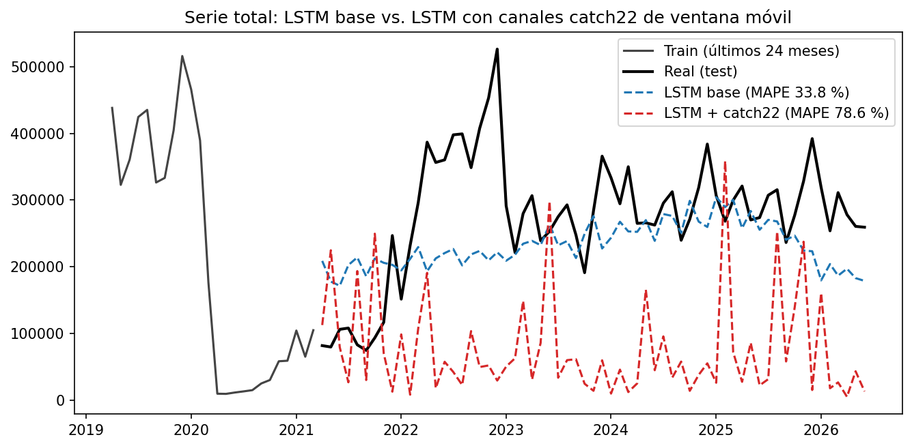

# Universidad del Valle de Guatemala

**Facultad de Ingeniería**
**Departamento de Ciencias de la Computación**
**CC3084 Data Science, Semestre II 2026**

## Laboratorio 2: Redes LSTM y caracterización con catch22

Modelado con redes LSTM de dos series mensuales de viajeros internacionales a Guatemala (total y
vía aérea), con tuneo de hiperparámetros, dos estrategias de pronóstico y comparación contra los
modelos del Laboratorio 1. Se añade la caracterización de las siete series del laboratorio anterior
con el algoritmo catch22 (22 características canónicas por serie), su análisis mediante PCA,
clustering, mapa de calor, correlaciones y distancias, y un LSTM adicional que usa esas
características de ventana móvil como entrada.

**Series analizadas:** total de viajeros y vía aérea, seleccionadas por no tener meses en cero
durante el entrenamiento (requisito de `log1p`) y por contrastar entre sí: total es la peor
predicha del Laboratorio 1 (MAPE 58.11 %) y vía aérea la mejor (MAPE 35.62 %).

**Split:** heredado sin modificaciones del Laboratorio 1: entrenamiento de enero de 2009 a marzo
de 2021 (147 meses) y prueba de abril de 2021 a junio de 2026 (63 meses).

**Integrantes**

| Nombre | Carné |
|---|---|
| Esteban Cárcamo | 23016 |
| Hugo Daniel Barillas | 23556 |
| Ernesto Ascencio | 23009 |

**Fecha:** 30 de julio de 2026
**Repositorio:** https://github.com/ecarcamo/CC3084-DATA-SCIENCE/tree/lab2

\newpage

## Índice

- 1. Metodología LSTM
- 2. Modelado LSTM de la serie total
- 3. Modelado LSTM de la vía aérea
- 4. Análisis comparativo: LSTM contra los modelos del Laboratorio 1
- 5. Caracterización de las series con catch22

\newpage

# 1. Metodología LSTM

## Series seleccionadas

El Laboratorio 1 construyó siete series mensuales de viajeros. El enunciado de este laboratorio
pide trabajar con dos de ellas, sobre la misma partición, para que la comparación entre familias
de modelos sea directa.

El criterio de descarte fue la presencia de meses en cero dentro del entrenamiento. Un cero obliga
a `log1p` a devolver 0 y arrastra el mínimo del escalador hasta ese punto, lo que comprime el resto
de la serie, y además deja el MAPE indefinido en esos meses. Solo tres series cumplen la condición:
total, vía aérea y vía terrestre. Vía marítima acumula 16 ceros en entrenamiento y las tres series
por país de residencia acumulan 5 cada una.

De las tres candidatas se descartó vía terrestre. Total y vía aérea ya tenían análisis preliminar
propio en `notebooks/03_series_preliminar.ipynb`, y contrastan mejor entre sí: total es la serie
agregada de referencia y la que peor se predijo en el Laboratorio 1, con un MAPE de 58.11 % en el
mejor modelo, mientras que vía aérea fue la mejor predicha, con 35.62 %. Las dos ponen a prueba la
red en condiciones distintas.

| Serie | Ceros en train | Mejor modelo del Lab 1 | MAE | RMSE | MAPE |
|---|---:|---|---:|---:|---:|
| Total | 0 | SES | 175,088 | 194,791 | 58.11 % |
| Vía aérea | 0 | SES | 36,109 | 41,368 | 35.62 % |

La partición es la del Laboratorio 1 y no se rehace: entrenamiento de enero de 2009 a marzo de 2021
(147 meses) y prueba de abril de 2021 a junio de 2026 (63 meses). El conjunto de prueba no
interviene en ninguna etapa del ajuste ni del tuneo.

## Preprocesamiento

La transformación es la misma del Laboratorio 1, `log1p`, lo que mantiene comparables los dos
conjuntos de resultados. Estabiliza la varianza, que en estas series crece con el nivel, y tolera
valores en cero.

Sobre la serie transformada se ajusta un `MinMaxScaler` que lleva el entrenamiento al intervalo
[0, 1], rango en el que la LSTM converge sin saturar sus activaciones. El escalador se ajusta
únicamente con las 147 observaciones de entrenamiento. Para la serie total sus límites son 9.1881 y
13.1535 en escala `log1p`, exactamente el mínimo y el máximo del entrenamiento; uno de los 63 meses
de prueba cae fuera de ese intervalo al transformarse, prueba de que el escalador nunca lo vio.

La reversión de cualquier pronóstico aplica `inverse_transform`, luego `expm1` y finalmente un
recorte en cero, porque un conteo de viajeros negativo no tiene sentido.

## Ventaneo y tamaño de la muestra

La red se alimenta con ventanas deslizantes sobre el vector escalado. Cada observación de
entrenamiento es una secuencia de `ventana` meses consecutivos y su objetivo son los
`horizonte_salida` meses siguientes. Las ventanas se construyen en orden temporal y no se barajan.

| Estrategia | Ventana | Ventanas totales | Ajuste | Validación |
|---|---:|---:|---:|---:|
| Recursiva | 12 | 135 | 115 | 20 |
| Recursiva | 24 | 123 | 105 | 18 |
| Directa | 12 | 73 | 62 | 11 |
| Directa | 24 | 61 | 52 | 9 |

El tamaño de muestra es la restricción dominante del laboratorio. Con 147 observaciones mensuales,
la estrategia directa dispone de 73 ventanas con ventana de 12 meses, una cifra baja para una red
recurrente, y eso acota tanto la profundidad de la arquitectura como el tamaño de la rejilla.

## Estrategias de pronóstico

El horizonte de 63 meses se cubre de dos formas, y el laboratorio las compara en lugar de suponer
cuál conviene.

La estrategia recursiva entrena un modelo de un paso, `Dense(1)`, y realimenta cada predicción como
último elemento de la ventana para producir la siguiente. Aprovecha las 135 ventanas disponibles,
pero acumula error a lo largo de 63 iteraciones: cualquier sesgo inicial se propaga y la trayectoria
tiende a aplanarse.

La estrategia directa entrena un modelo con salida `Dense(63)` que emite el horizonte completo en
una sola pasada. No acumula error, pero aprende 63 salidas con apenas 73 ventanas y multiplica los
parámetros de la capa densa.

## Validación y criterio de selección

La validación es el último 15 % de las ventanas, tomado en orden temporal y sin barajar, de modo
que el modelo se evalúa siempre sobre meses posteriores a los que vio. El entrenamiento usa Adam
con tasa de aprendizaje 1e-3, pérdida `mse` y hasta 300 épocas, con `EarlyStopping` de paciencia 20
sobre `val_loss` y restauración de los mejores pesos. Se registra el número de épocas efectivas de
cada combinación.

El error de validación se calcula en viajeros, no en escala escalada, y con la misma mecánica que
se usará en el test:

- En la estrategia recursiva se toman los meses previos al tramo de validación como contexto y se
  pronostica recursivamente el tramo completo. Así se tunea contra el error multi-paso, que es el
  objetivo real, y no contra el error a un paso, que siempre parece bueno.
- En la estrategia directa se evalúan todas las ventanas de validación, cada una con sus 63 salidas,
  y el error se calcula sobre el conjunto completo de predicciones revertidas.

Se selecciona la combinación de menor `rmse_val`; si ninguna converge, la de menor `val_loss`. Este
`rmse_val` solo ordena configuraciones **dentro** de una misma estrategia, porque el tramo evaluado
no es el mismo en las dos: veinte meses consecutivos en la recursiva frente a once ventanas de 63
valores en la directa. La comparación entre estrategias se resuelve hasta el conjunto de prueba,
con las mismas métricas del Laboratorio 1.

La configuración ganadora se reentrena sobre las 147 observaciones completas, ya sin partición de
validación, fijando las épocas en las efectivas registradas durante el tuneo. Ese modelo produce el
pronóstico de los 63 meses de prueba.

## Rejilla de hiperparámetros

La rejilla es idéntica para las dos series y las dos estrategias, y se recorre por producto
cartesiano con `itertools`, igual que la rejilla SARIMA del Laboratorio 1.

| Hiperparámetro | Valores |
|---|---|
| Ventana | 12, 24 |
| Unidades por capa | 32, 64 |
| Capas LSTM | 1, 2 |
| Dropout | 0.0, 0.2 |
| Tasa de aprendizaje | 1e-3 |
| Tamaño de lote | 16 |

Son 16 combinaciones por estrategia, 32 por serie y 64 ajustes en el laboratorio, muy por encima
del mínimo de dos configuraciones distintas que pide el enunciado. Dos de ellas se destacan como
referencias de arquitectura: la LSTM de una capa con 32 unidades y sin dropout, que es el modelo
más pequeño, y la apilada de dos capas con 64 unidades y dropout 0.2, que es el más grande.

Las ventanas de 12 y 24 meses cubren uno y dos ciclos estacionales completos, la dimensión relevante
en series mensuales de turismo. El resto de valores se mantuvo acotado por dos razones: la muestra
es pequeña y arquitecturas mayores sobreajustan, y TensorFlow no dispone de GPU en Windows nativo
desde la versión 2.11, de modo que todo el laboratorio corre en CPU. Cada ajuste toma entre ocho y
doce segundos según la ventana y el número de capas, lo que sitúa cada rejilla completa en el orden
de tres minutos.

## Reproducibilidad

El enunciado exige que los resultados sean reproducibles. Antes de cada ajuste se fija la semilla 42
con `keras.utils.set_random_seed`, que cubre los generadores de Python, NumPy y TensorFlow, y se
activa `tf.config.experimental.enable_op_determinism()`, que elimina el no determinismo de las
operaciones sobre CPU. La sesión de Keras se limpia entre combinaciones para que los grafos no se
acumulen a lo largo de la rejilla.

Con eso, dos ejecuciones seguidas de `notebooks/08_lstm_preparacion.ipynb` devuelven exactamente los
mismos valores de `val_loss`, `mae_val`, `rmse_val` y épocas efectivas. Ese cuaderno documenta el
protocolo, verifica los conteos de ventanas y comprueba la ausencia de fuga de información antes de
que los cuadernos 09 y 10 ejecuten la rejilla completa.

\newpage

# 2. Modelado LSTM de la serie total

La serie total es la agregada de referencia del estudio y la peor predicha del Laboratorio 1, con
un MAPE de 58.11 % en su mejor modelo. Todo lo que sigue está en `notebooks/09_lstm_total.ipynb`,
sobre el protocolo descrito en la sección 1 y con el split del Laboratorio 1 sin modificar:
entrenamiento de enero de 2009 a marzo de 2021, 147 meses, y prueba de abril de 2021 a junio de
2026, 63 meses.

## La rejilla ejecutada y su costo

Se recorrieron las 16 combinaciones de la rejilla para cada una de las dos estrategias, 32 ajustes
en total. La rejilla completa costó 1.9 minutos de CPU, entre 2.8 y 5.8 segundos por ajuste, y el
detalle de las 32 filas quedó en `resultados/lstm_tuneo_total.csv`.

Ninguna combinación falló. Las 32 entrenaron hasta que `EarlyStopping` las detuvo, restauraron sus
mejores pesos y produjeron un pronóstico finito; el bloque de captura de excepciones de `grid_lstm`
no se activó ni una vez y no hay filas con `rmse_val` infinito. Tampoco hubo pronósticos negativos
ni valores nulos.

Lo que sí hubo fue estancamiento, y conviene reportarlo porque afecta la lectura de los resultados.
Las 16 combinaciones de la estrategia recursiva pararon entre las épocas 21 y 25, y como la
paciencia del `EarlyStopping` es de 20 épocas, eso significa que su mejor época de validación estuvo
entre la 1 y la 5. El modelo de un paso alcanza su mejor error de validación casi de inmediato y
después solo mejora sobre el entrenamiento. Las combinaciones directas se comportaron mejor: épocas
efectivas entre 28 y 78, con la mejor época entre la 8 y la 58.

## Configuraciones seleccionadas

| Estrategia | Ventana | Unidades | Capas | Dropout | Épocas efectivas | Parámetros | MAE val. | RMSE val. |
|---|---:|---:|---:|---:|---:|---:|---:|---:|
| Recursiva | 24 | 64 | 1 | 0.2 | 24 | 16,961 | 121,320 | 149,716 |
| Directa | 24 | 64 | 2 | 0.0 | 42 | 54,015 | 97,483 | 130,075 |

Las dos ganadoras coinciden en la ventana de 24 meses y en las 64 unidades por capa, y se separan
en la profundidad y la regularización: la recursiva prefiere una sola capa con dropout de 0.2 y la
directa dos capas sin dropout. Los dos valores de `rmse_val` de la tabla no son comparables entre
sí, porque cada estrategia valida sobre un tramo distinto; la comparación entre estrategias se
resuelve en el test.

Dentro de cada estrategia, en cambio, la dispersión sí es informativa. Entre la mejor y la peor
configuración recursiva hay un 39.9 % de diferencia en `rmse_val`, de 149,716 a 209,463 viajeros.
Entre la mejor y la peor directa hay un 15.3 %, de 130,075 a 149,939. La elección de
hiperparámetros importa más cuando el error se realimenta 63 veces.

### Las dos arquitecturas de referencia

El enunciado pide al menos dos modelos con configuraciones distintas por serie. La rejilla contiene
16 por estrategia, y dos de ellas delimitan el rango de arquitecturas exploradas: la LSTM de una
capa con 32 unidades y sin dropout, la más pequeña, y la apilada de dos capas con 64 unidades y
dropout 0.2, la más grande.

| Estrategia | Arquitectura | Ventana | Parámetros | RMSE val. |
|---|---|---:|---:|---:|
| Recursiva | 1 capa, 32 unidades, dropout 0.0 | 24 | 4,385 | 187,605 |
| Recursiva | 2 capas, 64 unidades, dropout 0.2 | 24 | 49,985 | 155,304 |
| Directa | 1 capa, 32 unidades, dropout 0.0 | 24 | 6,431 | 136,507 |
| Directa | 2 capas, 64 unidades, dropout 0.2 | 24 | 54,015 | 132,213 |

El contraste entre las dos arquitecturas depende de la estrategia. En la recursiva la arquitectura
mayor mejora el error de validación en 17 %; en la directa la diferencia baja a 3 %. La salida
`Dense(63)` ya concentra la mayor parte de la capacidad del modelo directo, y agregar profundidad
recurrente aporta poco.

## Qué hiperparámetro movió el error

La comparación toma la mediana de `rmse_val` entre los dos valores de cada hiperparámetro, dentro
de cada estrategia, para que un solo ajuste afortunado no defina la lectura.

| Estrategia | Hiperparámetro | Valor bajo | RMSE val. | Valor alto | RMSE val. | Brecha |
|---|---|---:|---:|---:|---:|---:|
| Recursiva | Unidades | 32 | 180,907 | 64 | 155,652 | 16.2 % |
| Recursiva | Dropout | 0.0 | 181,810 | 0.2 | 162,257 | 12.1 % |
| Recursiva | Capas | 1 | 175,112 | 2 | 156,732 | 11.7 % |
| Recursiva | Ventana | 12 | 162,257 | 24 | 171,988 | 6.0 % |
| Directa | Ventana | 12 | 138,634 | 24 | 131,920 | 5.1 % |
| Directa | Dropout | 0.0 | 135,615 | 0.2 | 139,625 | 3.0 % |
| Directa | Unidades | 32 | 138,971 | 64 | 135,615 | 2.5 % |
| Directa | Capas | 1 | 137,244 | 2 | 136,215 | 0.8 % |

En la estrategia recursiva manda el número de unidades, con una brecha de 16.2 % a favor de 64,
seguido del dropout, 12.1 % a favor de 0.2, y del número de capas, 11.7 % a favor de dos. Los tres
apuntan en la misma dirección: un modelo de un paso que se realimentará 63 veces necesita capacidad
y regularización, porque cualquier sesgo sistemático se acumula a lo largo del horizonte. La
ventana es el único hiperparámetro cuya mediana favorece al valor bajo, 12 meses, aunque la
configuración ganadora usa 24; la brecha de 6.0 % en la mediana convive con el mejor resultado
individual en el otro extremo, señal de que la ventana interactúa con el resto y no domina por sí
sola.

En la estrategia directa el orden se invierte y todas las brechas se achican. Manda la ventana, con
5.1 % a favor de 24 meses, y el resto queda por debajo del 3 %. El número de capas es
prácticamente irrelevante, con 0.8 %. Con la salida completa emitida en una sola pasada, lo
determinante es cuánta historia ve la red, no cuán profunda es.

La figura muestra las cinco mejores de cada estrategia y no las diez mejores del conjunto, porque
`rmse_val` no es comparable entre estrategias: la recursiva se valida sobre veinte meses
consecutivos y la directa sobre once ventanas de 63 valores cada una. Un ranking global mezclaría
dos escalas distintas.

## Curvas de entrenamiento

Las dos curvas describen problemas distintos. En la recursiva la pérdida de validación toca su
mínimo en la época 4, en 0.129, y a partir de ahí se queda plana mientras la de entrenamiento sigue
bajando hasta 0.006, más de veinte veces menor. Es sobreajuste puro desde la quinta época: el
modelo memoriza las 105 ventanas de ajuste sin mejorar su capacidad de generalizar. En la directa
la validación baja durante una docena de épocas hasta 0.068 y a partir de ahí apenas se mueve,
con su mínimo formal en la época 22, mientras la de entrenamiento termina en 0.004; la brecha final
es de 16 veces en lugar de 22 y hay más aprendizaje real antes del estancamiento.

La lectura práctica es que el `EarlyStopping` con paciencia 20 hizo su trabajo en las dos
estrategias, y que ampliar el número máximo de épocas no habría cambiado nada: ninguna de las 32
combinaciones se acercó al tope de 300.

## Predicción sobre el test

Cada configuración ganadora se reentrenó sobre las 147 observaciones completas, sin partición de
validación, con las épocas fijadas en las efectivas del tuneo, y ese modelo produjo los 63 meses de
prueba. Las dos predicciones están en `resultados/predicciones/total_lstm_recursivo.csv` y
`total_lstm_directo.csv`.

| Modelo | MAE | RMSE | MAPE | Media pronosticada | Sesgo medio |
|---|---:|---:|---:|---:|---:|
| lstm_recursivo | 143,303 | 164,706 | 46.90 % | 133,712 | −142,973 |
| lstm_directo | **76,957** | **100,290** | **33.76 %** | 232,356 | −44,329 |

El test real promedia 276,685 viajeros mensuales. La estrategia directa gana en las tres métricas:
46.30 % menos MAE, 39.11 % menos RMSE y 13.13 puntos porcentuales menos de MAPE. La diferencia es
demasiado grande para atribuirla al azar del ajuste y no se explica por la muestra, porque la
estrategia directa entrena con menos de la mitad de las ventanas, 61 contra 123 con ventana de 24
meses. Se explica por el sesgo: la recursiva subestima 62 de los 63 meses, con un error medio de
−142,973 viajeros, un 51.7 % del nivel medio del test, mientras que la directa subestima 45 de 63,
con −44,329, un 16.0 %. Realimentar 63 veces un modelo entrenado con datos que terminan en el punto
más bajo de la pandemia arrastra el pronóstico hacia ese nivel, y ni la ventana de 24 meses ni las
64 unidades lo evitan. La acumulación de error pesó más que el tamaño de la muestra.

## ¿Reproduce la recuperación pospandemia?

Esta es la pregunta que el Laboratorio 1 dejó abierta, porque los cinco modelos anteriores
subestimaron la recuperación sin excepción.

| Año | Test real | lstm_directo | Diferencia | lstm_recursivo | Diferencia |
|---|---:|---:|---:|---:|---:|
| 2021 (abr-dic) | 110,282 | 198,112 | +79.6 % | 81,033 | −26.5 % |
| 2022 | 359,680 | 213,867 | −40.5 % | 112,870 | −68.6 % |
| 2023 | 270,726 | 236,230 | −12.7 % | 136,809 | −49.5 % |
| 2024 | 299,490 | 263,214 | −12.1 % | 151,202 | −49.5 % |
| 2025 | 299,770 | 263,777 | −12.0 % | 159,088 | −46.9 % |
| 2026 (ene-jun) | 280,439 | 188,390 | −32.8 % | 162,489 | −42.1 % |

La estrategia recursiva no la reproduce, y falla igual que los modelos del Laboratorio 1: su
trayectoria es una curva monótona que sube de 64,931 a 163,165 viajeros y se detiene ahí, sin
estacionalidad visible, entre un 47 % y un 69 % por debajo del real en los cuatro años completos. Su
correlación con el test es de 0.507, de modo que acierta la dirección general y nunca el nivel.

La estrategia directa sí la reproduce parcialmente, y es el primer modelo de esta serie en las dos
entregas que lo consigue. Emite un perfil estacional con picos y valles, alcanza el nivel correcto
desde 2023 y se estabiliza en un error anual de entre 12.0 % y 12.7 % en el tramo 2023-2025. Sus
dos zonas de error son los extremos del horizonte: sobreestima 2021 en 79.6 %, cuando la serie real
todavía estaba deprimida, y se queda 40.5 % corta en el rebote de 2022, el año del pico de 526,190
viajeros que ningún modelo entrenado hasta marzo de 2021 podía anticipar.

## Lectura honesta de la calidad predictiva

El resultado es una mejora sustancial y sigue siendo un pronóstico de calidad limitada. Un MAPE de
33.76 % significa que el error típico es de un tercio del valor real: sirve para dimensionar
órdenes de magnitud y para planificación agregada, no para asignación fina de capacidad sin
intervalos amplios ni reentrenamiento periódico.

Tres reservas que conviene dejar escritas:

La primera es que el modelo no captura el pico de 2022 y ese es justamente el evento de mayor
interés operativo del periodo. Su acierto está en el régimen estable posterior, no en la
transición.

La segunda es que la mejora frente al Laboratorio 1 depende de una coincidencia favorable entre lo
que el modelo aprendió y lo que ocurrió. La LSTM directa reconstruye el patrón prepandemia en lugar
de prolongar el nivel deprimido del final del entrenamiento, y el test resultó ser un retorno a
niveles prepandemia. Si la serie no se hubiera recuperado, esa misma propiedad habría producido una
sobreestimación sistemática y el orden del ranking sería el inverso.

La tercera es de tamaño de muestra. La estrategia ganadora estima 54,015 parámetros con 61
ventanas de entrenamiento, y sus curvas muestran sobreajuste desde la época doce. El resultado del
test es sólido porque el protocolo nunca vio ese tramo, pero la varianza de la estimación es alta y
no debería leerse como una medida precisa de la capacidad de la arquitectura.

\newpage

# 3. Modelado LSTM de la vía aérea

La vía aérea es la serie mejor predicha del Laboratorio 1, con un MAPE de 35.62 % usando SES, la
vía menos volátil (CV de 0.216) y la de recuperación más rápida: alcanzó el 80 % del nivel de 2019
en diciembre de 2021. También es la serie donde 18 de las 36 especificaciones SARIMA se
descartaron por pronóstico explosivo, así que la vara a superar es la más alta de las siete series
y el fracaso de los modelos paramétricos lineales ya está documentado. Todo lo que sigue está en
`notebooks/10_lstm_via_aerea.ipynb`, sobre el protocolo descrito en la sección 1 y con el split del
Laboratorio 1 sin modificar: entrenamiento de enero de 2009 a marzo de 2021, 147 meses, y prueba de
abril de 2021 a junio de 2026, 63 meses.

## La rejilla ejecutada y su costo

Se recorrieron las 16 combinaciones de la rejilla para cada una de las dos estrategias, 32 ajustes
en total. La rejilla completa costó 2.4 minutos de CPU, entre 3.2 y 9.3 segundos por ajuste, y el
detalle de las 32 filas quedó en `resultados/lstm_tuneo_via_aerea.csv`.

Ninguna combinación falló. Las 32 entrenaron hasta que `EarlyStopping` las detuvo, restauraron sus
mejores pesos y produjeron un pronóstico finito; no hay filas con `rmse_val` infinito ni pronósticos
negativos o nulos.

El estancamiento temprano de la estrategia recursiva se repite en esta serie: las 16 combinaciones
pararon entre las épocas 21 y 26, así que con una paciencia de 20 épocas su mejor época de
validación estuvo entre la 1 y la 6. La estrategia directa volvió a comportarse mejor: épocas
efectivas entre 29 y 59, con la mejor época estimada entre la 9 y la 39.

## Configuraciones seleccionadas

| Estrategia | Ventana | Unidades | Capas | Dropout | Épocas efectivas | Parámetros | MAE val. | RMSE val. |
|---|---:|---:|---:|---:|---:|---:|---:|---:|
| Recursiva | 12 | 32 | 1 | 0.0 | 26 | 4,385 | 39,360 | 45,464 |
| Directa | 24 | 32 | 2 | 0.0 | 49 | 14,751 | 25,853 | 38,698 |

Las dos ganadoras coinciden en 32 unidades por capa y en dropout 0.0, y se separan en la ventana y
la profundidad: la recursiva prefiere la ventana corta de 12 meses con una sola capa, y la directa
la ventana larga de 24 meses con dos capas. A diferencia de la serie total, ninguna de las dos
estrategias eligió aquí la configuración más grande de la rejilla (64 unidades, dropout 0.2): la
vía aérea es más regular y no exige esa capacidad extra.

Dentro de cada estrategia la dispersión sigue siendo informativa. Entre la mejor y la peor
configuración recursiva hay un 50.6 % de diferencia en `rmse_val`, de 45,464 a 68,450 viajeros.
Entre la mejor y la peor directa hay un 33.5 %, de 38,698 a 51,648.

### Las dos arquitecturas de referencia

El enunciado pide al menos dos modelos con configuraciones distintas por serie. La rejilla contiene
16 por estrategia; estas dos delimitan el rango explorado: la LSTM de una capa con 32 unidades y sin
dropout, la más pequeña, y la apilada de dos capas con 64 unidades y dropout 0.2, la más grande.

| Estrategia | Ventana | Arquitectura | Parámetros | RMSE val. |
|---|---:|---|---:|---:|
| Recursiva | 12 | 1 capa, 32 unidades, dropout 0.0 | 4,385 | 45,464 |
| Recursiva | 12 | 2 capas, 64 unidades, dropout 0.2 | 49,985 | 58,576 |
| Recursiva | 24 | 1 capa, 32 unidades, dropout 0.0 | 4,385 | 68,450 |
| Recursiva | 24 | 2 capas, 64 unidades, dropout 0.2 | 49,985 | 50,901 |
| Directa | 12 | 1 capa, 32 unidades, dropout 0.0 | 6,431 | 41,248 |
| Directa | 12 | 2 capas, 64 unidades, dropout 0.2 | 54,015 | 44,593 |
| Directa | 24 | 1 capa, 32 unidades, dropout 0.0 | 6,431 | 44,508 |
| Directa | 24 | 2 capas, 64 unidades, dropout 0.2 | 54,015 | 45,875 |

Aquí el contraste no es monótono como en la serie total. En la estrategia recursiva la arquitectura
grande pierde con ventana de 12 meses (28.8 % peor) pero gana con ventana de 24 (34.5 % mejor): el
efecto de la capacidad depende de cuánta historia ve la red, no solo de su tamaño. En la estrategia
directa la arquitectura pequeña gana en las dos ventanas, aunque por márgenes moderados: 8.1 % con
ventana de 12 y 3.1 % con ventana de 24. Para esta serie, más parámetros no compran de forma
consistente mejor validación.

## Qué hiperparámetro movió el error

La comparación toma la mediana de `rmse_val` entre los dos valores de cada hiperparámetro, dentro
de cada estrategia, para que un solo ajuste afortunado no defina la lectura.

| Estrategia | Hiperparámetro | Valor bajo | RMSE val. | Valor alto | RMSE val. | Brecha |
|---|---|---:|---:|---:|---:|---:|
| Recursiva | Capas | 1 | 56,641 | 2 | 49,337 | 14.8 % |
| Recursiva | Dropout | 0.0 | 48,979 | 0.2 | 51,233 | 4.6 % |
| Recursiva | Ventana | 12 | 49,155 | 24 | 51,233 | 4.2 % |
| Recursiva | Unidades | 32 | 49,337 | 64 | 50,461 | 2.3 % |
| Directa | Dropout | 0.0 | 42,102 | 0.2 | 45,234 | 7.4 % |
| Directa | Capas | 1 | 43,629 | 2 | 45,072 | 3.3 % |
| Directa | Ventana | 12 | 44,754 | 24 | 43,963 | 1.8 % |
| Directa | Unidades | 32 | 44,712 | 64 | 43,963 | 1.7 % |

En la estrategia recursiva el factor dominante es el número de capas, con 14.8 % a favor de dos
capas; le siguen el dropout, 4.6 % a favor de 0.0, y la ventana, 4.2 % a favor de 12 meses. El orden
es distinto al de la serie total, donde mandaban las unidades: aquí una segunda capa recurrente
ayuda más que ensanchar la primera.

En la estrategia directa manda el dropout, con 7.4 % a favor de 0.0, y el resto queda por debajo
del 3.5 %. La regularización explícita no aporta en una serie ya de por sí menos volátil: con 147
observaciones y una serie estable, el dropout resta capacidad sin compensarla con menos sobreajuste.

La figura muestra las cinco mejores de cada estrategia y no las diez mejores del conjunto, porque
`rmse_val` no es comparable entre estrategias: la recursiva se valida sobre un tramo consecutivo y
la directa sobre varias ventanas de 63 valores cada una.

## Curvas de entrenamiento

Las dos curvas describen el mismo problema en escalas distintas. En la recursiva la pérdida de
validación toca su mínimo en la época 6, en 0.124, y a partir de ahí se queda plana en 0.137
mientras la de entrenamiento sigue bajando hasta 0.0006, más de doscientas veces menor: sobreajuste
puro desde la sexta época. En la directa la validación baja durante unas 28 épocas hasta 0.058 y
ahí se estabiliza, mientras la de entrenamiento termina en 0.0025; hay más aprendizaje real antes
del estancamiento, igual que en la serie total.

El `EarlyStopping` con paciencia 20 volvió a hacer su trabajo en las dos estrategias: ninguna de las
32 combinaciones se acercó al tope de 300 épocas.

## Predicción sobre el test

Cada configuración ganadora se reentrenó sobre las 147 observaciones completas, sin partición de
validación, con las épocas fijadas en las efectivas del tuneo, y ese modelo produjo los 63 meses de
prueba. Las dos predicciones están en `resultados/predicciones/via_aerea_lstm_recursivo.csv` y
`via_aerea_lstm_directo.csv`.

| Modelo | MAE | RMSE | MAPE | Media pronosticada | Sesgo medio | Correlación con test |
|---|---:|---:|---:|---:|---:|---:|
| lstm_recursivo | 31,638 | 37,766 | 31.14 % | 63,494 | −31,110 | 0.391 |
| lstm_directo | **22,635** | **29,623** | **24.93 %** | 85,409 | −9,196 | −0.150 |

El test real promedia 94,605 viajeros mensuales. La estrategia directa gana en las tres métricas:
28.5 % menos MAE, 21.6 % menos RMSE y 6.21 puntos porcentuales menos de MAPE. La brecha entre
estrategias es menor que en la serie total, porque aquí la recursiva ya parte de un sesgo más chico,
pero el orden es el mismo: la salida completa en una sola pasada evita la acumulación de error de la
recursiva a lo largo de 63 pasos.

El sesgo agregado confirma la historia: −32.9 % del nivel medio en la recursiva, que subestima 59 de
los 63 meses, contra −9.7 % en la directa, que subestima 34 de 63. Pero la correlación negativa de
la directa es la advertencia que el MAE y el RMSE no muestran por sí solos: el modelo gana en error
agregado porque su nivel medio está cerca del real, no porque reproduzca la dirección del movimiento
mes a mes. Esto se desarrolla en la sección siguiente.

## ¿Reproduce la recuperación pospandemia?

La vía aérea fue la vía de recuperación más rápida en el Laboratorio 1. La tabla anual muestra si el
LSTM captura esa dinámica o solo su nivel promedio.

| Año | Test real | lstm_recursivo | lstm_directo |
|---|---:|---:|---:|
| 2021 (abr-dic) | 65,700 | 37,905 | 82,331 |
| 2022 | 117,232 | 56,206 | 85,084 |
| 2023 | 82,153 | 66,793 | 89,985 |
| 2024 | 95,279 | 71,494 | 96,849 |
| 2025 | 99,081 | 73,403 | 87,270 |
| 2026 (ene-jun) | 107,307 | 74,041 | 54,920 |

La estrategia recursiva falla igual que en la serie total: una trayectoria monótona creciente que
nunca despega de los 74,000 viajeros, muy por debajo del pico de 117,232 en 2022 y del nivel de
2026. Su correlación de 0.391 con el test viene de la tendencia general al alza, no de acertar
niveles.

La estrategia directa cuenta una historia distinta a la de la serie total. Sobreestima 2021 en
25.3 % (82,331 contra 65,700, el año todavía deprimido), y desde ahí se acerca al nivel real en 2023
y 2024, dentro de un 10 % de diferencia, pero vuelve a alejarse al final: subestima 2025 en 11.9 % y
colapsa en el primer semestre de 2026, con 54,920 contra 107,307, un 48.8 % por debajo. Ese colapso
final es lo que produce la correlación negativa pese al buen MAE agregado: el modelo aprendió un
nivel medio razonable para el tramo intermedio de la serie, pero no anticipa que la recuperación
siguiera acelerando hacia 2026.

## Lectura honesta de la calidad predictiva

El LSTM directo mejora la mejor referencia del Laboratorio 1 (SES) en las tres métricas: 37.3 %
menos MAE, 28.4 % menos RMSE y 10.68 puntos porcentuales menos de MAPE, de 35.62 % a 24.93 %. Es la
primera vez en las dos entregas que un modelo de la vía aérea baja del 25 % de MAPE. Pero conviene
dejar tres reservas escritas, porque las métricas de error agregado esconden más de lo que muestran
en esta serie.

La primera es la correlación negativa de la estrategia ganadora con el test, −0.150. El modelo bate
a SES en MAE y RMSE porque su nivel medio (85,409) está más cerca del real (94,605) que el de la
recursiva, no porque reproduzca la dirección del movimiento mes a mes. Un pronóstico que acertara la
dinámica de la serie tendría correlación positiva incluso con métricas de error algo peores; este es
el caso inverso.

La segunda es el colapso en el tramo final: 48.8 % por debajo del real en el primer semestre de
2026, justo el periodo más reciente y el de mayor interés operativo. El modelo aprendió el nivel de
2023-2024 y lo proyectó hacia adelante, sin anticipar que la recuperación siguiera acelerando.

La tercera es de tamaño de muestra, igual que en la serie total: la estrategia ganadora estima
14,751 parámetros con relativamente pocas ventanas de entrenamiento, y su curva de validación se
estabiliza temprano, en la época 28. El resultado del test es sólido porque el protocolo nunca vio
ese tramo, pero la varianza de la estimación es alta y el buen MAPE de esta serie no debería leerse
como evidencia de que el LSTM directo entiende la trayectoria de la vía aérea mejor de lo que
entiende la de la serie total: en ambas, gana por cancelación de errores en direcciones opuestas más
que por seguimiento fiel de la dinámica.

\newpage

# 4. Análisis comparativo: LSTM contra los modelos del Laboratorio 1

Esta sección responde el punto 1.4 del enunciado. El desarrollo está en
`notebooks/11_comparativo_lstm.ipynb`, que no reentrena nada: lee las métricas de los cuadernos 09
y 10, las métricas del Laboratorio 1 en `resultados/metricas_modelos.csv` y las predicciones
guardadas en `resultados/predicciones/`, y deja dos tablas consolidadas, `metricas_lstm.csv` y
`comparativo_lstm_lab1.csv`.

## Criterio de comparación

Las dos familias se comparan sobre exactamente el mismo conjunto de prueba, los 63 meses de abril
de 2021 a junio de 2026, con las mismas tres métricas y calculadas por la misma función,
`src.evaluacion.metricas`, que se usó en el Laboratorio 1. MAE y RMSE van en viajeros y MAPE en
porcentaje. El modelo ganador de cada serie es el de menor suma de los rangos de MAE y RMSE, el
mismo criterio con el que el laboratorio anterior eligió entre SARIMA, Holt-Winters, SES, seasonal
naive y Prophet.

Las tres métricas se reportan juntas porque miden cosas distintas. El MAE promedia el error en
viajeros y trata todos los meses por igual; el RMSE penaliza los errores grandes, que en estas
series se concentran en los picos estacionales y en el rebote de 2022; el MAPE normaliza por el
nivel real y es la única de las tres comparable entre series de distinto volumen. Un modelo que
ganara en una sola de ellas exigiría una discusión; en los resultados de abajo no hace falta,
porque el ganador lo es en las tres.

Ninguna de las dos familias vio el conjunto de prueba durante el ajuste. En el Laboratorio 1 las
órdenes SARIMA se eligieron por AIC sobre el entrenamiento y los demás modelos se ajustaron solo
con esas 147 observaciones; en este laboratorio la rejilla LSTM se tuneó contra un tramo de
validación tomado del final del entrenamiento. La comparación es limpia en los dos sentidos.

### Por qué no se usan AIC ni BIC

El enunciado del Laboratorio 1 pedía comparar modelos ARIMA por AIC y BIC, y aquí esos criterios no
aparecen por dos razones.

La primera es que no están definidos para una red neuronal. AIC y BIC se construyen sobre la
verosimilitud maximizada del modelo, y una LSTM entrenada por descenso de gradiente sobre un error
cuadrático no tiene una verosimilitud que reportar ni un número de parámetros efectivos
interpretable de la misma forma; los 54,015 parámetros del modelo directo de la serie total o los
14,751 del de vía aérea no son comparables con los 8 o 10 coeficientes de un SARIMA.

La segunda es que, aun si estuvieran definidos, no serían el criterio adecuado. Los dos miden
ajuste dentro de muestra penalizado por complejidad, no capacidad predictiva fuera de muestra, y el
Laboratorio 1 documentó el caso extremo: el SARIMA(2,1,2)(0,1,1)12 de vía aérea fue el de menor AIC
de su rejilla, 169.72, y produjo el peor pronóstico a 63 pasos de esa serie, con un MAE de 73,966
frente a los 36,109 de SES. Elegir por AIC habría empeorado el resultado. Toda la comparación de
esta sección se resuelve, por eso, sobre el conjunto de prueba.

## Resultados

| Serie | Familia | Mejor modelo | MAE | RMSE | MAPE |
|---|---|---|---:|---:|---:|
| Total | Lab 1 | SES | 175,088 | 194,791 | 58.11 % |
| Total | LSTM | lstm_directo | **76,957** | **100,290** | **33.76 %** |
| Vía aérea | Lab 1 | SES | 36,109 | 41,368 | 35.62 % |
| Vía aérea | LSTM | lstm_directo | **22,635** | **29,623** | **24.93 %** |

El LSTM de estrategia directa es el mejor modelo global de las dos series considerando las dos
familias, y lo es en las tres métricas a la vez, así que el criterio de desempate no llega a
aplicarse. Queda marcado como `mejor_global` en `comparativo_lstm_lab1.csv`.

## Serie total

### Cuál de las dos estrategias LSTM predijo mejor

La estrategia directa, con `Dense(63)`, gana con claridad a la recursiva.

| Modelo | MAE | RMSE | MAPE |
|---|---:|---:|---:|
| lstm_directo | 76,957 | 100,290 | 33.76 % |
| lstm_recursivo | 143,303 | 164,706 | 46.90 % |
| Margen | 46.30 % | 39.11 % | 13.13 pp |

El margen es demasiado grande para atribuirlo al azar del ajuste, y va en contra de la ventaja
muestral: la estrategia recursiva entrena con 123 ventanas y la directa con 61, la mitad. Lo que
inclina la balanza es el sesgo acumulado. La recursiva subestima 62 de los 63 meses, con un error
medio de −142,973 viajeros, el 51.7 % del nivel medio del test; la directa subestima 45 de 63, con
−44,329, el 16.0 %. Realimentar 63 veces un modelo de un paso entrenado sobre datos que terminan en
el punto más bajo de la pandemia arrastra toda la trayectoria hacia ese nivel.

Conviene señalar de dónde no sale esta conclusión. Los `rmse_val` del tuneo, 149,716 en la
recursiva y 130,075 en la directa, apuntan en la misma dirección, pero no sirven como argumento: se
miden sobre tramos distintos, veinte meses consecutivos en un caso y once ventanas de 63 valores en
el otro, y solo ordenan configuraciones dentro de una misma estrategia. La comparación entre
estrategias se resuelve únicamente en el test.

### Si son mejores que los del Laboratorio 1

Sí, y por el mayor margen registrado en las dos entregas para esta serie.

| Comparación | MAE | RMSE | MAPE |
|---|---:|---:|---:|
| SES, Lab 1 | 175,088 | 194,791 | 58.11 % |
| lstm_directo | 76,957 | 100,290 | 33.76 % |
| Mejora | 56.05 % | 48.51 % | 24.35 pp |

Para dimensionar el salto: en el Laboratorio 1, la distancia entre SES y el segundo mejor modelo de
esta serie, Holt-Winters, era de 21,868 viajeros de MAE. Aquí la distancia entre SES y el LSTM
directo es de 98,131, cuatro veces y media mayor. No es una diferencia que exija matices ni que
pueda explicarse por la semilla: es un cambio de régimen en la calidad del pronóstico. Y no depende
de haber elegido bien la estrategia, porque incluso la perdedora supera a SES: la recursiva registra
143,303 de MAE y 164,706 de RMSE, por debajo de los 175,088 y 194,791 de SES.

El LSTM directo es, en consecuencia, el mejor modelo global de la serie total entre las dos
familias, y el primero de esta serie, en las dos entregas, que baja del 50 % de MAPE.

La figura muestra por qué. SES es una recta horizontal en 105,145 viajeros durante 63 meses: por
construcción prolonga el último nivel suavizado del entrenamiento, que es un mes de pandemia. El
SARIMA(2,1,2)(1,1,1)12 es peor todavía, porque a un nivel inicial bajo le suma una tendencia
estimada que apunta hacia abajo, y termina rozando el cero desde 2023; su correlación con el test
es de −0.597, es decir que se mueve de forma sistemática al revés que la serie real. El LSTM
directo es el único de los tres que traza un perfil estacional con el nivel correcto, y en el tramo
2023-2025 se superpone con el test en buena parte de los meses.

Ahora bien, la ventaja no es uniforme a lo largo del horizonte, y decirlo importa tanto como
reportar el promedio. El LSTM directo sobreestima 2021 en 79.6 %, con 198,112 viajeros mensuales
frente a 110,282 reales, mientras que SES, por estar anclado en el nivel deprimido, acierta ese
tramo mucho mejor. La ventaja del LSTM se construye de 2022 en adelante y se estabiliza en un error
anual de entre 12.0 % y 12.7 % en 2023-2025. Un usuario interesado solo en los primeros doce meses
del horizonte no habría obtenido de esta comparación la misma conclusión que uno interesado en los
63.

## Vía aérea

La vara aquí es más alta que en la serie total. SES parte de un MAPE de 35.62 % en esta serie, casi
el mismo 33.76 % que el LSTM directo alcanzó en la agregada, así que una mejora del orden de la
anterior no estaba dada por descontada. El LSTM gana de todas formas, pero con márgenes más chicos y
con una reserva de fondo que la serie total no tiene.

### Cuál de las dos estrategias LSTM predijo mejor

La directa, otra vez, y otra vez en las tres métricas.

| Modelo | MAE | RMSE | MAPE |
|---|---:|---:|---:|
| lstm_directo | 22,635 | 29,623 | 24.93 % |
| lstm_recursivo | 31,638 | 37,766 | 31.14 % |
| Margen | 28.46 % | 21.56 % | 6.21 pp |

El margen es aproximadamente la mitad del de la serie total, y la razón está en el punto de partida
de la recursiva. Su sesgo medio aquí es de −31,110 viajeros, el 32.9 % del nivel medio del test,
contra el 51.7 % que acumulaba en la serie agregada. La vía aérea es la menos volátil de las siete
series, con un CV de 0.216 frente a 0.335 de la total, y fue la de recuperación más rápida: alcanzó
el 80 % del nivel de 2019 en diciembre de 2021. Sobre una serie más plana y con menos distancia por
recorrer, aplanar el pronóstico cuesta menos error.

El orden entre estrategias, en cambio, es el mismo en las dos series y por el mismo motivo:
realimentar 63 veces un modelo de un paso arrastra la trayectoria hacia el nivel del último mes de
entrenamiento, que es un mes de pandemia.

### Si son mejores que los del Laboratorio 1

Sí, pero el margen es de otro orden que en la serie total.

| Comparación | MAE | RMSE | MAPE |
|---|---:|---:|---:|
| SES, Lab 1 | 36,109 | 41,368 | 35.62 % |
| lstm_directo | 22,635 | 29,623 | 24.93 % |
| Mejora | 37.31 % | 28.39 % | 10.68 pp |

Es la primera vez en las dos entregas que un modelo de esta serie baja del 25 % de MAPE, y la mejora
es consistente en las tres métricas. Conviene ponerla en perspectiva con el mismo criterio que se
usó arriba. En la serie total el salto de SES al LSTM directo, 98,131 viajeros de MAE, era cuatro
veces y media la distancia que separaba a SES del segundo mejor modelo del Laboratorio 1. Aquí el
salto es de 13,474 y esa distancia era de 11,935: apenas 1.13 veces. En la serie agregada el LSTM
abre una categoría nueva; en la vía aérea se coloca un escalón por delante del mejor modelo
anterior, dentro del rango de variación que ya existía entre los modelos de esa entrega.

Como en la serie total, la estrategia perdedora también supera a SES: la recursiva registra 31,638
de MAE y 37,766 de RMSE, por debajo de los 36,109 y 41,368 de SES.

### La reserva que las métricas de error no muestran

La figura explica por qué el buen MAPE de esta serie no debe leerse como un buen seguimiento de la
serie. SES es una recta en 60,160 viajeros, exactamente el último mes del entrenamiento, y el
SARIMA(2,1,2)(0,1,1)12, el de menor AIC de su rejilla, se queda en una media de 20,639 y subestima
los 63 meses del horizonte. Contra esas dos referencias, cualquier modelo con el nivel correcto
gana.

Y el nivel del LSTM directo es correcto: promedia 85,409 viajeros contra 94,605 del test, un sesgo
de −9.7 %, y subestima 34 de 63 meses, casi la mitad. El problema es la amplitud. Su CV es de 0.157
frente a 0.244 del test, de modo que comprime a menos de dos tercios la variación real, y su
correlación con el test es de −0.150. Gana en MAE y RMSE por cancelación de errores en direcciones
opuestas, no porque reproduzca la dinámica mes a mes.

Los dos tramos donde eso se ve son los extremos del horizonte. En el pico de diciembre de 2022 el
test llega a 158,463 viajeros y el modelo se queda en 84,002; de hecho su máximo en los 63 meses es
de 104,058, un 34 % por debajo del pico real. Y en el primer semestre de 2026 colapsa a 54,920
frente a 107,307 reales, un 48.8 % por debajo, justo el tramo más reciente y el de mayor interés
operativo.

El contraste con la serie total cierra la lectura. Allí el LSTM directo dibuja un perfil estacional
con el nivel correcto y su correlación con el test es positiva, 0.249. Aquí el nivel es más preciso
todavía, con un sesgo de −9.7 % contra −16.0 %, pero la forma se pierde. Las métricas agregadas
premian a la vía aérea, con 24.93 % de MAPE contra 33.76 %, y sin embargo es el modelo de la serie
total el que sigue mejor la dinámica de su serie.

## Qué significa el resultado dado el diseño temporal del split

El split se heredó del Laboratorio 1 sin modificarlo, y esa decisión condiciona la lectura de todo
lo anterior. El entrenamiento termina en marzo de 2021 y el test recorre la recuperación completa:
la serie total pasa de 105,145 viajeros en el último mes de entrenamiento a una media de 276,685 en
el horizonte, y la vía aérea de 60,160 a 94,605. La frontera cae en el peor punto posible: el modelo
aprende con una serie cuyo tramo final es atípico respecto de todo lo que vendrá después.

Ese diseño explica el resultado en las dos direcciones. Explica por qué los modelos del Laboratorio
1 fallaron: SES, Holt-Winters, seasonal naive, SARIMA y Prophet anclan el pronóstico en las últimas
observaciones o en la tendencia estimada sobre ellas, y las últimas observaciones eran pandemia. El
informe anterior ya lo documentó al señalar que SES ganó seis de las siete series precisamente por
no extrapolar, es decir, por equivocarse menos que los demás y no por acertar.

Y explica también por qué el LSTM directo gana. La red aprende un patrón sobre ventanas de 24 meses
que en su mayoría provienen del periodo prepandemia, once años de los doce del entrenamiento, y al
pronosticar reconstruye ese patrón en lugar de prolongar el nivel del último mes. Sobre un test que
efectivamente vuelve a niveles prepandemia, esa forma de equivocarse resulta ser la correcta.

De ahí se sigue la reserva más importante de esta sección. La superioridad del LSTM medida aquí es
real y está calculada de forma limpia, pero se apoya en una coincidencia favorable entre lo que el
modelo aprendió y lo que ocurrió. Si la serie no se hubiera recuperado, o si el test hubiera
cubierto un periodo de deterioro sostenido, la misma propiedad que hoy lo hace ganar habría
producido una sobreestimación sistemática, y el ranking se habría invertido. Lo que estos 63 meses
demuestran no es que una LSTM sea mejor que un SARIMA en general, sino que un modelo capaz de
reconstruir el patrón histórico completo supera a uno anclado en el último nivel observado cuando
el horizonte contiene una vuelta a ese patrón histórico.

La conclusión operativa para INGUAT es más modesta que el 56 % y el 37 % de mejora en el MAE. Un
MAPE de 33.76 % en la serie total sigue significando un error típico de un tercio del valor real, y
el 24.93 % de la vía aérea, de una cuarta parte: sirven para dimensionar órdenes de magnitud y
planificación agregada, no para asignación fina de capacidad sin intervalos de confianza ni
reentrenamiento periódico. Y en vía aérea la cifra agregada es incluso más engañosa que en total,
porque el mejor modelo se mueve al revés que la serie en el mes a mes y subestima a la mitad el
tramo más reciente. La recomendación es reentrenar con datos posteriores a la recuperación en cuanto
haya suficientes, porque ninguno de los modelos comparados aquí, de ninguna de las dos familias,
tuvo forma de aprender el régimen que efectivamente rige las series desde 2023.
\newpage

# 5. Caracterización de las series con catch22

El enunciado pide, además del modelado LSTM, explorar la similitud de las siete series
construidas en el Laboratorio 1 con el algoritmo catch22. El desarrollo completo está en
`notebooks/12_catch22_caracteristicas.ipynb`, que a diferencia de los cuadernos 09 y 10 no
pronostica: describe y compara la dinámica de las siete series completas, de enero de 2009 a
junio de 2026 (210 meses), sin respetar la partición de entrenamiento y prueba, porque no hay
nada que pronosticar. Produce los `resultados/catch22_*.csv` y las figuras `catch22_*.png` que
se citan en esta sección.

## 5.1 La idea detrás de catch22

Lubba et al. (2019) partieron de una versión filtrada de `hctsa`, 4,791 características de
series de tiempo, y las evaluaron sobre 93 conjuntos de clasificación con más de 147,000 series.
Descartaron las que no superan al azar, agruparon las restantes por la similitud de su desempeño
entre conjuntos —dos características que aciertan y fallan en los mismos problemas son
redundantes— y conservaron un representante por grupo. De 4,791 quedaron 22. La reducción cuesta
en promedio 7 % de exactitud de clasificación y devuelve un factor cercano a 1,000 en tiempo de
cómputo.

La importancia práctica para este laboratorio es que catch22 convierte una serie de longitud
arbitraria en un vector de 22 valores interpretables y **invariante a escala y nivel**: pone en
el mismo plano a la serie total, con una media de 248,990 viajeros mensuales, y a vía marítima,
con 5,851, sin necesidad de normalizar cada indicador a mano como hizo el comparativo del
Laboratorio 1. La limitación declarada es que catch22 se diseñó para benchmarks de clasificación
y varias de sus 22 características necesitan series largas; las nuestras tienen 210
observaciones mensuales. La verificación del inciso 5.2 confirma que, aun así, ninguna de las 22
resultó constante entre las siete series.

## 5.2 Extracción, matriz y estandarización

Las características se calculan sobre la serie completa —no sobre el conjunto de
entrenamiento—, con `pycatch22`, el binding oficial en C de los autores. La extracción devuelve
0 valores faltantes, confirma la invariancia de escala (`2 · serie + 1000` reproduce exactamente
los mismos 22 valores) y no encuentra ninguna característica constante entre las siete series.

La matriz resultante tiene **7 filas (series) por 22 columnas (características)**, guardada en
`resultados/catch22_caracteristicas.csv`. Sus columnas viven en escalas incomparables: la racha
media más larga por encima del promedio (`SB_BinaryStats_mean_longstretch1`) va de 9 a 50 meses
y el coeficiente de la matriz de transición (`SB_TransitionMatrix_3ac_sumdiagcov`) se mueve entre
0.006 y 0.111. Estandarizar con `StandardScaler` —ajustado sobre las siete series, con `ddof=0`,
la misma convención usada para escalar las series antes de la LSTM— es indispensable antes de
cualquier distancia, PCA o clustering; sin eso, dos o tres columnas decidirían el resultado. La
matriz estandarizada queda en `resultados/catch22_estandarizado.csv`.

Con solo **siete observaciones**, ningún resultado de esta sección tiene respaldo inferencial
convencional: no hay pruebas de hipótesis con poder razonable y una sola serie distinta cambiaría
varias conclusiones. El análisis es descriptivo y cada afirmación se acompaña del número que la
sostiene.

## 5.3 PCA, clustering, heatmap, correlaciones y distancias

Los cinco análisis que pide el inciso 2.5 del enunciado parten de la misma matriz 7 × 22
estandarizada.

**PCA.** Las dos primeras componentes explican el **63.4 %** de la varianza (39.2 % la primera,
24.3 % la segunda). PC1 es un eje de memoria y predictibilidad: en un extremo, series con error
de pronóstico local alto, espectro concentrado en frecuencias altas y autocorrelación que se
extingue rápido; en el otro, series con memoria larga y rachas prolongadas. PC2, en cambio, existe
en buena medida para describir a una sola serie —Estados Unidos, con PC2 = −5.22 cuando ninguna
otra pasa de 2.65—, un punto que retoma el inciso 5.6.

**Clustering.** El agrupamiento corre sobre las 22 características estandarizadas, no sobre las
coordenadas del PCA, para no descartar el 36.6 % de varianza restante antes de medir la primera
distancia. Con `k = 3` (silueta media 0.163, el máximo entre `k = 2` y `k = 5`) Ward produce
`{total, vía aérea, vía marítima}`, `{vía terrestre, El Salvador, Honduras}` y `{Estados Unidos}`
en solitario. K-means con el mismo `k` coincide solo parcialmente (Rand ajustado 0.444): mueve a
total al grupo del trío terrestre y deja a vía aérea y vía marítima juntas. La coincidencia
parcial entre algoritmos es la primera señal de que no los tres grupos son igual de sólidos, algo
que el inciso 5.7 confirma con pruebas de estabilidad.

**Mapa de calor.** Las 22 características, agrupadas por familia, contra las siete series,
ordenadas según el dendrograma. Confirma visualmente los tres grupos y señala las celdas más
extremas: Estados Unidos en las dos características de escalamiento de fluctuaciones y Honduras
en la de la matriz de transición.

**Correlaciones entre características.** Calculada sobre la matriz estandarizada, aunque el
resultado es idéntico al de la matriz cruda por la invariancia afín de Pearson. Con solo siete
series, correlaciones altas entre características no contradicen el diseño de catch22 —sus
autores minimizaron la redundancia por desempeño de clasificación sobre 93 conjuntos distintos,
no por correlación lineal en siete series mensuales de turismo—, y significan solo que, para este
conjunto en particular, aportan la misma información.

**Distancias entre series.** La matriz euclidiana sobre las 22 características estandarizadas es
la contraparte numérica del dendrograma: Ward decide qué fusionar primero con esta misma
distancia. Sirve de base a los incisos 5.6 a 5.9.

## 5.4 ¿Cuáles series presentan comportamientos más similares?

**El par más similar es vía terrestre y El Salvador, a 3.77**, un 21 % por debajo del siguiente
par más cercano (El Salvador–Honduras, 4.77). Las tres fuentes de evidencia coinciden: es la
distancia mínima de los 21 pares, es la primera fusión del dendrograma (altura 3.766) y sobrevive
tanto a Ward como a k-means, y las dos series quedan contiguas en el plano PC1-PC2. La
explicación de dominio, ya documentada en el Laboratorio 1, es que El Salvador es el principal
país de residencia que ingresa por vía terrestre —los pasos fronterizos de mayor tráfico del
país son salvadoreños—, así que las dos series comparten calendario y respuesta a la pandemia casi
por construcción. catch22 llega a la misma conclusión sin conocer geografía, solo la forma de las
curvas.

La serie total queda a medio camino entre vía terrestre (5.02) y vía aérea (5.24), coherente con
ser la suma de ambas: no se parece de forma particular a ninguna, lo que explica su silueta
negativa (−0.102) y el desacuerdo entre Ward y k-means precisamente en su asignación.

## 5.5 ¿Qué características fueron las más importantes para diferenciar las series?

No hay una lista única, porque las características importan de tres maneras distintas.

**Para el eje dominante (PC1, 39.2 % de varianza):** `FC_LocalSimple_mean3_stderr` (r = +0.958,
comunalidad 0.980, la característica más informativa del conjunto) y `CO_f1ecac` (r = −0.910) en
extremos opuestos.

**Para separar grupos:** `PD_PeriodicityWang_th0_01`, con una razón F de **321**, dos órdenes de
magnitud por encima de la siguiente y sin ninguna serie atípica inflándola —una separación
genuina—. En unidades originales: periodo dominante de 11 meses en total, vía aérea y vía
marítima, contra 3, 3 y 2 meses en vía terrestre, El Salvador y Honduras. El ciclo anual frente a
ciclos sub-anuales es lo que produce los grupos.

**Para aislar una sola serie:** las dos de escalamiento de fluctuaciones aíslan a Estados Unidos
(brecha 1.92 y 1.87 sobre un máximo de 2.4), y son las que construyen PC2.

**Las que no sirvieron:** `DN_HistogramMode_10` (comunalidad 0.026) y
`SB_BinaryStats_diff_longstretch0`, casi constantes entre las siete series —esperable con solo
siete series de un mismo país, no un fallo del método.

## 5.6 ¿Existen grupos naturales de series?

**Sí, pero solo uno de los tres grupos de Ward merece llamarse natural.** Cuatro pruebas
—cohesión interna, saltos en las alturas de fusión, estabilidad ante la remoción de una serie y
perfil de características— coinciden en distinguir un trío cohesionado, dos series aisladas y un
residuo.

**El grupo natural es vía terrestre, El Salvador y Honduras**: distancia interna de 4.90 contra
7.35 hacia afuera, silueta media +0.316 (la más alta), idéntico en Ward y k-means, estable con
`k = 3` y `k = 4`. Su perfil combina periodo dominante corto (z medio −1.00), potencia
concentrada en frecuencias bajas (+0.95) y el menor error de pronóstico local del conjunto
(−0.94): series dominadas por tendencia y nivel, muy predecibles, sin que el calendario turístico
anual sea su rasgo dominante. Es, en la lectura de dominio, el tráfico fronterizo terrestre
centroamericano.

**El grupo total/vía aérea/vía marítima no es natural: es un residuo.** Su cohesión interna es
apenas 11 % mayor que su distancia hacia afuera (6.71 contra 7.55), contra el 33 % del trío, y
contiene la única silueta negativa. Lo único que comparten es el rasgo opuesto al trío: ciclo
anual dominante (z medio +1.13 en `PD_PeriodicityWang_th0_01`).

**Las alturas de fusión sugieren cuatro grupos, no tres**: el salto mayor del dendrograma (2.088)
ocurre al pasar de 4 a 3, cuando se fusiona vía marítima con total y vía aérea. Con `k = 4` la
partición es {trío terrestre}, {total, vía aérea}, {vía marítima} y {Estados Unidos}, más fiel al
resto de la evidencia. La silueta prefirió `k = 3` por una diferencia de 0.0019, sin contenido con
siete observaciones.

**La prueba de estabilidad —quitar una serie y reagrupar las seis restantes— es la más honesta.**
Sin cualquier serie ajena al trío, la partición sobrevive intacta (Rand ajustado +1.000). Sin El
Salvador cae a +0.118: es el vecino más cercano de los otros dos y sin él el trío se desarma. El
grupo es real *dado este conjunto de siete series* y depende de un miembro central, no de una
estructura que sobreviva a cualquier recomposición de la muestra. En las tres reorganizaciones
donde la partición se rompe, vía marítima queda sola las tres veces: su aislamiento es más
robusto que cualquiera de los grupos.

## 5.7 ¿Las series de una misma categoría tienden a agruparse?

**No.** Con solo siete series repartidas en tres categorías (una de referencia, tres vías de
ingreso, tres países de residencia), la distribución nula puede enumerarse por completo: 140
asignaciones posibles, lo que permite un valor *p* **exacto** en lugar de aproximado —la única
inferencia legítima de toda esta sección.

| Evidencia | Valor | Lectura |
|---|---:|---|
| Distancia media dentro de categoría | 7.003 | Prácticamente idéntica a la general (7.015) |
| p exacto de permutación | **0.486** | Casi la mitad de las 140 asignaciones al azar agrupan igual o mejor |
| Rand ajustado categoría / grupo de Ward | **0.067** | Coincidencia nula |

Vía de ingreso es incluso peor que el azar: sus tres pares internos promedian 7.398, por encima
de la media general. País de residencia queda apenas por debajo (6.609) solo porque une a El
Salvador y Honduras (4.77) sin lograr acercar a Estados Unidos (6.78 y 8.28 de ellos).

Lo que sí organiza el espacio es el **régimen de viaje**, que cruza las categorías administrativas:
el par más parecido de todo el conjunto (vía terrestre–El Salvador) une categorías distintas, y
los tres pares más lejanos también las cruzan. Un modelo o una política diseñada "para las vías
de ingreso" como bloque estaría juntando series con dinámicas incompatibles, mientras que vía
terrestre, El Salvador y Honduras —hoy reportadas por separado— admitirían un tratamiento común.

## 5.8 ¿Qué series presentan el comportamiento más atípico?

**Dos series son atípicas por razones distintas, y el resultado no depende del indicador:** vía
marítima ocupa el primer lugar en los cinco criterios calculados (norma z, distancia media,
distancia al vecino, celdas extremas, silueta) y Estados Unidos el segundo en los cinco.

**Vía marítima es atípica en todos los sentidos a la vez.** Distancia media de 8.41 contra un
promedio general de 6.92, cuatro características con \|z\| > 2. Es tráfico de cruceros: pasa 27
de sus 210 meses en cero, con coeficiente de variación de 1.147, más del doble que cualquier otra
serie. Un centroide espectral casi tres veces más alto que el resto y la dependencia de retardo 2
más débil del conjunto describen una serie con menos memoria y menos estructura temporal
aprovechable: eventos discretos, no un flujo continuo. Es también la serie que el Laboratorio 1
excluyó del modelado LSTM porque sus meses en cero rompían `log1p`.

**Estados Unidos es atípica en una sola dimensión, pero radicalmente.** Solo dos características
superan \|z\| > 2, contra las cuatro de vía marítima, pero pertenecen a la misma familia y la
separación es de régimen, no de grado: sus dos características de escalamiento de fluctuaciones
caen a un quinto del valor de las otras seis (0.143–0.167 contra 0.738–0.857). Esa singularidad
es la que explica que PC2 (24.3 % de la varianza total) exista casi enteramente para describirla.
Es también la única serie que forma un grupo unipersonal en Ward y en k-means, y en el
Laboratorio 1 fue de las más difíciles de modelar: 24 de sus 36 especificaciones SARIMA se
descartaron por trayectorias explosivas.

**Dos series parecen atípicas y no lo son.** Honduras tiene la celda más extrema del mapa de
calor, pero su vecino está a 4.77 (el segundo más cercano del conjunto) y pertenece con claridad
al grupo natural del inciso 5.6: un rasgo extremo, no un comportamiento aislado. La serie total
tiene la silueta más negativa (−0.102) pero su norma (3.90) está por debajo del promedio y su
distancia media es la quinta de siete: está en el centro, no afuera; su silueta negativa refleja
que, siendo la suma de las demás, queda equidistante entre los grupos y ninguno la reclama. En el
otro extremo, vía terrestre es la serie más típica del conjunto: la menor norma, la menor
distancia media y ninguna característica con \|z\| > 2.

## 5.9 Comparación con el análisis exploratorio del Laboratorio 1

La pregunta es si los agrupamientos de catch22 son consistentes con la tendencia, la
estacionalidad, la volatilidad, el impacto de la pandemia y las funciones de autocorrelación que
el Laboratorio 1 ya había medido a mano. La respuesta es **parcial y desigual entre las cinco
dimensiones**, no un sí o un no único.

| Serie | Grupo Ward | `ft` (tendencia) | `fs` (estacional) | `cv_2009_2019` (volatilidad) | `caida_pct` (pandemia) | `CO_f1ecac` (ACF) |
|---|---:|---:|---:|---:|---:|---:|
| Total | 1 | 0.505 | 0.189 | 0.335 | 97.50 % | 8.58 |
| Vía aérea | 1 | 0.241 | 0.142 | 0.216 | 99.60 % | 6.44 |
| Vía marítima | 1 | 0.690 | 0.405 | 0.790 | 100.00 % | 2.77 |
| Vía terrestre | 2 | 0.653 | 0.169 | 0.431 | 97.77 % | 9.00 |
| El Salvador | 2 | 0.185 | 0.105 | 0.453 | 100.00 % | 13.87 |
| Honduras | 2 | 0.116 | 0.119 | 0.335 | 100.00 % | 18.93 |
| Estados Unidos | 3 | 0.107 | 0.109 | 0.300 | 100.00 % | 9.22 |

**El impacto de la pandemia no discrimina nada.** `caida_pct` va de 97.50 % a 100.00 %, un rango
de 2.50 puntos entre las siete series: no puede explicar por qué Ward separa tres grupos. Es
coherente con la invariancia de escala de catch22 (sección 5.2): dos series con caídas de 97.5 %
y 100 % son indistinguibles para el algoritmo, aunque una haya llegado literalmente a cero.

**La tendencia tampoco se alinea.** Dentro del grupo 2, `ft` va de 0.116 a 0.653, un rango tan
amplio como el de todo el conjunto.

**La estacionalidad, la volatilidad y la autocorrelación sí se alinean, pero solo en el grupo 2.**
Sus tres miembros comparten `fs` bajo y compacto (0.105–0.169), `cv_2009_2019` compacto
(0.335–0.453) y `CO_f1ecac` uniformemente lento (9.0–18.9, ninguno por debajo de nueve meses):
memoria larga, estacionalidad discreta, volatilidad moderada. Es el mismo trío que la sección 5.6
ya había identificado como el grupo más cohesionado (distancias internas de 3.77 a 4.77, contra
5.02 a 7.07 del grupo 1).

**El grupo 1 es la evidencia de que Ward con `k = 3` obliga a un residuo.** Total, vía aérea y
vía marítima no comparten decaimiento de autocorrelación (2.77 a 8.58), ni `fs` (0.142–0.405), ni
`cv_2009_2019` (0.216–0.790, dominado por vía marítima). Las distancias al vecino más cercano
dentro del grupo confirman una cohesión mucho más débil que la del grupo 2, exactamente lo que la
sección 5.6 ya había advertido sobre vía marítima como miembro forzado.

En conjunto: **los agrupamientos de catch22 son consistentes con la estacionalidad, la
volatilidad y la autocorrelación del grupo terrestre-El Salvador-Honduras, ciegos al impacto de
la pandemia por diseño, y no capturan la fuerza de tendencia en ningún grupo.**

## 5.10 Tres descubrimientos que el análisis exploratorio tradicional no había mostrado

**1. Estados Unidos es indistinguible en el EDA tradicional y radicalmente atípica en catch22.**
Sus indicadores clásicos —`ft` = 0.107, `fs` = 0.109, `cv_2009_2019` = 0.300— están los tres en
el rango medio de las siete series, sin nada que la señale. catch22 mostró lo contrario: un
cambio de régimen, no de grado, en sus características de escalamiento de fluctuaciones, algo
que el comparativo del Laboratorio 1 no tenía forma de detectar porque mide dispersión y
tendencia, no la estructura de las fluctuaciones a distintas escalas temporales.

**2. Vía marítima no es solo "una serie con muchos ceros": es un proceso de eventos discretos.**
El diagnóstico del Laboratorio 1 la había señalado por sus 27 meses en cero y la excluyó del
modelado LSTM por eso. catch22 explica *por qué* tiene esa forma: centroide espectral casi tres
veces más alto que el resto y la dependencia de retardo 2 más débil del conjunto son la firma de
tráfico de cruceros —eventos puntuales, no un flujo continuo— y no una simple anomalía de
conteo.

**3. El impacto de la pandemia, la variable más dramática del análisis exploratorio, resultó
invisible para catch22.** `caida_pct` varía menos de tres puntos entre las siete series y no
separa ningún grupo (sección 5.9). No es un fallo del método; es la consecuencia directa de la
invariancia de escala, que el análisis exploratorio tradicional no tenía —cada serie del
Laboratorio 1 se leyó con su propio eje— y que aquí queda demostrada con números: catch22
compara *forma*, no *profundidad del choque*.

## 5.11 Un LSTM con características catch22 de ventana móvil

Los incisos anteriores usan catch22 sobre siete series completas —un vector de 22 valores por
serie—, insuficiente para entrenar una LSTM. Aquí catch22 se recalcula por **ventana móvil**: para
cada ventana de 24 meses que ve la LSTM de la serie `total`, se extraen sus 22 características y
se agregan como canales adicionales de entrada, junto al valor escalado, repetidas en los 24
pasos de tiempo porque describen la ventana completa.

El protocolo es idéntico al del modelo ganador de la sección 2 salvo por los canales de entrada:
ventana de 24 meses, dos capas LSTM de 64 unidades, sin dropout, estrategia directa
(`Dense(63)`), tuneo de épocas por paro anticipado sobre una validación del 15 % y reentrenamiento
final sobre las 61 ventanas completas por ese número de épocas —exactamente el procedimiento de
`ajustar_final`—. Las 22 características se calculan sobre los mismos 24 meses de contexto,
nunca sobre el futuro, y se estandarizan con un `StandardScaler` ajustado solo con las ventanas
de entrenamiento.

| Modelo | Canales | Épocas | Parámetros | MAE | RMSE | MAPE |
|---|---:|---:|---:|---:|---:|---:|
| LSTM directo (base) | 1 | 42 | 54,015 | 76,957 | 100,290 | **33.76 %** |
| LSTM directo + catch22 | 23 | 37 | 59,647 | 216,932 | 239,228 | 78.56 % |

**Agregar catch22 como canales de entrada empeoró el pronóstico, y de forma sustancial.** El
modelo base reproduce exactamente la métrica publicada en la sección 2 (33.76 % de MAPE),
confirmando que la comparación es limpia. El modelo con los 23 canales llega a 78.56 %, más del
doble de error. El resultado es reproducible: dos corridas con la misma semilla dan exactamente
los mismos números en ambos modelos.

**La causa más probable es el tamaño de muestra, no la arquitectura.** Ambos modelos tienen un
número de parámetros similar (incremento de solo 10 %), pero el volumen de entrada por ventana
pasa de 24 valores a 552 (24 pasos × 23 canales) sin agregar una sola observación nueva a las 61
ventanas de entrenamiento que la sección 2 ya había señalado como pequeñas, con sobreajuste desde
la época doce en el modelo base. Multiplicar por 23 el número de valores de entrada agrava
exactamente ese problema: el paro anticipado se activó antes en el modelo con catch22 (37 épocas
contra 42), consistente con una red que encuentra un mínimo de validación más rápido pero que
generaliza peor.

**Las 22 características no aportan información temporal nueva dentro de la ventana.** Se
calculan sobre los mismos 24 valores que ya recibe el canal base y se repiten idénticas en los 24
pasos de tiempo: no describen algo que ocurra *dentro* de la ventana en un momento distinto, sino
un resumen constante de la ventana completa. Una LSTM con acceso a los 24 valores crudos ya puede,
en principio, aprender cualquier función de ellos, incluida su propia estadística resumida; los
canales catch22 no añaden grados de libertad a lo que el modelo puede representar, y sí diluyen la
señal, porque 22 de 23 canales llevan la misma constante en cada paso de tiempo y desplazan parte
de la capacidad de la primera capa LSTM hacia pesos que multiplican una descripción redundante en
lugar de aprender la dinámica secuencial.

**Conclusión.** Para la serie `total`, con 61 ventanas de entrenamiento, agregar características
catch22 de ventana móvil no mejora el mejor LSTM del laboratorio: lo empeora, y la explicación más
defendible es el tamaño de muestra, no la utilidad de catch22 como descriptor. El resultado es
coherente con el uso que sí funcionó en las secciones 5.1 a 5.10: catch22 aporta valor para
**comparar series entre sí** con pocas observaciones por serie y muchas series (7 filas, 22
columnas), no para alimentar directamente un modelo secuencial que ya tiene acceso a la serie
cruda y muy pocas ventanas de entrenamiento.
