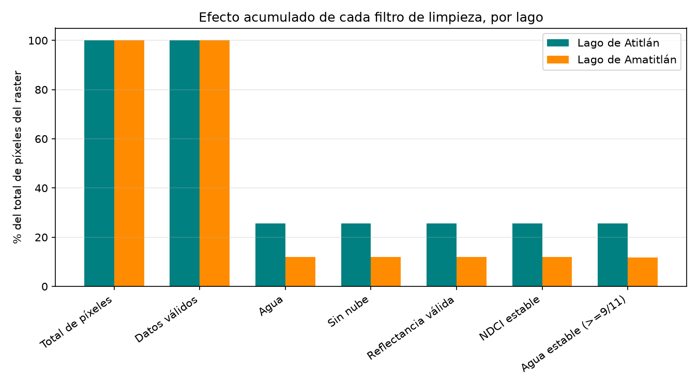
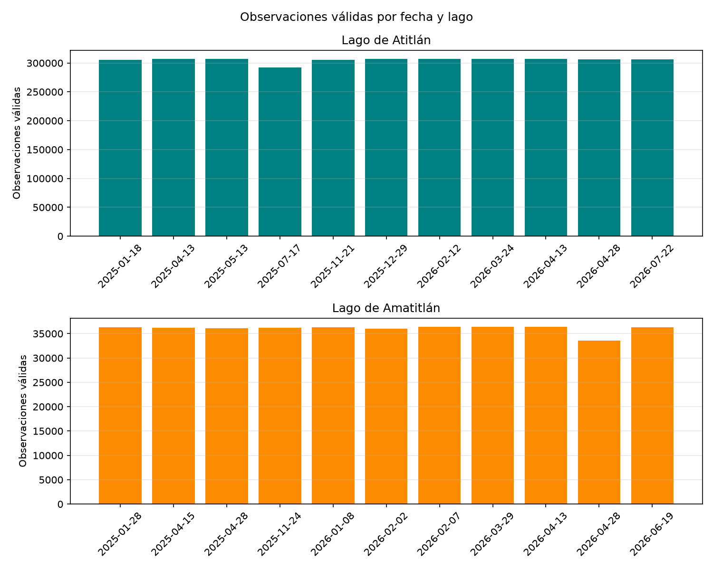
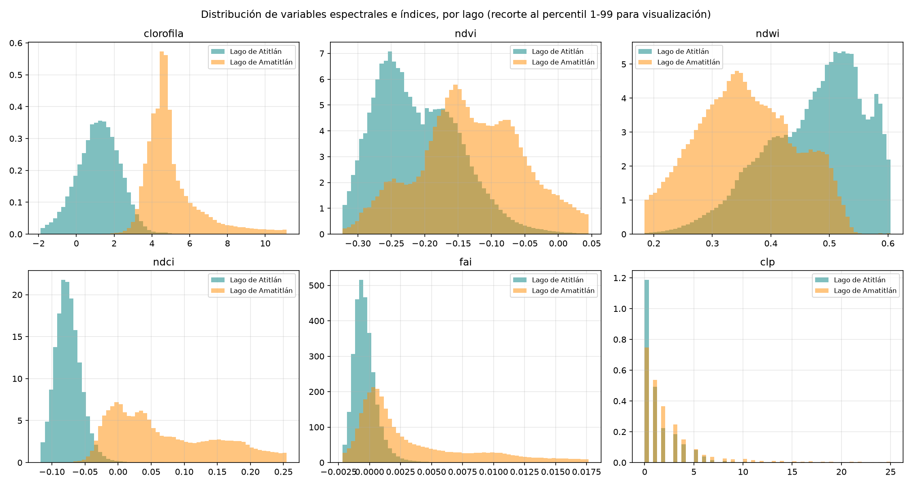
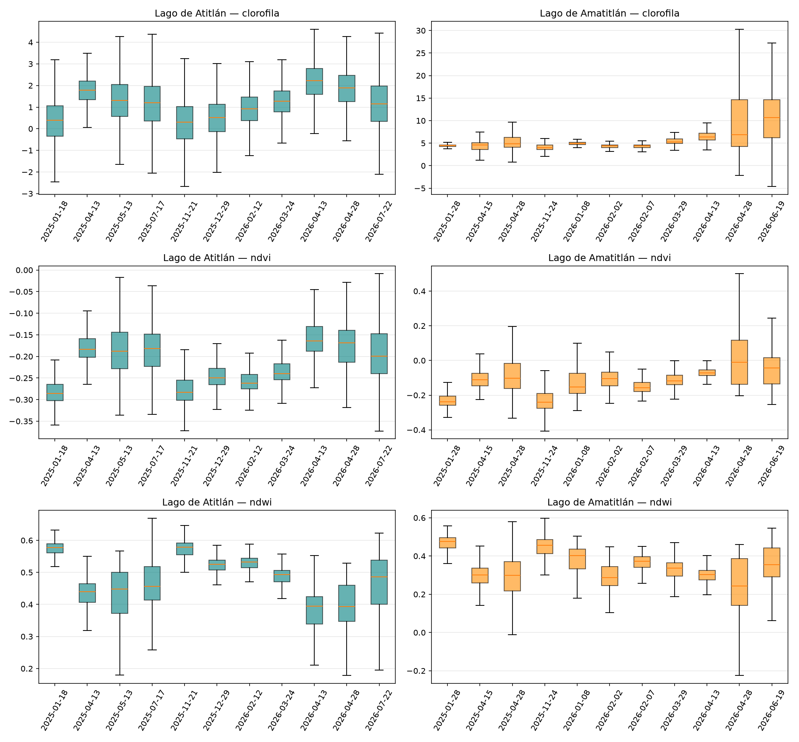
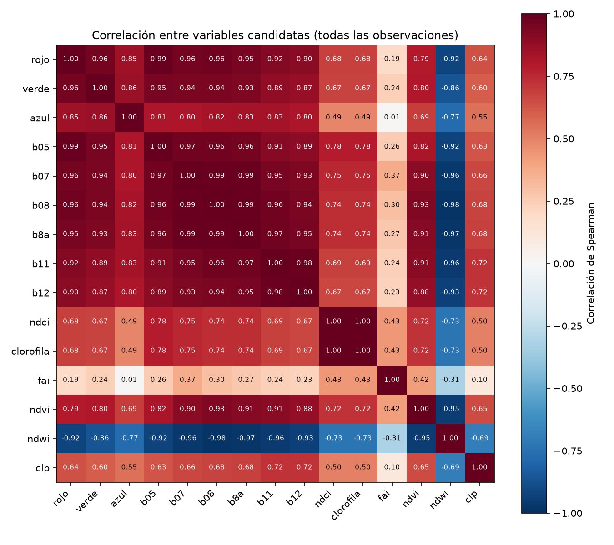
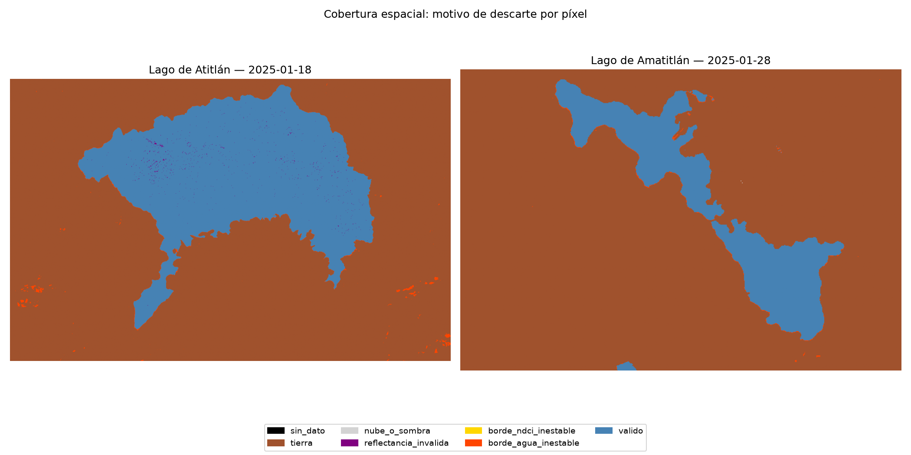

# Inciso 1. Preparación de los datos para Machine Learning

## Metodología

El punto de partida son los 22 rasters de la Parte I, uno por cada combinación de lago y fecha oficial (11 fechas para Atitlán, 11 para Amatitlán), cubriendo enero de 2025 a julio de 2026. Para este inciso el evalscript de descarga se amplió respecto a la Parte I: además de las 10 bandas originales, el raster ahora incluye las reflectancias B05, B07, B08, B8A, B11 y B12, y las bandas de nube CLM y CLP de Sentinel Hub. Con este evalscript ampliado se volvieron a descargar los 22 rasters antes de construir el dataset tabular, de modo que cada píxel de agua cuenta con un conjunto más completo de bandas espectrales como posibles predictoras.

La construcción del conjunto de datos se implementó en `src/dataset.py` y se ejecuta desde `notebooks/p2_01_preparacion_datos.ipynb`. Por cada combinación lago-fecha se calcula el centro de cada píxel en WGS84 a partir de la transformación geográfica del raster y se reproyecta a UTM 15N, EPSG:32615, con unidades en metros. Esta reproyección se realiza en este inciso, y no se posterga hasta la validación espacial del inciso 6, porque el sistema métrico es el mismo que exige esa validación y porque permite verificar en este mismo inciso que las coordenadas de cada observación caen dentro del área geográfica esperada de su lago.

Sobre cada raster se aplican, en orden, los siguientes filtros de validez:

1. Máscara de datos válidos, descarta valores NoData y área fuera de la huella descargada.
2. Clasificación de agua, descarta tierra firme alrededor del lago, usando la máscara espectral ya calculada en la Parte I.
3. Ausencia de nube o sombra de nube, descarta píxeles con nube confirmada o con probabilidad alta de nube.
4. Reflectancia en rango válido, exige que las nueve bandas ópticas sean finitas y estén en un rango físicamente razonable.
5. Denominador del NDCI estable, descarta el pequeño número de píxeles de borde donde el índice de cianobacteria es matemáticamente inestable.
6. Agua estable, exige que el píxel se haya clasificado como agua en al menos nueve de las once fechas oficiales de su lago.

El último filtro reutiliza el criterio de agua estable definido en el inciso 8 de la Parte I para descartar píxeles de orilla observados como agua en muy pocas fechas, cuyos ratios espectrales resultan inestables. La tabla final conserva, por observación, el lago, la fecha, la fila y columna dentro del raster, las coordenadas en longitud y latitud, las coordenadas en UTM 15N, las nueve bandas de reflectancia, el NDCI, el índice de cianobacteria, el FAI, el NDVI, el NDWI y la probabilidad residual de nube. Las bandas de máscara de datos válidos, de clasificación de agua y de nube confirmada se usan únicamente como filtros y no se conservan como columnas, porque tras aplicarlos quedan en un valor constante y no aportan información adicional.

## Resultados

### 1.1 a 1.3 Construcción y limpieza del dataset

El dataset final contiene 3,753,732 observaciones válidas. La figura `p2_efecto_filtros.png` muestra el porcentaje de píxeles retenido tras cada filtro, por lago.

La caída más grande ocurre en el filtro de agua: en Atitlán, cuyo bbox es más ancho respecto al cuerpo del lago, queda alrededor de 26% del raster como agua; en Amatitlán, con un bbox más ajustado al contorno del lago, queda cerca de 12%. Los filtros posteriores retienen prácticamente toda esta agua, con la excepción puntual de fechas con nubosidad real sobre el lago, discutida en la sección de decisiones técnicas.

### 1.4 Observaciones, variables y valores faltantes

El dataset contiene 3,357,567 observaciones de Atitlán y 396,165 de Amatitlán, distribuidas en las once fechas oficiales de cada lago. La figura `p2_observaciones_por_lago_fecha.png` muestra el número de observaciones válidas por fecha.

En Atitlán, diez de las once fechas conservan entre 305 mil y 307 mil observaciones; la excepción es 2025-07-17, con 292,390, afectada por nubosidad real sobre el lago, ya explicada en la sección de decisiones técnicas. En Amatitlán las once fechas se mantienen entre 33,578 y 36,390 observaciones, con la fecha 2026-04-28 como la más afectada por nubosidad.

El dataset tiene 23 columnas: identificadores de lago y fecha, posición dentro del raster, coordenadas geográficas y UTM, y las quince bandas de reflectancia e índices. Ninguna variable presenta valores faltantes, ya que los filtros de limpieza descartan todo píxel con NoData, tierra, nube, reflectancia inválida o denominador inestable antes de construir la tabla, de modo que cada observación conservada tiene sus quince bandas completas. Los tipos de dato son consistentes con el contenido de cada columna: categórico para el lago, fecha para la fecha de adquisición, enteros para la posición en el raster y punto flotante para coordenadas, reflectancias e índices.

### 1.5 Análisis exploratorio

La figura `p2_distribuciones_variables.png` compara la distribución de seis variables clave entre ambos lagos, con el eje recortado al percentil 1 y 99 únicamente para fines de visualización.

El índice de cianobacteria muestra una separación clara entre lagos: la distribución de Atitlán se concentra entre -2 y 4, con una moda cercana a 1, mientras la de Amatitlán se concentra entre 2 y 8, con una moda cercana a 5 y una cola derecha más larga hacia valores altos. Esta diferencia reproduce, ya a nivel de píxel, el mayor deterioro ambiental de Amatitlán reportado en la Parte I. El NDVI es negativo en la mayoría de píxeles de ambos lagos, coherente con agua abierta sin vegetación emergente, y el NDWI es alto y con distribución similar entre lagos, confirmando que la máscara de agua delimita correctamente el cuerpo de agua en ambos casos. El NDCI y el FAI muestran el mismo patrón de separación entre lagos que el índice de cianobacteria, dado que ambos participan en su construcción. La probabilidad residual de nube se concentra en valores cercanos a cero en los dos lagos, consistente con el filtro de nubosidad ya aplicado.

La figura `p2_boxplots_por_fecha.png` compara la distribución completa del índice de cianobacteria, el NDVI y el NDWI entre las once fechas de cada lago.

En Atitlán la mediana del índice de cianobacteria sube de forma moderada hacia 2026, con una caja notablemente más ancha en 2026-04-13 y 2026-04-28 que en el resto de fechas. En Amatitlán el patrón es más marcado: las medianas se mantienen relativamente estables entre 4 y 6 hasta 2026-03-29, y luego suben con fuerza en 2026-04-28 y 2026-06-19, con cajas mucho más anchas y bigotes que llegan hasta 30, reflejando los picos de floración ya identificados en la Parte I. El NDVI y el NDWI siguen el mismo patrón temporal en dirección opuesta, con NDVI subiendo y NDWI bajando en las fechas de mayor índice de cianobacteria, consistente con la relación entre ambos indicadores reportada en la Parte I.

La figura `p2_correlacion_variables.png` muestra la matriz de correlación de Spearman entre las quince variables candidatas, calculada sobre la totalidad de las observaciones.

El NDCI y el índice de cianobacteria tienen una correlación de 1.00, porque el segundo es una transformación polinomial directa del primero. Ambos correlacionan con fuerza con las bandas rojo y B05, con valores de 0.68 y 0.78 respectivamente, ya que el NDCI se calcula directamente a partir de esas dos bandas. Las nueve bandas de reflectancia correlacionan entre 0.80 y 0.99 entre sí, un nivel de colinealidad esperado dado que todas responden, en distinto grado, a la misma señal de agua. El NDVI y el NDWI tienen una correlación de -0.95, coherente con que ambos se construyen a partir de combinaciones similares de las mismas bandas con signo opuesto. La probabilidad residual de nube correlaciona de forma moderada con las bandas de reflectancia, entre 0.56 y 0.72, y de forma negativa con el NDWI, -0.69, lo que sugiere que incluso tras el filtro de nubosidad queda una señal residual asociada a condiciones atmosféricas parciales sobre el agua.

La figura `p2_cobertura_espacial.png` clasifica cada píxel de una fecha representativa de cada lago según el primer filtro que lo descarta.

En ambas fechas la categoría de descarte por tierra domina fuera del contorno del lago, como se espera dado que el bbox de descarga incluye área terrestre alrededor del cuerpo de agua. Las observaciones válidas cubren la práctica totalidad del cuerpo de agua en ambos lagos. Los descartes por calidad, nube o sombra, reflectancia inválida, borde con NDCI inestable y borde de agua inestable, aparecen como un borde delgado alrededor del contorno del agua y no como regiones internas extensas, lo que indica que la limpieza no introduce huecos relevantes dentro del área de estudio de ninguno de los dos lagos.

## Figuras generadas

- `informe/figuras/p2_efecto_filtros.png`
- `informe/figuras/p2_observaciones_por_lago_fecha.png`
- `informe/figuras/p2_distribuciones_variables.png`
- `informe/figuras/p2_boxplots_por_fecha.png`
- `informe/figuras/p2_correlacion_variables.png`
- `informe/figuras/p2_cobertura_espacial.png`

## Decisiones técnicas

- El evalscript de descarga se amplió de 10 a 18 bandas de salida, anexando las bandas nuevas después de las diez originales para no alterar el resultado de los notebooks de la Parte I. Sin esta ampliación, las únicas bandas de reflectancia disponibles eran B02, B03 y B04, y dos de esas tres participan en la construcción del índice de cianobacteria, lo que habría dejado casi sin predictores válidos independientes a los incisos de modelado.
- Al construir el dataset se detectó que la banda CLM usa el valor 255 como código de "sin dato" del modelo de detección de nubes, y no como nube. En tres de las 22 fechas, tratar ese valor como nube descartaba entre 48% y 92% de los píxeles de agua, a pesar de que esos píxeles tenían reflectancia y probabilidad de nube, CLP, normales. Por esta razón el filtro final excluye únicamente los píxeles con nube confirmada, CLM igual a uno, y usa CLP, que sí entrega un valor continuo incluso donde CLM es "sin dato", como criterio principal de nubosidad. Esta decisión evita descartar de forma injustificada una fracción grande de observaciones válidas y sustituye, para efectos de limpieza, el porcentaje de nubosidad reportado a nivel de escena completa por una evaluación directa sobre cada píxel del área de estudio.
- La fecha de Amatitlán del 7 de febrero de 2026 había sido señalada en la Parte I con una cobertura parcial de nubes de 57.1% según el catálogo. Los conteos de este inciso confirman lo ya observado en la Parte I: para el área específica del lago la imagen retiene 36,383 de 36,792 píxeles de agua, un 98.9%, prácticamente libre de nubes, por lo que la fecha se mantiene sin ajustes adicionales.
- Las columnas de máscara de datos válidos, clasificación de agua y nube confirmada se usan como filtros pero no se conservan en la tabla final, porque tras aplicar los filtros quedan en un valor constante y no aportan información como predictoras.
- El NDCI, la banda rojo, B04, y la banda B05 quedan comprometidas como predictoras desde este inciso, porque el índice de cianobacteria se calcula directamente a partir de ellas. Esta observación se retoma con mayor detalle en el inciso 2.5, donde se define formalmente la variable respuesta y se excluyen sus predictores directos.
- El dataset completo se guarda en `data/processed/dataset_ml.parquet`. Dado su tamaño, más de 3.7 millones de filas, se genera además `data/processed/dataset_ml_muestra.parquet`, un submuestreo aleatorio reproducible de 150,000 observaciones por lago, repartidas en partes iguales entre las once fechas de cada lago, que se usará como conjunto de trabajo en los incisos de ajuste de hiperparámetros, validación espacial y explicabilidad, donde el volumen completo resultaría lento sin aportar precisión adicional relevante.
