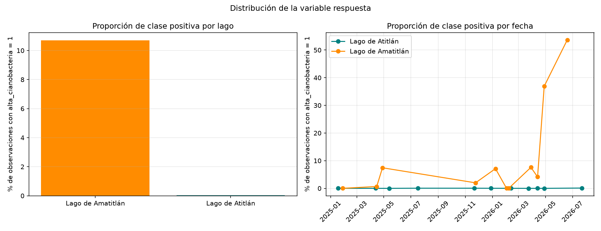

# Inciso 2. Construcción de la variable respuesta

## Metodología

La variable respuesta se construye en `src/modelado.py` (`construir_respuesta`) y se aplica desde `notebooks/p2_02_variable_respuesta.ipynb` sobre el dataset completo del inciso 1, `data/processed/dataset_ml.parquet`. Se define `alta_cianobacteria = 1` cuando `clorofila >= 10 µg/L`, y `0` en caso contrario, donde `clorofila` es la concentración de clorofila-a estimada en el inciso 1 mediante el polinomio NDCI de Mishra & Mishra.

## Resultados

### 2.1 y 2.2 Umbral y justificación científica

Se adopta el umbral de **10 µg/L de clorofila-a**, sustentado en tres fuentes independientes que convergen en el mismo rango:

- La Organización Mundial de la Salud (WHO, 2003, *Guidelines for Safe Recreational Water Environments*, Vol. 1: *Coastal and Fresh Waters*) define el **Alert Level 1** para aguas recreativas en clorofila-a >= 10 µg/L, típicamente acompañado de cianobacterias >= 20,000 células/mL, umbral a partir del cual recomienda vigilancia activa por riesgo de irritación de piel y síntomas gastrointestinales leves. Es el criterio principal adoptado, por estar directamente ligado a riesgo sanitario y ser el más usado en monitoreo operativo de floraciones.
- La clasificación trófica de la OECD (1982, *Eutrophication of Waters: Monitoring, Assessment and Control*) ubica el estado **eutrófico** en clorofila-a media de 8 a 25 µg/L.
- El Índice de Estado Trófico de Carlson (1977, *A trophic state index for lakes*, `TSI(Chl) = 9.81·ln(Chl) + 30.6`) marca el límite mesotrófico-eutrófico (TSI = 50) en clorofila-a ≈ 7 µg/L.

El umbral se aplica sobre `clorofila`, ya en unidades físicas (µg/L) comparables con la bibliografía citada, y no sobre `ndci`, que es adimensional y solo tiene interpretación relativa.

### 2.3 Distribución de la variable respuesta

La figura `p2_distribucion_respuesta.png` muestra la proporción de observaciones con `alta_cianobacteria = 1` por lago y por fecha.

**Globalmente**, de las 3,753,732 observaciones del dataset, 43,269 (**1.15 %**) quedan clasificadas como alta presencia.

**Por lago**, la diferencia es de dos órdenes de magnitud:

| Lago | Observaciones | Alta presencia | Proporción |
|---|---|---|---|
| Amatitlán | 396,165 | 42,405 | **10.70 %** |
| Atitlán | 3,357,567 | 864 | **0.026 %** |

Es decir, el 98 % de las observaciones positivas del dataset provienen de Amatitlán, que aporta apenas el 10.6 % de las observaciones totales.

**Por fecha**, la proporción positiva en Amatitlán recorre casi todo el rango posible: desde 0.00 % (2026-02-02, 1 píxel de 36,010) hasta **53.7 %** (2026-06-19) y 36.9 % (2026-04-28), con valores intermedios de 7-8 % en 2025-04-28, 2026-01-08 y 2026-03-29. En Atitlán ninguna fecha supera el 0.11 % (máximo 2026-07-22, con 335 píxeles), y siete de las once fechas quedan por debajo de 0.05 %. Los dos picos de Amatitlán coinciden con los eventos de floración identificados en la Parte I.

### 2.4 Desbalance de clases

Existe un desbalance de clases severo: la razón global es de **85.8 : 1** a favor de la clase 0 (3,710,463 observaciones de clase 0 contra 43,269 de clase 1). Ese promedio, además, esconde dos regímenes muy distintos: en Amatitlán la razón es de **8.3 : 1**, un desbalance moderado y manejable, mientras que en Atitlán llega a **3,885 : 1**, un caso extremo en el que la clase positiva es prácticamente anecdótica. Las consecuencias sobre el entrenamiento y la evaluación de los modelos son:

- **Entrenamiento**: un clasificador puede minimizar la función de pérdida global prediciendo casi siempre la clase mayoritaria (0), logrando *accuracy* alto sin aprender a distinguir la clase de interés. Se mitiga con `class_weight="balanced"` en Regresión Logística y Random Forest (inciso 4) y con la división estratificada del inciso 4.2.
- **Evaluación**: el *accuracy* deja de ser informativo, porque un modelo trivial que siempre predice 0 obtendría un *accuracy* cercano a la proporción de la clase mayoritaria. Por eso el inciso 5 reporta también *precision*, *recall*, *F1* y *ROC-AUC*, y prioriza el *recall* de la clase 1 dado el mayor costo ambiental de no detectar una floración real frente al de una falsa alarma (inciso 5.3).

### 2.5 Variables excluidas como predictoras

Quedan excluidas como predictoras: `clorofila`, `ndci`, `rojo` (B04) y `b05` (B05).

`clorofila` es la variable a partir de la cual se construye directamente `alta_cianobacteria`; incluirla haría que el modelo aprenda literalmente el umbral, no un patrón espectral. `ndci` queda excluida porque `clorofila` es una transformación polinomial directa de `ndci` (correlación de Spearman de 1.00, reportada en el inciso 1). `rojo` y `b05` quedan excluidas porque `ndci = (B05 − B04) / (B05 + B04)` se calcula directamente a partir de ellas, produciendo fuga de información indirecta.

`fai` y `ndvi` sí se conservan como predictoras a pesar de que su fórmula también usa B04: a diferencia de `ndci`, no son la variable a partir de la cual se definió el umbral de la respuesta, combinan B04 con otras bandas (B07, B8A) y capturan una señal distinta (materia flotante y vegetación) que aporta información adicional sin ser una transformación directa de la respuesta.

## Figuras generadas

- `informe/figuras/p2_distribucion_respuesta.png`

## Decisiones técnicas

- El umbral (10 µg/L) es fijo y absoluto, no relativo a percentiles de la muestra, para conservar interpretación ambiental directa y comparabilidad entre lagos y fechas.
- Además de las cuatro variables excluidas por fuga directa, `clp` (probabilidad residual de nube) no se incluye en el conjunto de predictoras definido en `src/modelado.py`: no participa en la construcción de la respuesta, pero es un remanente de la limpieza de nubes del inciso 1 sin señal ambiental relevante para cianobacteria. Esta decisión se detalla en el inciso 3.
