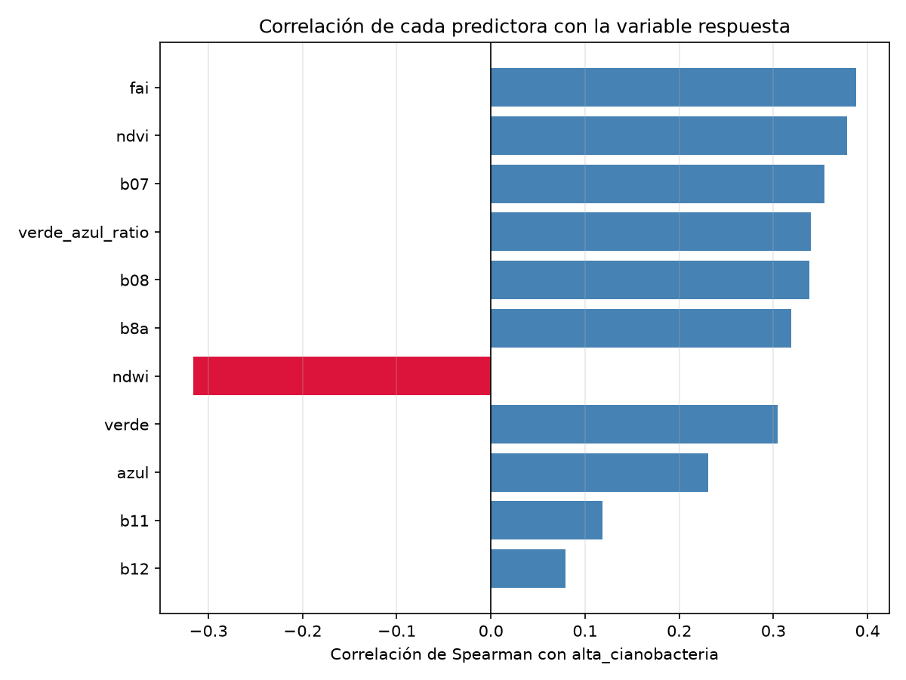

# Inciso 3. Selección y construcción de variables predictoras

## Metodología

`PREDICTORES` (`src/modelado.py`) reúne las bandas e índices que no participan en la construcción de la variable respuesta (inciso 2.5). A partir de este inciso los notebooks trabajan sobre `data/processed/dataset_ml_muestra.parquet`, la muestra de trabajo de 300,000 observaciones generada en el inciso 1, que también usarán los incisos de modelado siguientes.

## Resultados

### 3.1 y 3.2 Conjunto de variables predictoras

| Variable | Tipo | Qué representa | Por qué contribuye a detectar cianobacteria |
|---|---|---|---|
| `verde` | banda espectral (B03, 560 nm) | Reflectancia verde-amarilla | El pico de reflectancia verde es característico de la absorción de ficocianina y clorofila-a en cianobacterias; base de los algoritmos clásicos de color oceánico |
| `azul` | banda espectral (B02, 490 nm) | Reflectancia azul | Junto con verde forma la base de las razones de color oceánico (OC2/OC3) para estimar clorofila en agua abierta; disminuye con mayor concentración de pigmentos |
| `b07` | banda espectral (Red Edge 3, 783 nm) | Reflectancia en el filo rojo | Zona de transición entre absorción de clorofila y dispersión celular; insumo del FAI |
| `b08` | banda espectral (NIR, 842 nm) | Reflectancia infrarroja cercana | La dispersión por partículas y biomasa suspendida eleva la reflectancia NIR; distingue acumulaciones densas de fitoplancton o espuma del agua limpia |
| `b8a` | banda espectral (NIR angosta, 865 nm) | Reflectancia infrarroja cercana, banda angosta | Insumo directo del FAI; sensible a materia orgánica flotante en superficie |
| `b11` | banda espectral (SWIR1, 1610 nm) | Reflectancia infrarroja de onda corta 1 | Sensible al contenido de humedad/turbidez; ayuda a diferenciar agua limpia de agua con alta carga orgánica o sedimentaria |
| `b12` | banda espectral (SWIR2, 2190 nm) | Reflectancia infrarroja de onda corta 2 | Sensibilidad complementaria a `b11` frente a turbidez y materiales flotantes |
| `fai` | índice espectral derivado | Floating Algae Index | Diseñado para detectar acumulaciones de materia flotante, incluidas floraciones superficiales |
| `ndvi` | índice espectral derivado | Normalized Difference Vegetation Index | En agua abierta toma valores negativos; su magnitud es sensible a biomasa flotante y algas superficiales densas |
| `ndwi` | índice espectral derivado | Normalized Difference Water Index | Delimita el cuerpo de agua; covaría de forma inversa con la turbidez y la carga de biomasa |
| `verde_azul_ratio` | característica derivada (3.3) | Razón verde/azul | Análoga simplificada a las razones OC2/OC3 de color oceánico para estimar pigmentos fotosintéticos |

### 3.3 Ingeniería de características

Se agrega una única variable derivada, `verde_azul_ratio` (`src/modelado.agregar_features`), razón entre las bandas verde y azul. Es análoga simplificada a las razones de color oceánico OC2/OC3 (O'Reilly et al., 1998, *Ocean color chlorophyll algorithms for SeaWiFS*), diseñadas para estimar la concentración de pigmentos fotosintéticos a partir de reflectancias visibles, y no comparte bandas con `ndci`/`clorofila`, por lo que no introduce fuga de información.

Se consideraron y descartaron razones adicionales entre `b11`, `b12`, `b07` y `b8a` (por ejemplo `b11/b12` como proxy de turbidez, o una pendiente del red edge con `b07`/`b8a`): esas cuatro bandas ya entran individualmente como predictoras, y una razón entre ellas sería casi colineal con las bandas que la componen sin aportar señal independiente adicional, por lo que se mantiene el conjunto de predictoras simple.

### Correlación de cada predictora con la variable respuesta

La figura `p2_correlacion_predictoras_respuesta.png` muestra la correlación de Spearman de cada predictora con `alta_cianobacteria`.

`ndvi` y `verde_azul_ratio` muestran la correlación positiva más fuerte, consistente con que ambas capturan, de forma indirecta, la señal de pigmentos fotosintéticos que también produce el NDCI. `ndwi` muestra la correlación negativa más fuerte, coherente con que las floraciones dispersan y reflejan más luz en el visible/NIR, reduciendo la señal de "agua limpia" que captura ese índice. Las bandas SWIR (`b11`, `b12`) muestran correlaciones más débiles, aportando información complementaria más que señal dominante.

## Figuras generadas

- `informe/figuras/p2_correlacion_predictoras_respuesta.png`

## Decisiones técnicas

- El conjunto de predictoras se limita a 11 variables (10 bandas/índices del inciso 1 más `verde_azul_ratio`) para mantener el modelo interpretable y evitar colinealidad redundante; no se agregaron razones adicionales entre bandas ya incluidas individualmente.
- El análisis de correlación de este inciso es descriptivo, no un filtro de selección: todas las 11 variables se llevan al inciso 4, y es en la evaluación e interpretabilidad (incisos 5 y 8) donde se identifica su aporte real dentro de cada modelo.
