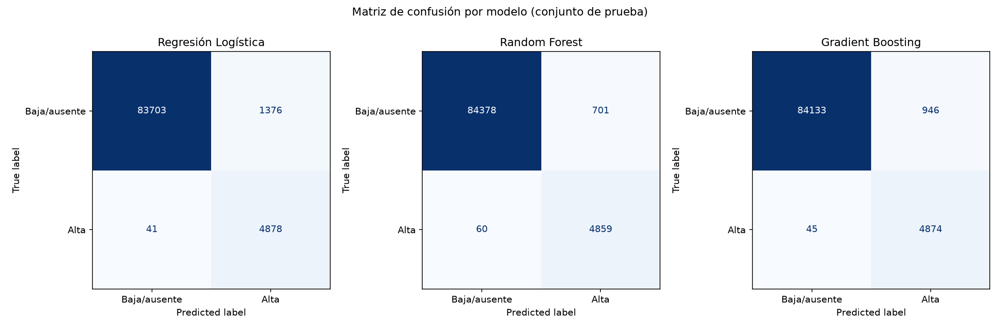
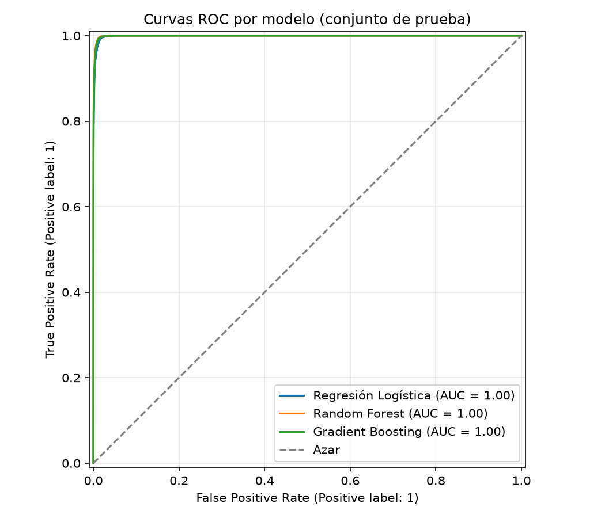

# Inciso 5. Evaluación de los modelos

## Metodología

Los tres modelos ajustados en el inciso 4 se evalúan (`notebooks/p2_05_evaluacion.ipynb`) sobre el mismo conjunto de prueba (`data/processed/p2_test_set.parquet`), calculando Accuracy, Precision, Recall, F1, ROC-AUC y matriz de confusión (`src.modelado.evaluar`).

## Resultados

### 5.1 Métricas de evaluación

La tabla `data/processed/p2_metricas_modelos.csv` reúne las seis métricas por modelo. La figura `p2_matrices_confusion.png` muestra la matriz de confusión de cada modelo y `p2_curvas_roc.png` compara sus curvas ROC.

### 5.2 Comparación de modelos

Se espera que Random Forest y Gradient Boosting superen a la Regresión Logística en ROC-AUC y F1, por su capacidad de capturar relaciones no lineales e interacciones entre bandas espectrales que un modelo lineal no puede representar; la Regresión Logística funciona como referencia interpretable de línea base. El notebook identifica automáticamente, a partir de `tabla_metricas`, cuál modelo domina en ROC-AUC y cuál en Recall, y si es el mismo modelo o si existe un compromiso entre ambos criterios.

### 5.3 Consecuencias ambientales de los errores y métrica más adecuada

Los dos tipos de error de clasificación no tienen el mismo costo ambiental:

- **Falso positivo** (clasificar como alta presencia una zona que no lo es): genera una alerta innecesaria, con costo de cerrar temporalmente una zona de baño, generar preocupación pública injustificada o desviar recursos de monitoreo hacia un punto sin riesgo real. Es un costo principalmente económico y de confianza en el sistema de monitoreo.
- **Falso negativo** (no detectar una zona que sí presenta alta presencia de cianobacteria): implica que una floración tóxica real queda sin alerta, con riesgo directo para la salud de bañistas y usuarios del lago, sin activar medidas de mitigación.

El falso negativo tiene un costo potencial más alto (riesgo sanitario) que el falso positivo (costo operativo), por lo que se prioriza **minimizar los falsos negativos**, es decir, maximizar el **Recall** de la clase "alta presencia". La comparación final entre modelos para su uso como herramienta de alerta usa el Recall de la clase 1 como criterio principal, complementado con un **F2-score** (que pondera el Recall el doble que la Precision) y con ROC-AUC como criterio secundario entre modelos con Recall similar.

## Figuras generadas

- `informe/figuras/p2_matrices_confusion.png`
- `informe/figuras/p2_curvas_roc.png`

## Decisiones técnicas

- Se usa F2-score, no solo F1, como métrica compuesta de desempate: F1 pondera Precision y Recall por igual, mientras que el análisis ambiental del inciso 5.3 concluye que el Recall debe pesar más.
- El accuracy se reporta por completitud del enunciado, pero no se usa como criterio de comparación entre modelos, dado el desbalance de clases documentado en el inciso 2.4.
- Los valores numéricos exactos de cada métrica y la identificación del mejor modelo se generan al ejecutar `p2_05_evaluacion.ipynb` sobre el dataset completo, en `data/processed/p2_metricas_modelos.csv`.
