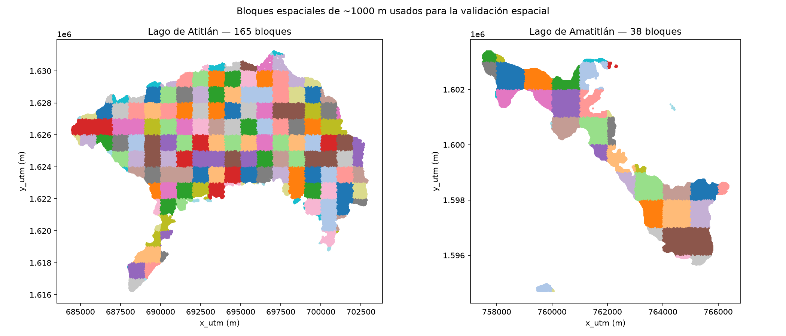
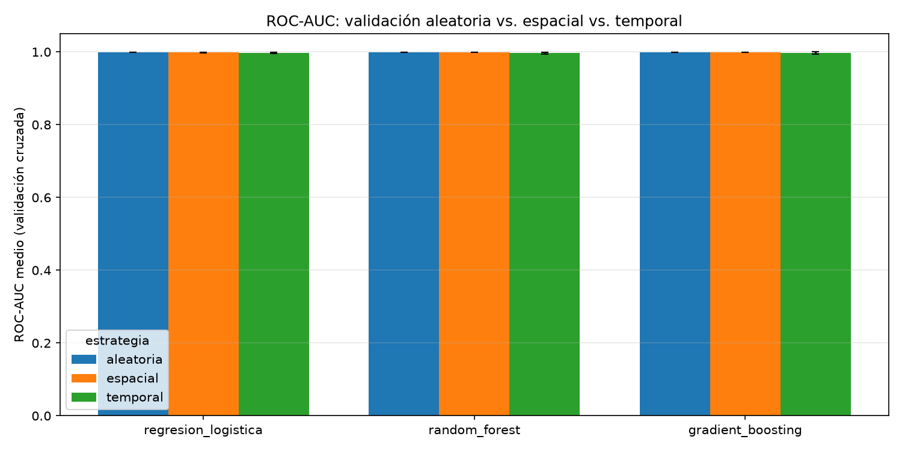

# Inciso 6. Validación espacial y temporal

## Metodología

Se divide cada lago en una cuadrícula regular de ~1 km × 1 km (`src/espacial.py`, `notebooks/p2_06_validacion_espacial.ipynb`) sobre las coordenadas `x_utm`/`y_utm` en EPSG:32615, ya calculadas en el inciso 1 al construir el dataset, por lo que este inciso no requiere una reproyección adicional. Cada observación se asigna a un bloque `"<lago>_<col>_<fila>"` (`asignar_bloques`), calculado por separado en cada lago para no mezclar identificadores entre Atitlán y Amatitlán. La validación espacial usa `StratifiedGroupKFold`: agrupa por bloque (ninguna observación de un mismo bloque queda repartida entre entrenamiento y validación dentro de un fold) y, dentro de esa restricción, intenta mantener la proporción de clases de cada fold cercana a la global.

A esa validación espacial se agrega su contraparte **temporal** (`asignar_grupos_temporales`, `cv_temporal`), con la misma mecánica de grupos pero usando la **fecha de adquisición** como agrupador: cada fold se evalúa sobre escenas completas que el modelo no vio durante su entrenamiento. Las dos responden a preguntas distintas: la espacial pregunta si el modelo predice *zonas* nuevas del lago; la temporal, si predice *días* nuevos, en los que cambian la iluminación solar, la nubosidad residual y el estado de la floración.

## Resultados

### 6.1 Cuadrícula de bloques y evaluación del tamaño

Con el tamaño de 1 km × 1 km del enunciado, la cuadrícula produce **203 bloques con observaciones válidas** en la muestra de trabajo:

| Lago | Bloques | Obs. por bloque (mín / mediana / máx) |
|---|---|---|
| Atitlán | 165 | 2 / 1,181 / 1,344 |
| Amatitlán | 38 | 42 / 3,128 / 10,859 |

El tamaño de 1 km **se conserva sin modificar**, porque incluso el lago más pequeño (Amatitlán, 38 bloques) queda muy por encima de los 5 grupos que exige una validación cruzada de 5 folds; `n_splits_seguro` confirmó que 5 folds son viables y ese es el número usado. La diferencia de forma entre ambos lagos es notoria y esperable: Atitlán, más extenso y de contorno regular, reparte sus observaciones de manera homogénea (mediana 1,181, máximo 1,344, es decir bloques casi todos "llenos"); Amatitlán, más pequeño y alargado, concentra hasta 10,859 observaciones en un solo bloque y baja a 42 en los bloques de borde, que apenas rozan la orilla del lago.

Reducir el bloque a 500 m habría multiplicado por cuatro el número de bloques, pero también habría acercado el tamaño del bloque a la escala espacial de las propias manchas de floración, debilitando el objetivo de la validación espacial: separar entrenamiento y validación a una distancia mayor que la autocorrelación que se quiere neutralizar.

### 6.2 Bloques espaciales

La figura `p2_bloques_espaciales.png` visualiza los bloques asignados a cada lago sobre sus coordenadas UTM.

Para la validación temporal, el agrupador son las **11 fechas de cada lago**, con exactamente 13,636 observaciones por fecha y por lago en la muestra de trabajo (`data/processed/p2_resumen_grupos_temporales.csv`), gracias al muestreo balanceado del inciso 1.

### 6.3 y 6.4 Validación cruzada espacial, temporal y aleatoria

Los tres modelos (con los mismos hiperparámetros por defecto usados como punto de partida en el inciso 4.1) se evalúan bajo las tres estrategias, con 5 folds cada una (`data/processed/p2_cv_aleatoria_vs_espacial.csv`, figura `p2_comparacion_cv.png`):

| Modelo | Estrategia | ROC-AUC medio | Desv. est. | Recall medio | F1 medio |
|---|---|---|---|---|---|
| Regresión Logística | aleatoria | 0.9989 | 0.0001 | 0.9932 | 0.8711 |
| Regresión Logística | espacial | 0.9987 | 0.0007 | 0.9927 | 0.8713 |
| Regresión Logística | temporal | 0.9977 | 0.0019 | 0.9758 | 0.7633 |
| Random Forest | aleatoria | 0.9993 | 0.0002 | 0.9700 | 0.9465 |
| Random Forest | espacial | 0.9991 | 0.0006 | 0.9604 | 0.9400 |
| Random Forest | temporal | 0.9968 | 0.0023 | **0.6839** | 0.7428 |
| Gradient Boosting | aleatoria | 0.9992 | 0.0001 | 0.9391 | 0.9410 |
| Gradient Boosting | espacial | 0.9991 | 0.0005 | 0.9304 | 0.9347 |
| Gradient Boosting | temporal | 0.9973 | 0.0028 | 0.8045 | 0.8414 |

### 6.5 y 6.6 Comparación e interpretación

**El desempeño sí disminuyó, pero la magnitud depende por completo de qué dimensión se bloquee y de qué métrica se mire.**

**La validación espacial casi no cambia nada.** La caída de ROC-AUC respecto a la aleatoria es de 0.0002 en Regresión Logística y Random Forest y de 0.0001 en Gradient Boosting — diferencias del orden de la desviación estándar entre folds, es decir, ruido. El Recall cae algo más (Random Forest, de 0.970 a 0.960; Gradient Boosting, de 0.939 a 0.930), pero sigue siendo una diferencia de aproximadamente un punto porcentual.

Este resultado, contrario a lo que suele esperarse en datos geoespaciales, tiene una explicación concreta: **el modelo no usa las coordenadas como predictoras**. Las 11 predictoras del inciso 3 son bandas espectrales e índices, no posición. La autocorrelación espacial de los píxeles vecinos existe, pero se manifiesta como similitud espectral, no como una regla del tipo "esta zona del lago siempre tiene floración" que el modelo pudiera memorizar. Al retirar un bloque completo de 1 km, el modelo sigue viendo, en el resto del lago y en las demás fechas, píxeles con firmas espectrales muy parecidas, así que no pierde información relevante.

**La validación temporal sí golpea, y con fuerza desigual entre modelos.** El ROC-AUC baja poco (de 0.9993 a 0.9968 en Random Forest, 2.5 diezmilésimas), pero el **Recall de Random Forest se desploma de 0.970 a 0.684**: al evaluarse sobre fechas nunca vistas, el mejor modelo del inciso 5 deja de detectar casi un tercio de las zonas con alta presencia. Gradient Boosting cae de 0.939 a 0.805, y la Regresión Logística, el modelo más simple, es el más robusto (0.993 a 0.976). La variabilidad entre folds también se multiplica por diez (desviación estándar de ROC-AUC de 0.0002 a 0.0023).

La razón es que **la verdadera unidad de dependencia en estos datos no es la vecindad espacial, sino la escena**. Todos los píxeles de una misma fecha comparten ángulo solar, condiciones atmosféricas, nubosidad residual y estado de la floración; una escena no es una colección de observaciones independientes sino, en la práctica, una sola observación de alta dimensión. Con solo 11 fechas por lago, retirar una fecha completa retira un régimen de condiciones entero. El caso extremo es 2026-06-19 en Amatitlán, con 53.7 % de píxeles positivos frente a fechas casi sin positivos: un fold entrenado sin esa fecha nunca vio una floración de esa intensidad.

También explica la inversión del ranking de modelos: Random Forest, con 400 árboles sin límite de profundidad, es el que más partido saca de particiones finas del espacio espectral, y esas particiones son precisamente lo que deja de ser válido cuando cambian las condiciones de adquisición. La Regresión Logística, al imponer una frontera lineal, no puede sobreajustarse a las particularidades de una escena y por eso degrada menos.

**Cuál estimación es más realista.** Para el uso previsto del modelo —aplicarlo a una imagen nueva de un día futuro— la estimación más realista es la de la **validación temporal**, no la espacial ni la aleatoria. La validación aleatoria del inciso 4 y la espacial de este inciso reparten píxeles de las mismas 11 fechas entre entrenamiento y prueba, de modo que el modelo siempre ha visto ya el "día" que se le pide predecir. Un Recall operativo del orden de **0.68**, y no el 0.99 del inciso 5, es la cifra que debe usarse para decidir si el modelo sirve como herramienta de monitoreo (inciso 10).

## Figuras generadas

- `informe/figuras/p2_bloques_espaciales.png`
- `informe/figuras/p2_comparacion_cv.png`

## Decisiones técnicas

- Se usa `StratifiedGroupKFold` en lugar de `GroupKFold` simple: agrupar únicamente por bloque, sin estratificar, podría producir folds con muy pocas o ninguna observación de la clase minoritaria dado el desbalance del inciso 2.4, especialmente en Atitlán.
- La cuadrícula se construye por división entera sobre `x_utm`/`y_utm` en lugar de con una librería de geometría (p. ej. geopandas), evitando una dependencia nueva para una operación que, sobre una grilla regular alineada a los ejes UTM, se resuelve con aritmética simple.
- La validación temporal agrupa por fecha **sola**, sin combinarla con el lago: las dos fechas compartidas por ambos lagos (2026-04-13 y 2026-04-28) caen así en el mismo fold. Separarlas dejaría que el modelo viera la escena de un lago mientras se le evalúa en la del otro el mismo día, que es exactamente la fuga que esta validación busca evitar.
- El número de folds no se fija en 5 de forma incondicional: `n_splits_seguro` lo reduce si el lago con menos bloques o la clase minoritaria no alcanzan para 5 grupos. En esta ejecución no fue necesario reducirlo.
