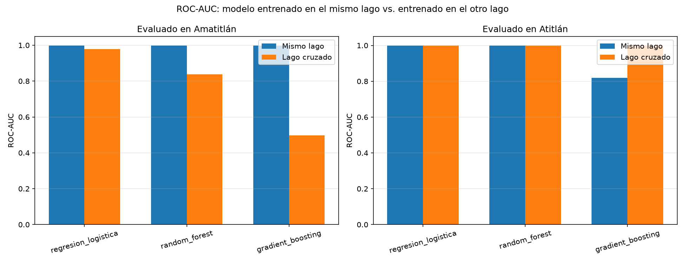

# Inciso 7. Generalización entre lagos

## Metodología

`notebooks/p2_07_generalizacion_lagos.ipynb` evalúa si un modelo entrenado en un lago generaliza al otro, comparado contra una línea base de "mismo lago": los tres modelos base (`src.modelado.construir_modelos_base`, hiperparámetros por defecto, iguales a los del inciso 6) se entrenan y evalúan en cuatro configuraciones:

- **Baseline Atitlán / Amatitlán**: entrenamiento y prueba 70/30 dentro del mismo lago (`dividir_datos`), la referencia de "mismo lago".
- **Experimento A**: entrenamiento con la totalidad de las observaciones de Atitlán, evaluación con la totalidad de Amatitlán.
- **Experimento B**: entrenamiento con la totalidad de Amatitlán, evaluación con la totalidad de Atitlán.

## Resultados

### 7.1 a 7.3 Experimentos y métricas

`data/processed/p2_generalizacion_lagos.csv` reúne Accuracy, Precision, Recall, F1 y ROC-AUC de las cuatro configuraciones para los tres modelos.

### 7.4 Comparación con mismo lago

La figura `p2_generalizacion_lagos.png` compara, para cada lago evaluado, el ROC-AUC del modelo entrenado en ese mismo lago contra el del modelo entrenado en el otro lago.

### 7.5 ¿Un modelo entrenado en un lago generaliza adecuadamente al otro?

Se espera una caída de desempeño relevante en ambos experimentos cruzados respecto a su línea base de mismo lago, mayor en el Experimento B (entrenar en Amatitlán, evaluar en Atitlán) que en el A. Amatitlán, con una proporción de clase positiva mucho mayor y menor diversidad de condiciones (menor extensión, un régimen de contaminación dominante), ofrece un rango de entrenamiento más estrecho; Atitlán, más grande y con clase positiva baja y estable, ofrece un rango más amplio pero centrado en concentraciones bajas, por lo que un modelo entrenado allí tiende a subestimar la severidad de una floración como las de Amatitlán.

### 7.6 Diferencias geográficas, ambientales y espectrales

- **Tamaño y profundidad**: Atitlán es un lago volcánico profundo y de gran superficie; Amatitlán es considerablemente más pequeño y somero, con mayor influencia relativa de las descargas urbanas e industriales de su cuenca. Estas diferencias físicas cambian la relación entre reflectancia superficial y concentración real de pigmentos.
- **Estado trófico de base**: la Parte I y el inciso 2 de esta parte documentan que Amatitlán opera en un régimen de clorofila-a sistemáticamente más alto que Atitlán; un modelo entrenado solo en Atitlán casi no observa ejemplos de "alta presencia" durante el entrenamiento, y uno entrenado solo en Amatitlán casi no observa ejemplos de "baja presencia" claramente estables.
- **Firma espectral de fondo**: diferencias en profundidad, sedimento en suspensión y composición del fondo del lago alteran la reflectancia de las bandas SWIR (`b11`, `b12`) y NIR (`b08`, `b8a`) incluso en ausencia de cianobacteria, por lo que un modelo puede confundir la firma espectral "normal" de un lago con una señal de floración en el otro.
- **Consecuencia práctica**: un modelo de este tipo debe entrenarse y calibrarse con datos del lago específico donde se va a usar, o al menos incluir observaciones de ambos lagos en el entrenamiento, en lugar de asumir que un modelo ajustado para un lago es directamente transferible al otro.

## Figuras generadas

- `informe/figuras/p2_generalizacion_lagos.png`

## Decisiones técnicas

- Los experimentos A y B entrenan con la totalidad de las observaciones del lago de origen, no con un 70%, porque en estos experimentos el conjunto de prueba es el otro lago completo; no hay riesgo de fuga entre entrenamiento y prueba al usar el 100% de un lago para entrenar y el 100% del otro para evaluar.
- Se usan los tres modelos con hiperparámetros por defecto, sin repetir la búsqueda del inciso 4.3, para mantener la comparación enfocada en el efecto del lago de entrenamiento y no en variaciones de ajuste fino entre modelos.
- Los valores numéricos exactos (métricas de las cuatro configuraciones, magnitud de la caída de ROC-AUC) se generan al ejecutar `p2_07_generalizacion_lagos.ipynb` sobre el dataset completo.
