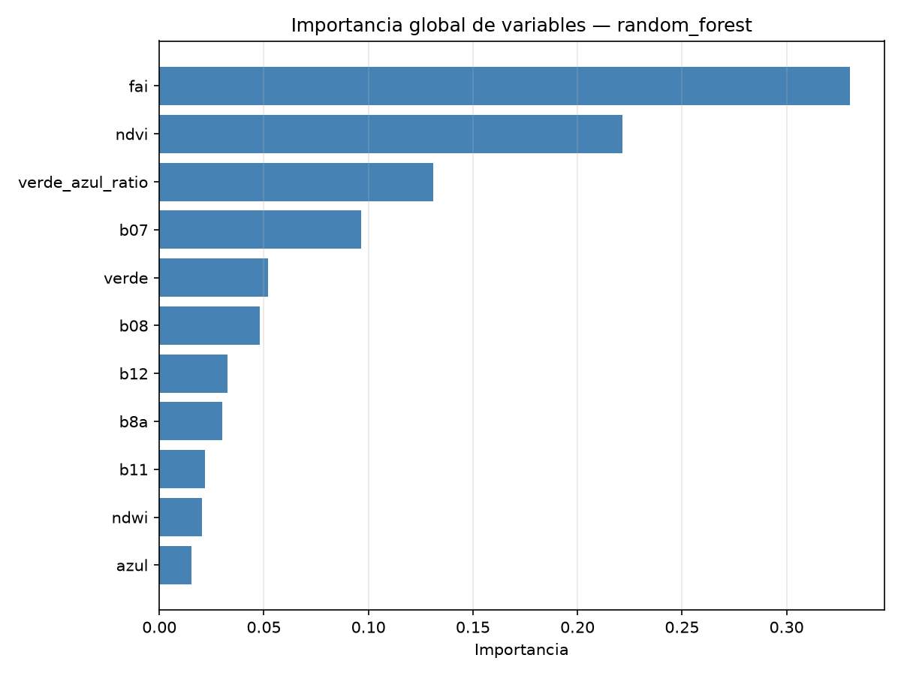
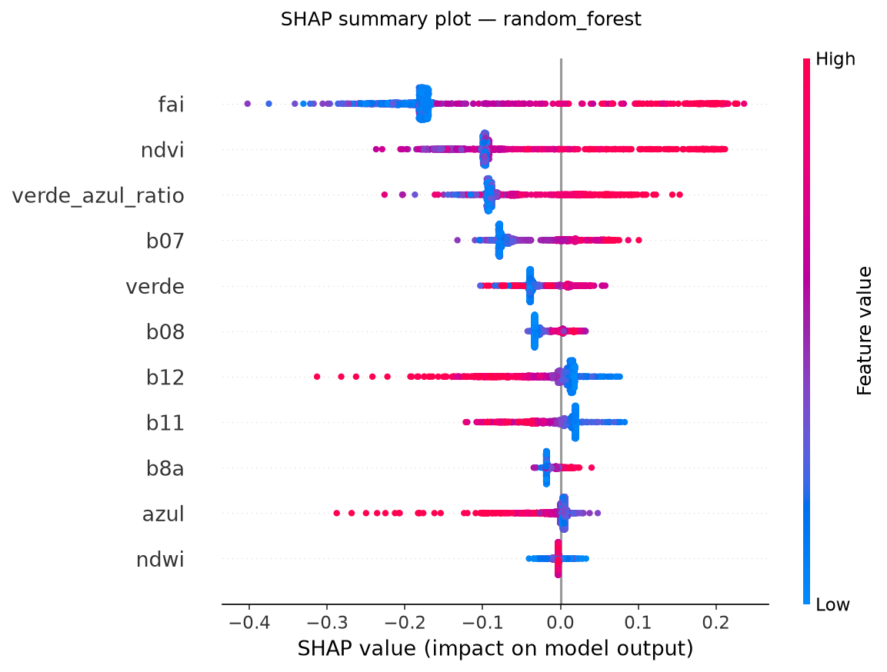

# Inciso 8. Interpretación y explicabilidad del modelo

## Metodología

`notebooks/p2_08_interpretabilidad.ipynb` toma el modelo con mejor F2-score del inciso 5 (`data/processed/p2_metricas_modelos.csv`), el criterio orientado a Recall definido en el 5.3, y lo interpreta con importancia global de variables (`src.modelado.importancia_global`) y con SHAP. Random Forest y Gradient Boosting exponen `feature_importances_` directamente; Regresión Logística, envuelta en un `Pipeline` con escalado, se interpreta con el valor absoluto de sus coeficientes estandarizados. Para SHAP, los modelos de árboles usan `shap.TreeExplainer` (exacto y eficiente); Regresión Logística usa el `shap.Explainer` genérico sobre `predict_proba`, con una muestra de referencia. Los valores SHAP se calculan sobre una submuestra de 2,000 observaciones del conjunto de prueba del inciso 4, suficiente para un resumen estable sin el costo de explicar el conjunto completo.

## Resultados

### 8.1 Importancia global de variables

El mejor modelo por F2-score es **Random Forest** (F2 = 0.9627). Su importancia global de variables (`data/processed/p2_importancia_variables.csv`) queda concentrada en cuatro predictoras, que reúnen el 78 % de la importancia total:

| Variable | Importancia | Variable | Importancia |
|---|---|---|---|
| `fai` | 0.330 | `b12` | 0.033 |
| `ndvi` | 0.222 | `b8a` | 0.030 |
| `verde_azul_ratio` | 0.131 | `b11` | 0.022 |
| `b07` | 0.097 | `ndwi` | 0.020 |
| `verde` | 0.052 | `azul` | 0.015 |
| `b08` | 0.048 | | |

### 8.2 SHAP Summary Plot

La figura `p2_shap_summary.png` muestra la dispersión de valores SHAP de cada predictora sobre la submuestra explicada. El orden de variables coincide exactamente con el de la importancia global, lo que indica que la jerarquía no es un artefacto del método de medición.

### 8.3 y 8.4 Variables de mayor influencia e interpretación ambiental

Las cuatro variables de mayor dispersión SHAP son `fai`, `ndvi`, `verde_azul_ratio` y `b07`, y en las cuatro **los valores altos (rojo) empujan la predicción hacia alta presencia y los bajos (azul) hacia baja presencia**, con una separación limpia entre ambos grupos:

- **`fai` (0.330)** es la variable dominante, con el rango de impacto más amplio del gráfico (SHAP de −0.42 a +0.24). El Floating Algae Index fue diseñado precisamente para detectar materia flotante en superficie, y en Amatitlán las floraciones de cianobacteria forman natas visibles que se acumulan en la superficie del agua. Que el modelo apoye su decisión principalmente en `fai` es coherente con la fenomenología del problema: no está detectando clorofila disuelta en la columna de agua, sino biomasa acumulada arriba. Es relevante notar que la mayor densidad de puntos azules se concentra en SHAP ≈ −0.18: el `fai` bajo es la señal más frecuente y estable de "agua sin floración".
- **`ndvi` (0.222)** funciona como confirmación independiente. En agua limpia el NDVI es negativo; una floración densa lo empuja hacia valores propios de vegetación, porque una nata de algas se comporta ópticamente como vegetación flotante. Los valores altos producen SHAP de hasta +0.22.
- **`verde_azul_ratio` (0.131)**, la única variable derivada construida en el inciso 3.3, resulta ser la tercera más influyente, por encima de siete bandas espectrales originales. Esto valida la decisión de construirla: la razón verde/azul es análoga a los algoritmos de color oceánico OC2/OC3 y capta la absorción diferencial de los pigmentos fotosintéticos, información que ninguna banda individual expresa por sí sola.
- **`b07` (0.097)**, el red edge en 783 nm, aporta la transición entre la absorción de clorofila y la dispersión celular, la región del espectro donde el fitoplancton se distingue mejor del agua.

**Dos comportamientos invertidos** merecen atención: en `b12` y `azul`, los valores **altos** (rojo) empujan hacia baja presencia, con SHAP de hasta −0.30. En el caso de `azul` es directamente interpretable: una alta concentración de pigmentos absorbe fuertemente en el azul, así que un azul alto indica agua sin floración. En `b12` (SWIR2, 2190 nm), donde el agua absorbe casi toda la radiación, una reflectancia alta indica más bien sedimento en suspensión o mezcla espectral con la orilla — es decir, el modelo aprendió a usar `b12` como señal de "esto es turbidez, no algas", una discriminación útil que evita confundir agua sucia con agua con floración.

**`ndwi` es la variable menos influyente (0.020)**, pese a haber mostrado la correlación negativa más fuerte con la respuesta en el inciso 3 (−0.32). No es una contradicción: NDWI delimita agua frente a no-agua, y como el dataset ya está restringido a píxeles de agua estable por los filtros del inciso 1, esa información resulta redundante dentro del dominio en que opera el modelo. Es un buen ejemplo de que una correlación marginal alta no implica aporte marginal alto en presencia de otras variables.

**Lectura ambiental de conjunto**: el modelo no descubrió un mecanismo nuevo, sino que reconstruyó, a partir de bandas independientes de la variable respuesta, la misma física que sustenta los índices de floración publicados — materia flotante (`fai`), comportamiento tipo vegetación (`ndvi`) y absorción de pigmentos en el visible (`verde_azul_ratio`, `azul`). Esto refuerza la credibilidad del modelo: sus predicciones se apoyan en señal espectral con significado físico, no en correlaciones espurias del conjunto de entrenamiento.

## Figuras generadas

- `informe/figuras/p2_importancia_variables.png`
- `informe/figuras/p2_shap_summary.png`

## Decisiones técnicas

- SHAP se calcula sobre una submuestra de 2,000 observaciones del conjunto de prueba, no sobre el conjunto completo: `TreeExplainer` es exacto pero su costo crece con el número de observaciones explicadas, y una submuestra de este tamaño ya da un resumen visual estable.
- Para Regresión Logística se usa el `shap.Explainer` genérico sobre `predict_proba` en lugar de `LinearExplainer`, para tener una única ruta de código (aplicable a cualquier modelo con `predict_proba`) en vez de una rama adicional específica para modelos lineales.
- El criterio de selección del "mejor modelo" es el F2-score del inciso 5.3 (orientado a Recall), no ROC-AUC, para mantener la interpretabilidad alineada con la prioridad ambiental ya establecida: minimizar falsos negativos.
- La coincidencia entre el orden de `feature_importances_` y el de dispersión SHAP no era garantizada: la importancia por impureza de Random Forest tiende a favorecer variables continuas de alta cardinalidad, mientras que SHAP mide contribución marginal al resultado. Que ambos coincidan aquí da confianza en la jerarquía reportada.
