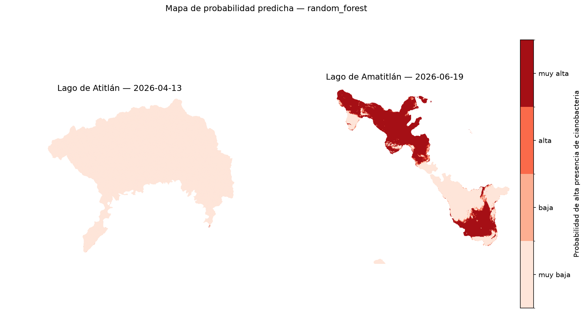
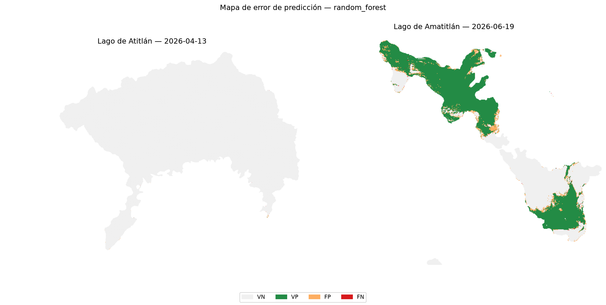

# Inciso 9. Generación de mapas predictivos

## Metodología

`notebooks/p2_09_mapas_predictivos.ipynb` usa el mejor modelo del inciso 5 (mismo criterio de selección del inciso 8: mayor F2-score) sobre el **dataset completo** (`data/processed/dataset_ml.parquet`, no la muestra de trabajo), para poder reconstruir una imagen densa de probabilidad por píxel. Para cada lago se usa `fecha_pico`, la fecha con mayor `clorofila` promedio, con la misma definición que la Parte I (`notebooks/05_analisis_espacial.ipynb`) usa para identificar la fecha de floración más intensa, lo que permite comparar directamente contra los mapas de cianobacteria ya generados en esa parte. `src/mapas.py` reconstruye la imagen 2D a partir de las columnas `fila`/`columna` guardadas desde el inciso 1 (`rejilla_desde_columnas`), dejando en NaN las celdas sin observación válida.

## Resultados

### 9.1 a 9.4 Probabilidad por observación y mapa de probabilidad

El modelo aplicado es Random Forest (mejor F2 del inciso 5). Las fechas pico seleccionadas son **2026-04-13 para Atitlán** y **2026-06-19 para Amatitlán**, con 306,794 y 36,327 observaciones válidas respectivamente. El contraste entre ambos lagos es total: la probabilidad media predicha es de **0.000 en Atitlán** y **0.587 en Amatitlán**.

La figura `p2_mapa_probabilidad.png` muestra, para cada lago en su `fecha_pico`, la probabilidad predicha de alta presencia de cianobacteria en una escala discreta de 4 niveles (muy baja, baja, alta, muy alta), delimitados en `[0, 0.25, 0.5, 0.75, 1]`.

### 9.5 Comparación con los mapas de cianobacteria de la Parte I

El mapa predictivo **reproduce fielmente el patrón espacial reportado en la Parte I**, sin haber usado ninguna de las variables con las que se construyó ese mapa:

- En **Amatitlán (2026-06-19)**, las zonas de probabilidad "muy alta" cubren el brazo norte completo, el estrecho que lo conecta con el cuerpo principal y la bahía sur — exactamente las tres zonas que la Parte I identificó como puntos persistentes de acumulación por su poca profundidad y circulación reducida. La franja central del lago, entre el cuerpo principal y la bahía sur, aparece en "muy baja", coincidiendo con la zona abierta y de mayor circulación.
- En **Atitlán (2026-04-13)**, prácticamente toda la superficie queda en "muy baja", consistente con el índice de cianobacteria uniformemente bajo que la Parte I documentó para ese lago, incluso en su fecha de mayor promedio.

La concordancia es significativa metodológicamente: las 11 predictoras excluyen `ndci`, `clorofila`, `rojo` y `b05` (inciso 2.5), de modo que el modelo llegó a la misma geografía de la floración por una vía espectral independiente de la que produjo el mapa de referencia.

### 9.6 Zonas correctamente detectadas, falsos positivos y falsos negativos

La figura `p2_mapa_errores.png` clasifica cada observación en verdadero positivo (VP), falso positivo (FP), falso negativo (FN) o verdadero negativo (VN), comparando la predicción del modelo contra `alta_cianobacteria`. El conteo por lago es:

| Lago | VP | VN | FP | FN | Total |
|---|---|---|---|---|---|
| Amatitlán (2026-06-19) | 19,415 | 14,863 | 1,970 | **79** | 36,327 |
| Atitlán (2026-04-13) | 4 | 306,744 | 39 | **7** | 306,794 |

En Amatitlán, el modelo detecta 19,415 de las 19,494 zonas con alta presencia real: un **Recall de 0.996**, con solo 79 falsos negativos. El precio son 1,970 falsos positivos (Precision 0.908). Dada la prioridad establecida en el inciso 5.3 —minimizar falsos negativos por su costo sanitario— este reparto de errores es el deseable. En Atitlán las cifras absolutas son minúsculas (11 positivos reales en 306,794 píxeles) y no permiten conclusiones estadísticas sólidas, aunque los 39 falsos positivos sobre 306,783 negativos reales representan una tasa de falsa alarma de 0.013 %, operativamente despreciable.

### 9.7 Regiones con dificultad sistemática

**Sí, y el patrón es inequívoco: los errores forman una orla en el contorno del lago.** En el mapa de Amatitlán, los falsos positivos (naranja) aparecen casi exclusivamente como una franja delgada y continua a lo largo de la línea de costa y en el perímetro de las zonas verdes (VP), mientras que el interior de las zonas de floración y el interior de las zonas limpias están prácticamente libres de error. En Atitlán ocurre lo mismo a escala mucho menor: los pocos falsos positivos se sitúan en la orilla de las bahías del sur.

Se identifican dos regímenes de dificultad, ambos de borde:

- **Borde tierra-agua (mezcla espectral)**. En el límite con la máscara de agua, un píxel de 20 m contiene una mezcla de agua, vegetación ribereña y sedimento costero. Esa mezcla eleva `ndvi` y `fai` —las dos variables dominantes del inciso 8— por razones que no tienen nada que ver con cianobacteria, y el modelo interpreta esa firma como floración. Los filtros de calidad del inciso 1 (agua estable en ≥9 de 11 fechas) reducen pero no eliminan este efecto, porque un píxel puede ser agua en todas las fechas y aun así estar espectralmente contaminado por la orilla adyacente.
- **Borde de la mancha de floración (transición gradual)**. En el perímetro de las zonas de alta concentración, la clorofila real cruza el umbral de 10 µg/L de forma continua, mientras que el modelo debe emitir una decisión binaria con un umbral fijo de 0.5. Cualquier clasificador produce error justo ahí, y ese error es en buena medida un artefacto de haber binarizado una variable continua (inciso 2.1), no una falla del modelo.

**Consecuencia operativa**: la orla de falsos positivos costeros no invalida el mapa, pero sí sugiere que un uso operativo debería o bien aplicar una erosión morfológica de un píxel a la máscara de agua, o bien reportar el riesgo agregado por zona (bahía, brazo) en lugar de píxel a píxel, para que el ruido de borde no domine la alerta.

## Figuras generadas

- `informe/figuras/p2_mapa_probabilidad.png`
- `informe/figuras/p2_mapa_errores.png`

## Decisiones técnicas

- El mapa se construye sobre el dataset completo, no sobre la muestra de trabajo de 300,000 observaciones usada en los incisos 4 a 8: una reconstrucción espacial densa requiere todos los píxeles válidos de la fecha elegida, no un submuestreo aleatorio, que dejaría huecos artificiales en la imagen.
- `fecha_pico` se define con el mismo criterio que la Parte I (mayor `clorofila` promedio por lago), en lugar de una fecha arbitraria, para que la comparación del inciso 9.5 sea directa contra un mapa de cianobacteria ya generado previamente para esa misma fecha.
- Las celdas sin observación válida se dejan en NaN, no en 0, para que `imshow` las distinga visualmente de una probabilidad real de 0 (agua sin riesgo) en lugar de mostrarlas como parte del cuerpo de agua.
- El umbral de clasificación para el mapa de error es 0.5 (el que usa `modelo.predict` por defecto), consistente con el usado para calcular las métricas del inciso 5, aunque el mapa de probabilidad (9.1-9.4) sigue mostrando el valor continuo antes de aplicar ese umbral.
- Los mapas de este inciso se generan con el modelo entrenado en el inciso 4, cuyo conjunto de entrenamiento incluye píxeles de estas mismas dos fechas. Las cifras de error de 9.6 son, por tanto, optimistas respecto a lo que el modelo lograría sobre una escena futura; la estimación honesta para ese escenario es la de la validación temporal del inciso 6 (Recall ≈ 0.68), no el 0.996 de este mapa.
