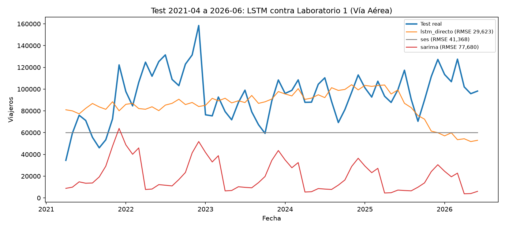

# 4. Análisis comparativo: LSTM contra los modelos del Laboratorio 1

Esta sección responde el punto 1.4 del enunciado. El desarrollo está en
`notebooks/11_comparativo_lstm.ipynb`, que no reentrena nada: lee las métricas de los cuadernos 09
y 10, las métricas del Laboratorio 1 en `resultados/metricas_modelos.csv` y las predicciones
guardadas en `resultados/predicciones/`, y deja dos tablas consolidadas, `metricas_lstm.csv` y
`comparativo_lstm_lab1.csv`.

## Criterio de comparación

Las dos familias se comparan sobre exactamente el mismo conjunto de prueba, los 63 meses de abril
de 2021 a junio de 2026, con las mismas tres métricas y calculadas por la misma función,
`src.evaluacion.metricas`, que se usó en el Laboratorio 1. MAE y RMSE van en viajeros y MAPE en
porcentaje. El modelo ganador de cada serie es el de menor suma de los rangos de MAE y RMSE, el
mismo criterio con el que el laboratorio anterior eligió entre SARIMA, Holt-Winters, SES, seasonal
naive y Prophet.

Las tres métricas se reportan juntas porque miden cosas distintas. El MAE promedia el error en
viajeros y trata todos los meses por igual; el RMSE penaliza los errores grandes, que en estas
series se concentran en los picos estacionales y en el rebote de 2022; el MAPE normaliza por el
nivel real y es la única de las tres comparable entre series de distinto volumen. Un modelo que
ganara en una sola de ellas exigiría una discusión; en los resultados de abajo no hace falta,
porque el ganador lo es en las tres.

Ninguna de las dos familias vio el conjunto de prueba durante el ajuste. En el Laboratorio 1 las
órdenes SARIMA se eligieron por AIC sobre el entrenamiento y los demás modelos se ajustaron solo
con esas 147 observaciones; en este laboratorio la rejilla LSTM se tuneó contra un tramo de
validación tomado del final del entrenamiento. La comparación es limpia en los dos sentidos.

### Por qué no se usan AIC ni BIC

El enunciado del Laboratorio 1 pedía comparar modelos ARIMA por AIC y BIC, y aquí esos criterios no
aparecen por dos razones.

La primera es que no están definidos para una red neuronal. AIC y BIC se construyen sobre la
verosimilitud maximizada del modelo, y una LSTM entrenada por descenso de gradiente sobre un error
cuadrático no tiene una verosimilitud que reportar ni un número de parámetros efectivos
interpretable de la misma forma; los 54,015 parámetros del modelo directo de la serie total o los
14,751 del de vía aérea no son comparables con los 8 o 10 coeficientes de un SARIMA.

La segunda es que, aun si estuvieran definidos, no serían el criterio adecuado. Los dos miden
ajuste dentro de muestra penalizado por complejidad, no capacidad predictiva fuera de muestra, y el
Laboratorio 1 documentó el caso extremo: el SARIMA(2,1,2)(0,1,1)12 de vía aérea fue el de menor AIC
de su rejilla, 169.72, y produjo el peor pronóstico a 63 pasos de esa serie, con un MAE de 73,966
frente a los 36,109 de SES. Elegir por AIC habría empeorado el resultado. Toda la comparación de
esta sección se resuelve, por eso, sobre el conjunto de prueba.

## Resultados

| Serie | Familia | Mejor modelo | MAE | RMSE | MAPE |
|---|---|---|---:|---:|---:|
| Total | Lab 1 | SES | 175,088 | 194,791 | 58.11 % |
| Total | LSTM | lstm_directo | **76,957** | **100,290** | **33.76 %** |
| Vía aérea | Lab 1 | SES | 36,109 | 41,368 | 35.62 % |
| Vía aérea | LSTM | lstm_directo | **22,635** | **29,623** | **24.93 %** |

El LSTM de estrategia directa es el mejor modelo global de las dos series considerando las dos
familias, y lo es en las tres métricas a la vez, así que el criterio de desempate no llega a
aplicarse. Queda marcado como `mejor_global` en `comparativo_lstm_lab1.csv`.

## Serie total

### Cuál de las dos estrategias LSTM predijo mejor

La estrategia directa, con `Dense(63)`, gana con claridad a la recursiva.

| Modelo | MAE | RMSE | MAPE |
|---|---:|---:|---:|
| lstm_directo | 76,957 | 100,290 | 33.76 % |
| lstm_recursivo | 143,303 | 164,706 | 46.90 % |
| Margen | 46.30 % | 39.11 % | 13.13 pp |

El margen es demasiado grande para atribuirlo al azar del ajuste, y va en contra de la ventaja
muestral: la estrategia recursiva entrena con 123 ventanas y la directa con 61, la mitad. Lo que
inclina la balanza es el sesgo acumulado. La recursiva subestima 62 de los 63 meses, con un error
medio de −142,973 viajeros, el 51.7 % del nivel medio del test; la directa subestima 45 de 63, con
−44,329, el 16.0 %. Realimentar 63 veces un modelo de un paso entrenado sobre datos que terminan en
el punto más bajo de la pandemia arrastra toda la trayectoria hacia ese nivel.

Conviene señalar de dónde no sale esta conclusión. Los `rmse_val` del tuneo, 149,716 en la
recursiva y 130,075 en la directa, apuntan en la misma dirección, pero no sirven como argumento: se
miden sobre tramos distintos, veinte meses consecutivos en un caso y once ventanas de 63 valores en
el otro, y solo ordenan configuraciones dentro de una misma estrategia. La comparación entre
estrategias se resuelve únicamente en el test.

### Si son mejores que los del Laboratorio 1

Sí, y por el mayor margen registrado en las dos entregas para esta serie.

| Comparación | MAE | RMSE | MAPE |
|---|---:|---:|---:|
| SES, Lab 1 | 175,088 | 194,791 | 58.11 % |
| lstm_directo | 76,957 | 100,290 | 33.76 % |
| Mejora | 56.05 % | 48.51 % | 24.35 pp |

Para dimensionar el salto: en el Laboratorio 1, la distancia entre SES y el segundo mejor modelo de
esta serie, Holt-Winters, era de 21,868 viajeros de MAE. Aquí la distancia entre SES y el LSTM
directo es de 98,131, cuatro veces y media mayor. No es una diferencia que exija matices ni que
pueda explicarse por la semilla: es un cambio de régimen en la calidad del pronóstico. Y no depende
de haber elegido bien la estrategia, porque incluso la perdedora supera a SES: la recursiva registra
143,303 de MAE y 164,706 de RMSE, por debajo de los 175,088 y 194,791 de SES.

El LSTM directo es, en consecuencia, el mejor modelo global de la serie total entre las dos
familias, y el primero de esta serie, en las dos entregas, que baja del 50 % de MAPE.

La figura muestra por qué. SES es una recta horizontal en 105,145 viajeros durante 63 meses: por
construcción prolonga el último nivel suavizado del entrenamiento, que es un mes de pandemia. El
SARIMA(2,1,2)(1,1,1)12 es peor todavía, porque a un nivel inicial bajo le suma una tendencia
estimada que apunta hacia abajo, y termina rozando el cero desde 2023; su correlación con el test
es de −0.597, es decir que se mueve de forma sistemática al revés que la serie real. El LSTM
directo es el único de los tres que traza un perfil estacional con el nivel correcto, y en el tramo
2023-2025 se superpone con el test en buena parte de los meses.

Ahora bien, la ventaja no es uniforme a lo largo del horizonte, y decirlo importa tanto como
reportar el promedio. El LSTM directo sobreestima 2021 en 79.6 %, con 198,112 viajeros mensuales
frente a 110,282 reales, mientras que SES, por estar anclado en el nivel deprimido, acierta ese
tramo mucho mejor. La ventaja del LSTM se construye de 2022 en adelante y se estabiliza en un error
anual de entre 12.0 % y 12.7 % en 2023-2025. Un usuario interesado solo en los primeros doce meses
del horizonte no habría obtenido de esta comparación la misma conclusión que uno interesado en los
63.

## Vía aérea

La vara aquí es más alta que en la serie total. SES parte de un MAPE de 35.62 % en esta serie, casi
el mismo 33.76 % que el LSTM directo alcanzó en la agregada, así que una mejora del orden de la
anterior no estaba dada por descontada. El LSTM gana de todas formas, pero con márgenes más chicos y
con una reserva de fondo que la serie total no tiene.

### Cuál de las dos estrategias LSTM predijo mejor

La directa, otra vez, y otra vez en las tres métricas.

| Modelo | MAE | RMSE | MAPE |
|---|---:|---:|---:|
| lstm_directo | 22,635 | 29,623 | 24.93 % |
| lstm_recursivo | 31,638 | 37,766 | 31.14 % |
| Margen | 28.46 % | 21.56 % | 6.21 pp |

El margen es aproximadamente la mitad del de la serie total, y la razón está en el punto de partida
de la recursiva. Su sesgo medio aquí es de −31,110 viajeros, el 32.9 % del nivel medio del test,
contra el 51.7 % que acumulaba en la serie agregada. La vía aérea es la menos volátil de las siete
series, con un CV de 0.216 frente a 0.335 de la total, y fue la de recuperación más rápida: alcanzó
el 80 % del nivel de 2019 en diciembre de 2021. Sobre una serie más plana y con menos distancia por
recorrer, aplanar el pronóstico cuesta menos error.

El orden entre estrategias, en cambio, es el mismo en las dos series y por el mismo motivo:
realimentar 63 veces un modelo de un paso arrastra la trayectoria hacia el nivel del último mes de
entrenamiento, que es un mes de pandemia.

### Si son mejores que los del Laboratorio 1

Sí, pero el margen es de otro orden que en la serie total.

| Comparación | MAE | RMSE | MAPE |
|---|---:|---:|---:|
| SES, Lab 1 | 36,109 | 41,368 | 35.62 % |
| lstm_directo | 22,635 | 29,623 | 24.93 % |
| Mejora | 37.31 % | 28.39 % | 10.68 pp |

Es la primera vez en las dos entregas que un modelo de esta serie baja del 25 % de MAPE, y la mejora
es consistente en las tres métricas. Conviene ponerla en perspectiva con el mismo criterio que se
usó arriba. En la serie total el salto de SES al LSTM directo, 98,131 viajeros de MAE, era cuatro
veces y media la distancia que separaba a SES del segundo mejor modelo del Laboratorio 1. Aquí el
salto es de 13,474 y esa distancia era de 11,935: apenas 1.13 veces. En la serie agregada el LSTM
abre una categoría nueva; en la vía aérea se coloca un escalón por delante del mejor modelo
anterior, dentro del rango de variación que ya existía entre los modelos de esa entrega.

Como en la serie total, la estrategia perdedora también supera a SES: la recursiva registra 31,638
de MAE y 37,766 de RMSE, por debajo de los 36,109 y 41,368 de SES.

### La reserva que las métricas de error no muestran

La figura explica por qué el buen MAPE de esta serie no debe leerse como un buen seguimiento de la
serie. SES es una recta en 60,160 viajeros, exactamente el último mes del entrenamiento, y el
SARIMA(2,1,2)(0,1,1)12, el de menor AIC de su rejilla, se queda en una media de 20,639 y subestima
los 63 meses del horizonte. Contra esas dos referencias, cualquier modelo con el nivel correcto
gana.

Y el nivel del LSTM directo es correcto: promedia 85,409 viajeros contra 94,605 del test, un sesgo
de −9.7 %, y subestima 34 de 63 meses, casi la mitad. El problema es la amplitud. Su CV es de 0.157
frente a 0.244 del test, de modo que comprime a menos de dos tercios la variación real, y su
correlación con el test es de −0.150. Gana en MAE y RMSE por cancelación de errores en direcciones
opuestas, no porque reproduzca la dinámica mes a mes.

Los dos tramos donde eso se ve son los extremos del horizonte. En el pico de diciembre de 2022 el
test llega a 158,463 viajeros y el modelo se queda en 84,002; de hecho su máximo en los 63 meses es
de 104,058, un 34 % por debajo del pico real. Y en el primer semestre de 2026 colapsa a 54,920
frente a 107,307 reales, un 48.8 % por debajo, justo el tramo más reciente y el de mayor interés
operativo.

El contraste con la serie total cierra la lectura. Allí el LSTM directo dibuja un perfil estacional
con el nivel correcto y su correlación con el test es positiva, 0.249. Aquí el nivel es más preciso
todavía, con un sesgo de −9.7 % contra −16.0 %, pero la forma se pierde. Las métricas agregadas
premian a la vía aérea, con 24.93 % de MAPE contra 33.76 %, y sin embargo es el modelo de la serie
total el que sigue mejor la dinámica de su serie.

## Qué significa el resultado dado el diseño temporal del split

El split se heredó del Laboratorio 1 sin modificarlo, y esa decisión condiciona la lectura de todo
lo anterior. El entrenamiento termina en marzo de 2021 y el test recorre la recuperación completa:
la serie total pasa de 105,145 viajeros en el último mes de entrenamiento a una media de 276,685 en
el horizonte, y la vía aérea de 60,160 a 94,605. La frontera cae en el peor punto posible: el modelo
aprende con una serie cuyo tramo final es atípico respecto de todo lo que vendrá después.

Ese diseño explica el resultado en las dos direcciones. Explica por qué los modelos del Laboratorio
1 fallaron: SES, Holt-Winters, seasonal naive, SARIMA y Prophet anclan el pronóstico en las últimas
observaciones o en la tendencia estimada sobre ellas, y las últimas observaciones eran pandemia. El
informe anterior ya lo documentó al señalar que SES ganó seis de las siete series precisamente por
no extrapolar, es decir, por equivocarse menos que los demás y no por acertar.

Y explica también por qué el LSTM directo gana. La red aprende un patrón sobre ventanas de 24 meses
que en su mayoría provienen del periodo prepandemia, once años de los doce del entrenamiento, y al
pronosticar reconstruye ese patrón en lugar de prolongar el nivel del último mes. Sobre un test que
efectivamente vuelve a niveles prepandemia, esa forma de equivocarse resulta ser la correcta.

De ahí se sigue la reserva más importante de esta sección. La superioridad del LSTM medida aquí es
real y está calculada de forma limpia, pero se apoya en una coincidencia favorable entre lo que el
modelo aprendió y lo que ocurrió. Si la serie no se hubiera recuperado, o si el test hubiera
cubierto un periodo de deterioro sostenido, la misma propiedad que hoy lo hace ganar habría
producido una sobreestimación sistemática, y el ranking se habría invertido. Lo que estos 63 meses
demuestran no es que una LSTM sea mejor que un SARIMA en general, sino que un modelo capaz de
reconstruir el patrón histórico completo supera a uno anclado en el último nivel observado cuando
el horizonte contiene una vuelta a ese patrón histórico.

La conclusión operativa para INGUAT es más modesta que el 56 % y el 37 % de mejora en el MAE. Un
MAPE de 33.76 % en la serie total sigue significando un error típico de un tercio del valor real, y
el 24.93 % de la vía aérea, de una cuarta parte: sirven para dimensionar órdenes de magnitud y
planificación agregada, no para asignación fina de capacidad sin intervalos de confianza ni
reentrenamiento periódico. Y en vía aérea la cifra agregada es incluso más engañosa que en total,
porque el mejor modelo se mueve al revés que la serie en el mes a mes y subestima a la mitad el
tramo más reciente. La recomendación es reentrenar con datos posteriores a la recuperación en cuanto
haya suficientes, porque ninguno de los modelos comparados aquí, de ninguna de las dos familias,
tuvo forma de aprender el régimen que efectivamente rige las series desde 2023.
