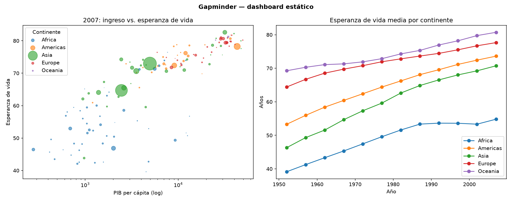

<!-- _class: portada -->
<!-- _paginate: false -->
<!-- footer: "Presenta: Ernesto" -->

# Dashboards dinámicos

## Filtros, navegación y actualización de datos

**Grupo 3** · CC3084 Data Science · Universidad del Valle de Guatemala

Ernesto Ascencio (23009) · Hugo Barillas (23556) · Esteban Carcamo (23016)

Pregunta guía: ¿qué preguntas **no** podemos responder con una imagen fija?

---

<!-- ============ INVESTIGACIÓN · Ernesto ============ -->

# Estático vs. dinámico

| | Estático | Dinámico |
|---|---|---|
| Vista | Fija, ya agregada | El usuario la modifica |
| Rol | **Presenta** respuestas | Ayuda a **descubrir** respuestas |
| Datos | Corte en el tiempo | Pueden actualizarse |
| Costo | Menor desarrollo | Mayor desarrollo y mantenimiento |
| Límite | No permite preguntas de seguimiento | Requiere cierta pericia del usuario |

> Cambia la exploración: de **leer** un resultado a **hacer preguntas** a los datos.

Fuentes: QuantHub; insightsoftware; Qrvey (ver referencias).

---

# Qué aporta cada recurso: el mantra de Shneiderman

> **Overview first, zoom and filter, then details-on-demand.** — Shneiderman (1996)

| Paso | Recurso del dashboard | Ejemplo |
|---|---|---|
| Overview | KPIs y vista global | Resumen del periodo |
| Zoom + filter | Filtros, segmentadores, resaltado cruzado | Power BI: *cross-filtering* quita los datos que no aplican; *cross-highlighting* los atenúa |
| Details-on-demand | Pestañas, *drill-through*, marcadores | Clic derecho en un dato → página de detalle |

---

# Actualización de datos y ejemplos reales

| Modo | Idea | Cuándo |
|---|---|---|
| Estático | Una sola carga | Informe de cierre |
| Programada | Recarga cada N min/horas | Ventas diarias |
| Tiempo real | Flujo continuo | Monitoreo de brotes |

En Streamlit: `st.cache_data(ttl=...)` define cuánto vive el dato en caché.

- **Johns Hopkins COVID-19** (2020): mapa en tiempo real.
- **Our World in Data:** más de 14 000 gráficos interactivos.
- **Gapminder Tools:** burbujas con 5 variables, los mismos datos de nuestra demo.

---

<!-- ============ APLICACIÓN · Hugo ============ -->
<!-- footer: "Presenta: Hugo" -->

# Demo: la misma data, dos formas

**Datos:** Gapminder (`px.data.gapminder()`): 142 países, 1952–2007, 1 704 filas.
Variables: `country, continent, year, lifeExp, pop, gdpPercap`.

**Herramienta:** Streamlit + Plotly (Python).

| Versión | Archivo | Qué ofrece |
|---|---|---|
| Estática | `demo/static.py` | Imagen fija: 2007 + tendencia |
| Dinámica | `demo/app.py` | Filtros, pestañas, animación, detalle |

---

# Demo estática: lo que se ve

Responde **una** pregunta fija. Para otro continente o años distintos hay que volver a programar.

---

# Demo dinámica: qué incluye

- **Filtros (sidebar):** continente (multiselección) y rango de años.
- **KPIs:** esperanza de vida media, PIB mediano, número de países.
- **Pestañas:** *Overview* (burbujas animadas) · *Comparar* (líneas por continente) · *Detalle* (país elegido + tabla).
- **Botón «Actualizar datos»:** limpia la caché y recarga.

Preguntas que responde: ¿el ingreso explica la salud? ¿qué continente mejoró más? ¿cómo evolucionó un país concreto?

---

# Cómo se construye (pasos)

1. `pip install -r demo/requirements.txt`
2. Cargar datos con `@st.cache_data(ttl=300)`.
3. Crear controles: `st.sidebar.multiselect`, `st.sidebar.slider`.
4. Filtrar el `DataFrame` con esos valores.
5. Dibujar con `px.scatter(animation_frame="year")` y `px.line`.
6. Organizar con `st.tabs` y `st.metric`.
7. Ejecutar: `streamlit run demo/app.py`

Flujo de Streamlit: **cada interacción vuelve a ejecutar el script** de arriba abajo.

---

# Demo en vivo: qué probar

1. Dejar solo **Asia** → cambian KPIs y gráficos.
2. Rango de años **1952–1972** → los KPIs usan el último año del rango.
3. *Overview* → pulsar ▶ en la animación.
4. *Detalle* → elegir un país (Rwanda) y ver su tabla.
5. **Actualizar datos** → cambia la hora de carga.
6. Quitar todos los continentes → aparece el aviso.

---

<!-- ============ COMPLEJIDAD Y PARTICIPACIÓN · Esteban ============ -->
<!-- footer: "Presenta: Esteban" -->

# Complejidad de implementación

| Qué se necesita | Estático | Dinámico |
|---|---|---|
| Conocimientos | Python/Excel + gráficos | + estado, eventos, filtrado de `DataFrame` |
| Recursos | Un script, una imagen | Servidor o servicio donde correr la app |
| Pasos | Cargar → graficar → exportar | Cargar → controles → filtrar → graficar → desplegar |
| Mantenimiento | Casi nulo | Dependencias, versiones, datos al día |

El modelo mental cambia: de **un resultado** a **una app que reacciona**.

---

# Dificultades que encontramos

- **Cada interacción re-ejecuta el script:** hay que cachear (`st.cache_data`) o la app se vuelve lenta.
- **Caché vs. frescura:** con `ttl` el dato puede estar viejo; hizo falta un botón para forzar la recarga.
- **API que cambia:** `use_container_width` quedó obsoleto y generó avisos; se migró a `width="stretch"`.
- **Supuestos sobre los datos:** se asumió 1998–2007 y el rango real es 1952–2007; **se verificó antes de graficar**.
- **Casos límite:** sin continentes seleccionados no hay datos; hubo que mostrar un aviso.

---

# ¿Cuándo NO conviene un dashboard dinámico?

- El mensaje es **único y ya conocido** (informe de cierre, presentación a directivos).
- Se imprime o se envía en PDF: la interactividad se pierde.
- Nadie mantendrá la app ni los datos.
- Demasiados filtros: **sobrecarga cognitiva** y riesgo de conclusiones erróneas por filtros mal combinados.
- Audiencia sin tiempo ni hábito de explorar.

> Regla práctica: si no hay preguntas de seguimiento, el estático alcanza.

---

# Herramientas para dashboards dinámicos

| Herramienta | Enfoque | Lenguaje |
|---|---|---|
| Streamlit | App de datos con pocas líneas | Python |
| Plotly + Dash | Callbacks explícitos, más control | Python |
| Panel | Componentes y controles enlazados | Python |
| R Shiny | Entradas reactivas → resultados | R |
| Power BI / Tableau | Sin código, segmentadores y *drill-through* | Visual |

Más control = más código. Menos código = menos personalización.

---

# Actividad y discusión (5 min)

Dos grupos: **A** solo ve la imagen estática · **B** usa la app dinámica.

1. ¿Qué país de **las Américas** tuvo la menor esperanza de vida en 2007?
2. ¿Qué país de **Asia** ganó más años de esperanza de vida entre 1952 y 2007?
3. ¿Qué pasó con la esperanza de vida de **Rwanda** en 1992?
4. ¿Qué periodo mostró la mayor **caída** de la media en **África**?

Midan: ¿quién respondió primero? ¿qué preguntas no se pudo responder?

**Discusión:** ¿cuándo bastó el estático? ¿qué filtro faltó en la app?

<!--
CLAVE (no mostrar):
1. Haití, 60.9 años (2007) — responde el estático.
2. Omán, +38.1 años (de 1952 a 2007); Vietnam +33.8, Indonesia +33.2 — el estático no tiene 1952.
3. Cayó a 23.6 años (vs 44.0 en 1987) — pestaña Detalle.
4. 1997→2002, −0.27 años en la media africana — pestaña Comparar.
-->

---

<!-- footer: "Presenta: Ernesto" -->

# Referencias

- Dong, E., Du, H., & Gardner, L. (2020). An interactive web-based dashboard to track COVID-19 in real time. *The Lancet Infectious Diseases, 20*(5), 533–534. https://pubmed.ncbi.nlm.nih.gov/32087114/
- Few, S. (2006). *Information Dashboard Design: The Effective Visual Communication of Data*. O'Reilly Media.
- Shneiderman, B. (1996). The eyes have it: A task by data type taxonomy for information visualizations. *IEEE Symposium on Visual Languages*. https://drum.lib.umd.edu/handle/1903/5784
- Microsoft. (s. f.). Interacciones del usuario final en informes de Power BI. https://learn.microsoft.com/en-us/power-bi/explore-reports/end-user-interactions
- Microsoft. (s. f.). Drillthrough en Power BI Desktop. https://learn.microsoft.com/en-us/power-bi/create-reports/desktop-drillthrough
- Streamlit. (s. f.). `st.cache_data`. https://docs.streamlit.io/develop/api-reference/caching-and-state/st.cache_data
- QuantHub. (s. f.). What is the difference between a static dashboard and an interactive dashboard? https://quanthub.com/what-is-the-difference-between-a-static-dashboard-and-an-interactive-dashboard
- Qrvey. (s. f.). Interactive dashboards. https://qrvey.com/blog/interactive-dashboard/
- insightsoftware. (s. f.). Dynamic dashboards. https://www.insightsoftware.com/encyclopedia/dynamic-dashboards
- Plotly. (s. f.). `plotly.express.data.gapminder` (datos de Gapminder, 1952–2007). https://plotly.com/python-api-reference/generated/plotly.express.data.html
- Our World in Data. https://ourworldindata.org/
- Gapminder. Gapminder Tools. https://www.gapminder.org/tools
- Johns Hopkins University. COVID-19 Map FAQ. https://coronavirus.jhu.edu/map-faq
